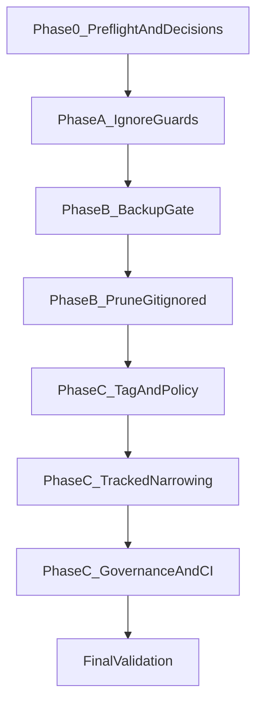

# Context Hygiene Cleanup Plan (`study-query-llm`)

## Decisions to ratify

- [x] **Archive snapshot ref type (ratified):** use annotated git tag, not branch.
  - Tag: `archive/pre-context-hygiene-cleanup`
  - Create before any tracked removals:
    - `git tag -a archive/pre-context-hygiene-cleanup -m "Snapshot of main prior to context-hygiene cleanup; UTC <iso-timestamp>"`
    - `git push origin archive/pre-context-hygiene-cleanup`
  - Recovery:
    - `git checkout archive/pre-context-hygiene-cleanup -- <path>`
    - `git show archive/pre-context-hygiene-cleanup:<path>`

- [x] **Post-cleanup restricted-set policy (ratified):** keep machinery and keep restricted set populated as a tombstone/reintroduction guard.
  - Keep/update:
    - [`scripts/internal/living_docs_governance.py`](scripts/internal/living_docs_governance.py)
    - [`scripts/check_living_docs_drift.py`](scripts/check_living_docs_drift.py)
    - [`scripts/warn_restricted_doc_edits.py`](scripts/warn_restricted_doc_edits.py)
    - [`.github/workflows/living-docs-drift.yml`](.github/workflows/living-docs-drift.yml)
  - Behavior after Phase C: CI continues blocking re-introduction of restricted paths on `main`.

- [ ] **Backup destination path (required before Phase B):**
  - Proposed default: `C:/Users/spenc/Backups/study-query-llm/context_hygiene_cleanup_<UTC>.zip`
  - Companion: `C:/Users/spenc/Backups/study-query-llm/context_hygiene_cleanup_<UTC>.manifest.csv`
  - Decision note: strongly prefer destination on a **different physical drive** than repo workspace.

- [ ] **`experimental_results/` retention policy:**
  - Option A (recommended): keep last 3 dated run directories in-repo, move remainder out-of-tree.
  - Option B: keep nothing in-repo after backup verify.
  - Option C: keep named whitelist only.

- [ ] **`data/embedding_cache/` + DB-dumps disposition:**
  - Option A (recommended): one-time move out-of-tree after backup verify; no auto-delete schedule.
  - Option B: delete locally after backup verify.

- [ ] **Worktree pruning aggressiveness:**
  - Conservative (recommended): stale-only via `git worktree prune`, then targeted directory cleanup.
  - Aggressive: remove old inactive worktrees after explicit confirmation.

- [ ] **Whether to archive tracked non-archive notebooks (`notebooks/*.ipynb`, currently 12 tracked):**
  - Default: keep out-of-scope for this pass; open follow-up.

- [ ] **Whether to run separate root wrapper audit (`scripts/*.py`, 71 tracked root files):**
  - Default: out-of-scope follow-up.

## Follow-up (Out of Scope for This Run)

- Remove stale `.gitignore` exceptions that reference non-existent `data/sample_data.csv` entries (`!data/sample_data.csv` currently appears twice). Do **not** edit `.gitignore` as part of this cleanup run; track in a separate hygiene pass.

## Goal

- Reduce cross-agent context pollution by shrinking read-time and physical-noise surfaces.
- Preserve retrieval for tracked removals via immutable pre-cleanup tag.
- Preserve retrieval for untracked deletions via verified zip + manifest backup created **before** deletion.
- Keep critical allowed files visible and safe:
  - `tests/fixtures/p0_baseline/baseline_snapshot.json`
  - `src/study_query_llm/datasets/source_specs/**`
  - tracked `config/*.json` exceptions
  - `scratch/claude/README.md`
  - `scratch/local/README.md`
  - `scratch/local/jetstream-remote-build-and-restart.ps1`

## Context

- Current tracked surface: `683` files (`git ls-files`).
- Measured high-noise buckets (approx):
  - `.claude/worktrees/`: 20,194 files, ~3.55 GB.
  - `experimental_results/`: 19,751 files, ~10.04 GB.
  - `scratch/`: 259 files, ~6.37 GB.
  - `pg_migration_dumps/`: 20 files, ~18.68 GB.
  - `backup_pg_dumps/`: 44 files, ~15.04 GB.
  - `data/embedding_cache/`: 25 files, ~2.27 GB.
- Tracked removal candidates (measured):
  - `docs/history/` (5), `docs/deprecated/` (1), `docs/plans/` (15), `docs/experiments/` (1), `docs/audit/` (39), `docs/design/` (1)
  - `scripts/history/` (32), `scripts/deprecated/` (14), `notebooks/archive/` (4)
  - tracked `scratch/`: 33 total, keep-list 3, removable 30
  - root orphan candidates present/tracked: 10 files (`test_phase_1_1.py`, `test_phase_1_2.py`, `test_phase_2_1.py`, `test_phase_2_2.py`, `test_phase_2_3.py`, `test_phase_2_4.py`, `test_e2e_verification.py`, `test_colab_imports.py`, `find_working_deployment.py`, `list_azure_deployments.py`)
- Governance files affected:
  - [`.cursor/rules/living-docs-only.mdc`](.cursor/rules/living-docs-only.mdc)
  - [`scripts/internal/living_docs_governance.py`](scripts/internal/living_docs_governance.py)
  - [`scripts/check_living_docs_drift.py`](scripts/check_living_docs_drift.py)
  - [`scripts/warn_restricted_doc_edits.py`](scripts/warn_restricted_doc_edits.py)
  - [`docs/README.md`](docs/README.md)
  - [`AGENTS.md`](AGENTS.md)
  - [`.cursorrules`](.cursorrules)
  - [`.github/workflows/living-docs-drift.yml`](.github/workflows/living-docs-drift.yml)

## Approach

- Preserve order: **A -> B (backup-first hard gate) -> C**.
- Put reversible controls first (ignore surfaces), destructive filesystem prune second (guarded by verified backup), permanent tracked narrowing last (guarded by pre-removal tag).
- Use milestone commits at logical boundaries.
- For Phase C commits that edit/remove restricted paths, commit messages **must include** literal token:
  - `[restricted-doc-edit-ok]`
- Compute docs archive links dynamically from `origin` URL captured in Phase 0, not hardcoded owner/repo.

## Steps

### Phase 0 - Preflight baseline and decision gates (read-only)

- [ ] **0.1 Capture baseline inventory snapshot**
  - Run:
    - `git ls-files | Measure-Object -Line`
    - `git worktree list --porcelain`
    - `Get-ChildItem -Recurse -File experimental_results -ErrorAction SilentlyContinue | Measure-Object Length -Sum`
    - `Get-ChildItem -Recurse -File .claude/worktrees -ErrorAction SilentlyContinue | Measure-Object Length -Sum`
  - Validation (read-only):
    - `git status --short`
  - Rollback:
    - Not applicable.

- [ ] **0.2 Resolve remote owner/repo from origin (for docs archive link templating)**
  - Run:
    - `git remote get-url origin`
    - Parse into `<origin_owner_repo>` (example: `spencermcbridemoore/study-query-llm`).
  - Validation (read-only):
    - `git remote -v`
    - Confirm parse result is non-empty and repository matches working repo.
  - Decision gate:
    - If origin is non-GitHub or parse fails, pause and ratify URL template format before C.6.
  - Rollback:
    - Not applicable.

- [ ] **0.3 Verify must-preserve files are tracked/present**
  - Run:
    - `git ls-files -- tests/fixtures/p0_baseline/baseline_snapshot.json`
    - `git ls-files -- src/study_query_llm/datasets/source_specs/`
    - `git ls-files -- config/*.json`
    - `git ls-files -- scratch/claude/README.md scratch/local/README.md scratch/local/jetstream-remote-build-and-restart.ps1`
  - Validation (read-only):
    - `@( 'tests/fixtures/p0_baseline/baseline_snapshot.json', 'scratch/claude/README.md', 'scratch/local/README.md', 'scratch/local/jetstream-remote-build-and-restart.ps1' ) | ForEach-Object { "$_`t$([bool](Test-Path $_))" }`
  - Rollback:
    - Not applicable.

- [ ] **0.4 Orphan root test decision gate (`pytest --collect-only`)**
  - Run:
    - `pytest --collect-only -q`
    - `Get-Content pytest.ini`
    - `Get-ChildItem .github/workflows/*.yml | ForEach-Object { Select-String -Path $_.FullName -Pattern 'test_phase_|test_e2e_verification|test_colab_imports' }`
  - Decision gate:
    - If any orphan root test is collected/referenced, move to `tests/legacy_phase_tests/` (do not remove).
  - Validation (read-only):
    - `pytest --collect-only -q | Select-String -Pattern 'test_phase_|test_e2e_verification|test_colab_imports'`
  - Rollback:
    - Not applicable.

- [ ] **0.5 Ratify open decisions before edits/deletes**
  - Validation (read-only):
    - Confirm all unchecked decisions in the top block are resolved.
  - Rollback:
    - Not applicable.

### Phase A - Per-tool ignore controls (additive, reversible)

- [ ] **A.1 Add [`.cursorignore`](.cursorignore) deny+exception policy**
  - Deny patterns:
    - `.claude/worktrees/**`
    - `experimental_results/**`
    - `pg_migration_dumps/**`
    - `backup_pg_dumps/**`
    - `backup_*/**`
    - `data/**`
    - `scratch/**`
    - `artifacts/**`
    - `logs/**`
    - `notebooks/archive/**`
    - `docs/history/**`
    - `docs/deprecated/**`
    - `docs/plans/**`
    - `docs/experiments/**`
    - `docs/audit/**`
    - `docs/design/**`
    - `docs/IMPLEMENTATION_PLAN.md`
    - `docs/ARCHITECTURE.md`
    - `docs/API.md`
    - `docs/MIGRATION_GUIDE.md`
    - `docs/PHASE1_5_VERIFICATION.md`
    - `docs/PLOT_ORGANIZATION.md`
    - `scripts/history/**`
    - `scripts/deprecated/**`
    - `**/*.pkl`
    - `**/*.npz`
    - `**/*.parquet`
    - `**/*.log`
  - Exceptions:
    - `!scratch/claude/README.md`
    - `!scratch/local/README.md`
    - `!scratch/local/jetstream-remote-build-and-restart.ps1`
  - Validation:
    - `Test-Path .cursorignore`
    - `Get-Content .cursorignore`
  - Rollback:
    - `git restore -- .cursorignore`

- [ ] **A.2 Extend Claude deny rules in [`.claude/settings.json`](.claude/settings.json) or [`.claude/settings.local.json`](.claude/settings.local.json)**
  - Add paired deny entries per protected path:
    - `Read(<pattern>)`
    - `Glob(<pattern>)`
  - Keep existing allowlist unchanged.
  - Validation:
    - `Select-String -Path .claude/settings.json,.claude/settings.local.json -Pattern '"deny"|Read\(|Glob\('`
    - `python -m json.tool .claude/settings.json > $null`
    - `if (Test-Path .claude/settings.local.json) { python -m json.tool .claude/settings.local.json > $null }`
  - Rollback:
    - `git restore -- .claude/settings.json`
    - `git restore -- .claude/settings.local.json`

- [ ] **A.3 Cursor ignore smoke check for `data/**` deny**
  - Manual UI check in Cursor chat:
    - Try `@data/embedding_cache/` or a file beneath it (must be blocked/not surfaced).
  - Validation:
    - Record pass/fail in operator notes before continuing.
  - Rollback:
    - If exception fails, adjust `.cursorignore` patterns before any destructive phase.

- [ ] **A.4 Must-not-hide verification after A.1/A.2**
  - Validation (read-only):
    - `git ls-files -- tests/fixtures/p0_baseline/baseline_snapshot.json`
    - `git ls-files -- src/study_query_llm/datasets/source_specs/ | Measure-Object -Line`
    - `git ls-files -- config/*.json`
    - `git ls-files -- scratch/claude/README.md scratch/local/README.md scratch/local/jetstream-remote-build-and-restart.ps1`
  - Rollback:
    - Same as A.1/A.2.

- [ ] **A.5 Milestone commit/push (reversible config controls)**
  - Commit scope:
    - `.cursorignore`
    - `.claude/settings.json` and/or `.claude/settings.local.json`
  - Validation:
    - `git show --name-status --oneline -1`
  - Rollback:
    - `git revert <phase-a-commit-sha>`

### Phase B - Physical prune of gitignored accumulators (backup-first hard gate)

- [ ] **B.0a Backup destination + preliminary capacity snapshot (informational, pre-dry-run)**
  - Purpose:
    - Gather destination-drive facts before helper creation/dry-run; no pass/fail gate yet.
  - Planning estimate (order-of-magnitude):
    - Uncompressed source set is about `57 GB`.
    - Expected zip size is roughly `40-50 GB` (binary-heavy content compresses weakly; text/log compresses better).
    - Expected wall time: typically `30+ minutes` depending on storage and CPU.
  - Decision note:
    - If destination is on the same physical drive as the repo, strongly recommend choosing a different drive.
  - Validation:
    - `Get-PSDrive | Select-Object Name,Free,Used`
    - `Test-Path (Split-Path '<zip_path>' -Parent)`
  - Rollback:
    - Not applicable (informational).

- [ ] **B.1 Create backup helper [scripts/internal/context_hygiene_backup.py](scripts/internal/context_hygiene_backup.py)**
  - Requirements:
    - ZIP64 + `ZIP_DEFLATED`.
    - Include:
      - `.claude/worktrees/**`
      - `experimental_results/**`
      - `scratch/**` minus keep-list
      - `backup_*/**`
      - `pg_migration_dumps/**`
      - `backup_pg_dumps/**`
      - `data/embedding_cache/**`
      - `artifacts/**`
      - `logs/**`
      - root files: `custom_sweep_output.log`, `no_pca_multi_embedding_sweep_output.log`, `sweep_curves.csv`, `gcm-diagnose.log`
      - repo-wide: `__pycache__/**`, `.pytest_cache/**`, `.mypy_cache/**`, `.cache/**`
    - Exclude secrets/system:
      - `.git/**`, `.env`, `.env.example`
      - `deploy/jetstream/.env.jetstream`
      - `deploy/jetstream/terraform/terraform.tfvars`
      - `deploy/jetstream/terraform/.terraform/**`
      - `deploy/jetstream/terraform/*.tfstate*`
      - `*.tfstate`, `*.pem`, `*.key`, `id_rsa*`
    - Write sibling CSV manifest with: `relpath,bytes,sha256`.
    - Abort if output zip already exists.
  - Deliberate note:
    - Cache folders are included as defense-in-depth snapshot, even though regeneratable; bloat accepted by policy.
  - Validation:
    - `python scripts/internal/context_hygiene_backup.py --help`
    - `python -m py_compile scripts/internal/context_hygiene_backup.py`
  - Rollback:
    - `git restore -- scripts/internal/context_hygiene_backup.py`

- [ ] **B.2 Run dry-run preview and capture projected bytes**
  - Run:
    - `python scripts/internal/context_hygiene_backup.py --dry-run --zip-path "<zip_path>" --manifest-path "<manifest_path>"`
  - Validation:
    - Output includes file count and projected bytes (`<projected_zip_bytes>`).
    - Compare projected bytes against initial planning expectation (`40-50 GB`) and adjust operator expectation if materially different.
    - Keep-list files are excluded from scratch backup.
  - Rollback:
    - Not applicable.

- [ ] **B.0b Backup destination pass/fail gate (post-dry-run, pre-execute)**
  - Inputs:
    - `<zip_path>`
    - `<manifest_path>`
    - projected zip bytes from B.2 dry-run (`<projected_zip_bytes>`)
  - Required pass condition:
    - `free_bytes(destination_drive) > ceil(<projected_zip_bytes> * 1.20)`
  - PowerShell check:
    - `$destZip = '<zip_path>'`
    - `$drive = (Split-Path -Path $destZip -Qualifier).TrimEnd(':','\')`
    - `$free = (Get-PSDrive -Name $drive).Free`
    - `$required = [math]::Ceiling(<projected_zip_bytes> * 1.20)`
    - `if ($free -gt $required) { 'PASS' } else { 'FAIL' }`
  - Fail handling:
    - If `FAIL`, do not run B.3; re-select destination drive/path and re-run B.2 + B.0b.
  - Validation:
    - `Get-PSDrive | Select-Object Name,Free,Used`
    - `Test-Path (Split-Path '<zip_path>' -Parent)`
  - Rollback:
    - Not applicable (gate only).

- [ ] **B.3 Execute full backup (must be first destructive-phase action)**
  - Run:
    - `python scripts/internal/context_hygiene_backup.py --zip-path "<zip_path>" --manifest-path "<manifest_path>" --abort-if-exists`
  - Validation:
    - `Test-Path "<zip_path>"`
    - `Test-Path "<manifest_path>"`
    - `Get-Item "<zip_path>" | Select-Object FullName,Length,LastWriteTimeUtc`
    - `Import-Csv "<manifest_path>" | Measure-Object -Line`
  - Rollback:
    - If output path/content wrong, delete output and rerun backup before any prune.

- [ ] **B.4 Verify backup integrity with scaled random sample before deletion**
  - Sample policy for this run:
    - `sample_size = Max(1000, Ceiling(0.5% of manifest rows))`
  - Run:
    - `python scripts/internal/context_hygiene_backup.py --verify-zip "<zip_path>" --manifest-path "<manifest_path>" --sample-size <sample_size>`
  - Validation:
    - Verification reports zero mismatches.
  - Rollback:
    - On mismatch, stop; regenerate zip+manifest and re-verify.

- [ ] **B.5 Prune stale Claude worktrees only**
  - Required precondition:
    - Confirm no other active Claude Code sessions are running against this repo before pruning.
    - If session state is uncertain, pause B.5 until all concurrent Claude sessions are closed.
  - Run:
    - `git worktree list --porcelain`
    - `Get-ChildItem .claude/worktrees -Directory -ErrorAction SilentlyContinue`
    - `git worktree prune -n -v`
    - `git worktree prune -v`
    - Compare registered worktree paths vs on-disk `.claude/worktrees` directories.
    - Only target directories explicitly identified as stale (`prunable`) after comparison; do not infer staleness from age/name alone.
  - Validation:
    - `git worktree list --porcelain`
    - `git worktree list --porcelain | Select-String -Pattern '^worktree |^prunable '`
    - `Get-ChildItem .claude/worktrees -Directory -ErrorAction SilentlyContinue | Measure-Object`
    - `git worktree prune -n -v` should report no additional prunable entries immediately after cleanup.
  - Rollback:
    - Restore deleted worktree dirs from zip; re-register with `git worktree add` as needed.

- [ ] **B.6 Apply `experimental_results/` retention decision**
  - Run decision-specific move/delete actions only after B.4 passes.
  - Validation:
    - `Get-ChildItem experimental_results -Recurse -File -ErrorAction SilentlyContinue | Measure-Object Length -Sum`
    - `Get-ChildItem experimental_results -Directory -ErrorAction SilentlyContinue | Sort-Object LastWriteTime -Descending`
  - Rollback:
    - Restore from zip to original relative paths.

- [ ] **B.7 Prune `scratch/` except keep-list**
  - Keep:
    - `scratch/claude/README.md`
    - `scratch/local/README.md`
    - `scratch/local/jetstream-remote-build-and-restart.ps1`
  - Validation:
    - `@( 'scratch/claude/README.md', 'scratch/local/README.md', 'scratch/local/jetstream-remote-build-and-restart.ps1' ) | ForEach-Object { "$_`t$([bool](Test-Path $_))" }`
  - Rollback:
    - Restore removed files from zip.

- [ ] **B.8 Move out-of-tree or remove backup-heavy buckets**
  - Buckets:
    - `pg_migration_dumps/`
    - `backup_pg_dumps/`
    - `backup_*/` invalid-data dirs
    - `data/embedding_cache/`
  - Validation:
    - `Get-ChildItem pg_migration_dumps -Recurse -File -ErrorAction SilentlyContinue | Measure-Object`
    - `Get-ChildItem backup_pg_dumps -Recurse -File -ErrorAction SilentlyContinue | Measure-Object`
    - `Get-ChildItem data/embedding_cache -Recurse -File -ErrorAction SilentlyContinue | Measure-Object`
  - Rollback:
    - Restore from zip or move back from external destination.

- [ ] **B.9 Delete regeneratable caches and root untracked logs/csv**
  - Targets:
    - `__pycache__/**`, `.pytest_cache/**`, `.mypy_cache/**`, `.cache/**`
    - `custom_sweep_output.log`, `no_pca_multi_embedding_sweep_output.log`, `sweep_curves.csv`, `gcm-diagnose.log`
  - Validation:
    - `Get-ChildItem -Recurse -Directory -Filter __pycache__ -ErrorAction SilentlyContinue | Measure-Object`
    - `@( '.pytest_cache', '.mypy_cache', '.cache', 'custom_sweep_output.log', 'no_pca_multi_embedding_sweep_output.log', 'sweep_curves.csv', 'gcm-diagnose.log' ) | ForEach-Object { "$_`t$([bool](Test-Path $_))" }`
  - Rollback:
    - Restore from zip.

- [ ] **B.10 Phase B checkpoint**
  - Validation:
    - Recompute bucket sizes and compare to Phase 0.
    - `git status --short`
  - Rollback:
    - Restore selected paths from zip.

### Phase C - Tracked-surface narrowing (permanent on `main`, retrievable via tag)

- [ ] **C.1 Clean-tree gate and annotated tag gate**
  - Required precondition:
    - `git status --porcelain` must be empty before `git tag -a`.
  - Run:
    - `git fetch origin --tags`
    - `git rev-parse --verify refs/tags/archive/pre-context-hygiene-cleanup` (expect missing before first create)
    - Create + push tag at `HEAD`.
  - Validation:
    - `git status --porcelain`
    - `git show --no-patch archive/pre-context-hygiene-cleanup`
    - `git ls-remote --tags origin archive/pre-context-hygiene-cleanup`
  - Rollback:
    - If wrong and unused: `git tag -d archive/pre-context-hygiene-cleanup` and `git push origin :refs/tags/archive/pre-context-hygiene-cleanup`.

- [ ] **C.2 Root orphan test gate (apply Phase 0 collect-only result)**
  - If collected/referenced:
    - move to `tests/legacy_phase_tests/` and keep tracked.
  - Else:
    - include in removal set.
  - Validation:
    - `pytest --collect-only -q | Select-String -Pattern 'test_phase_|test_e2e_verification|test_colab_imports'`
  - Rollback:
    - `git checkout archive/pre-context-hygiene-cleanup -- <path>`

- [ ] **C.3 Remove tracked non-living docs/scripts/archive notebooks**
  - Remove:
    - `docs/history/**`, `docs/deprecated/**`, `docs/plans/**`, `docs/experiments/**`, `docs/audit/**`, `docs/design/**`
    - `docs/IMPLEMENTATION_PLAN.md`, `docs/ARCHITECTURE.md`, `docs/API.md`, `docs/MIGRATION_GUIDE.md`, `docs/PHASE1_5_VERIFICATION.md`, `docs/PLOT_ORGANIZATION.md`
    - `scripts/history/**`, `scripts/deprecated/**`
    - `notebooks/archive/**`
  - Commit requirement (mandatory):
    - Commit message for this removal commit **must contain** `[restricted-doc-edit-ok]`.
  - Validation:
    - `git log -1 --format=%B | Select-String -Pattern '\[restricted-doc-edit-ok\]'`
    - `python scripts/check_living_docs_drift.py --base HEAD~1 --head HEAD`
    - `git ls-files docs/history/ docs/deprecated/ docs/plans/ docs/experiments/ docs/audit/ docs/design/ scripts/history/ scripts/deprecated/ notebooks/archive/`
  - Rollback:
    - `git checkout archive/pre-context-hygiene-cleanup -- <path>`
    - or `git revert <phase-c-removal-commit-sha>`

- [ ] **C.4 Remove tracked `scratch/` files except keep-list**
  - Keep tracked:
    - `scratch/claude/README.md`
    - `scratch/local/README.md`
    - `scratch/local/jetstream-remote-build-and-restart.ps1`
  - Commit requirement:
    - If this commit touches restricted paths from governance set, include `[restricted-doc-edit-ok]`.
    - Safe default: include token on all Phase C tracked-removal commits.
    - Clarification: token is strictly required only when commit diff includes restricted-set paths.
  - Validation:
    - Only if this commit includes restricted-set paths: `git log -1 --format=%B | Select-String -Pattern '\[restricted-doc-edit-ok\]'`
    - `python scripts/check_living_docs_drift.py --base HEAD~1 --head HEAD`
    - `git ls-files scratch/`
    - `git ls-files scratch/ | Where-Object { $_ -notin @('scratch/claude/README.md','scratch/local/README.md','scratch/local/jetstream-remote-build-and-restart.ps1') }`
  - Rollback:
    - `git checkout archive/pre-context-hygiene-cleanup -- scratch/`

- [ ] **C.5 Remove/move root orphan files conditionally**
  - Candidate set:
    - `test_phase_1_1.py`, `test_phase_1_2.py`, `test_phase_2_1.py`, `test_phase_2_2.py`, `test_phase_2_3.py`, `test_phase_2_4.py`, `test_e2e_verification.py`, `test_colab_imports.py`, `find_working_deployment.py`, `list_azure_deployments.py`
  - Missing already:
    - `test_phase_1_3.py`, `test_phase_1_4.py`, `test_phase_1_5.py`
  - Commit requirement:
    - Token is only strictly required if this commit also includes restricted-set paths.
  - Validation:
    - Only if this commit includes restricted-set paths: `git log -1 --format=%B | Select-String -Pattern '\[restricted-doc-edit-ok\]'`
    - `python scripts/check_living_docs_drift.py --base HEAD~1 --head HEAD`
    - `git ls-files test_phase_1_1.py test_phase_1_2.py test_phase_2_1.py test_phase_2_2.py test_phase_2_3.py test_phase_2_4.py test_e2e_verification.py test_colab_imports.py find_working_deployment.py list_azure_deployments.py`
    - `pytest --collect-only -q`
  - Rollback:
    - `git checkout archive/pre-context-hygiene-cleanup -- <path>`

- [ ] **C.6 Update governance/docs links with dynamic `<origin_owner_repo>` template**
  - Update [`.cursor/rules/living-docs-only.mdc`](.cursor/rules/living-docs-only.mdc):
    - restricted paths described as tombstoned/archive-backed; still restricted for reintroduction guard.
  - Update [`scripts/internal/living_docs_governance.py`](scripts/internal/living_docs_governance.py):
    - keep restricted set populated; message updated for post-cleanup tombstone enforcement.
  - Update [`scripts/check_living_docs_drift.py`](scripts/check_living_docs_drift.py) and [`scripts/warn_restricted_doc_edits.py`](scripts/warn_restricted_doc_edits.py):
    - wording aligned to tombstone/reintroduction intent.
  - Update [`docs/README.md`](docs/README.md):
    - replace removed local links with tag links built from Phase 0 value:
      - `https://github.com/<origin_owner_repo>/tree/archive/pre-context-hygiene-cleanup/<path>`
      - `https://github.com/<origin_owner_repo>/blob/archive/pre-context-hygiene-cleanup/<path>`
  - Update [`AGENTS.md`](AGENTS.md) and [`.cursorrules`](.cursorrules):
    - remove/adjust references that point to paths removed from `main`.
  - Validation:
    - `Select-String -Path docs/README.md -Pattern 'archive/pre-context-hygiene-cleanup'`
    - `python scripts/check_living_docs_drift.py --base HEAD~1 --head HEAD`
  - Rollback:
    - `git restore -- .cursor/rules/living-docs-only.mdc scripts/internal/living_docs_governance.py scripts/check_living_docs_drift.py scripts/warn_restricted_doc_edits.py docs/README.md AGENTS.md .cursorrules`

- [ ] **C.7 Validate CI workflow compatibility after narrowing**
  - Review:
    - [`.github/workflows/living-docs-drift.yml`](.github/workflows/living-docs-drift.yml)
    - [`.github/workflows/persistence-contract.yml`](.github/workflows/persistence-contract.yml)
    - [`.github/workflows/docker-smoke.yml`](.github/workflows/docker-smoke.yml)
  - Validation:
    - `rg "docs/history|docs/deprecated|docs/plans|docs/experiments|scripts/history|scripts/deprecated" .github/workflows --glob "*.yml"`
  - Rollback:
    - `git restore -- .github/workflows/living-docs-drift.yml .github/workflows/persistence-contract.yml .github/workflows/docker-smoke.yml`

- [ ] **C.8 Milestone commits and push (token requirement explicit)**
  - Recommended split:
    - Commit 1: tracked removals (`git rm` groups) -> message **must include** `[restricted-doc-edit-ok]`.
    - Commit 2: governance/docs/workflow sync (include token if commit still includes restricted-path edits; safe default include token).
  - Validation:
    - Immediately after each restricted-touching commit (before push): `git log -1 --format=%B | Select-String -Pattern '\[restricted-doc-edit-ok\]'`
    - `python scripts/check_living_docs_drift.py --base HEAD~1 --head HEAD`
    - `git log --oneline -n 5`
    - `git show --name-status --oneline -1`
  - Rollback:
    - `git revert <sha>`

### Phase D - Optional follow-up (out-of-scope for this cleanup pass)

- [ ] **D.1 Decide whether to archive top-level tracked notebooks**
  - Validation:
    - `git ls-files 'notebooks/*.ipynb' | Where-Object { $_ -match '^notebooks/[^/]+\.ipynb$' }`

- [ ] **D.2 Decide whether to run root scripts wrapper audit pass**
  - Validation:
    - `git ls-files 'scripts/*.py' | Where-Object { $_ -match '^scripts/[^/]+\.py$' } | Measure-Object -Line`

## Validation

- [ ] **Sequence check:** operations happened in strict `A -> B (backup first) -> C`.
  - `git log --oneline --decorate -n 30`

- [ ] **Backup integrity check:** zip and manifest exist, scaled sample verify passed before deletion.
  - `Test-Path <zip_path>; Test-Path <manifest_path>`

- [ ] **Keep-list safety check:** required fixture/spec/config/scratch keep paths remain visible.
  - `git ls-files -- tests/fixtures/p0_baseline/baseline_snapshot.json src/study_query_llm/datasets/source_specs/ config/*.json scratch/claude/README.md scratch/local/README.md scratch/local/jetstream-remote-build-and-restart.ps1`

- [ ] **Tracked-surface narrowing check:** removed paths absent on `main`, retrievable via tag.
  - `git ls-files docs/history/ docs/deprecated/ docs/plans/ docs/experiments/ docs/audit/ docs/design/ scripts/history/ scripts/deprecated/ notebooks/archive/`
  - `git show archive/pre-context-hygiene-cleanup:docs/README.md`

- [ ] **CI policy check:** living-docs gate and persistence checks still pass.
  - `python scripts/check_living_docs_drift.py --base HEAD~1 --head HEAD`
  - `python scripts/check_persistence_contract.py`
  - `python scripts/check_db_lane_policy.py`

- [ ] **Footprint reduction check:** measure net deltas against Phase 0 baselines.
  - `Get-ChildItem -Recurse -File .claude/worktrees,experimental_results,scratch,pg_migration_dumps,backup_pg_dumps,data/embedding_cache -ErrorAction SilentlyContinue | Measure-Object Length -Sum`

Implementation likely requires a high-capability agent (this agent or equivalent).
