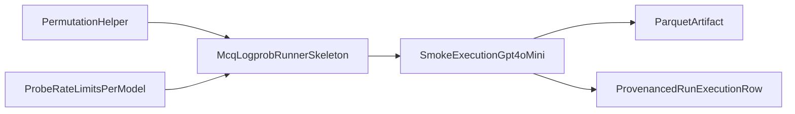

# MCQ Logprob Runner Plan — Phase 1 (Foundations)

## Capability Classification
- `high-capability-required`

## Goal
- Land the Latin-square-correct permutation helper, runner skeleton with 429 retry, probe phase function, and a smoke-test execution against gpt-4o-mini.
- Phase 2 (orchestrator + 14-model run + docs) is a separate follow-up plan.

## Context and Gate Status
- Binding references read:
  - [`.plans/mcq_logprob_runner_spec.md`](.plans/mcq_logprob_runner_spec.md)
  - [`scratch/midterm2_clean_mcq_subset.md`](scratch/midterm2_clean_mcq_subset.md)
  - [`scratch/openrouter_logprobs_report.md`](scratch/openrouter_logprobs_report.md)
  - Current polymorphic method framework in:
    - [`src/study_query_llm/services/method_execution_service.py`](src/study_query_llm/services/method_execution_service.py)
    - [`src/study_query_llm/services/method_runtime_registry.py`](src/study_query_llm/services/method_runtime_registry.py)
    - [`src/study_query_llm/algorithms/inference_methods.py`](src/study_query_llm/algorithms/inference_methods.py)
    - [`scripts/register_inference_methods.py`](scripts/register_inference_methods.py)
    - [`src/study_query_llm/providers/openai_compatible_chat_provider.py`](src/study_query_llm/providers/openai_compatible_chat_provider.py)
- G0 status: A/B/C/D/E all `Yes` (with non-fatal note that effective returned top-logprobs depth can be lower than requested).

## Approach

- Keep single method identity (`inference.mcq_logprob.basic@0.1`) with `permutation_strategy` and `format_idx` as parameters.
- Build only Phase 1 foundations: permutation correctness, retry semantics, probe ramp logic, runtime wiring, and one smoke invocation.
- Defer production orchestration, full 14-model execution, and documentation sync to Phase 2.

## Steps

1. **Method registration/runtime wiring (Phase 1 scope)**
   - Add one method catalog entry in [`src/study_query_llm/algorithms/inference_methods.py`](src/study_query_llm/algorithms/inference_methods.py) for `inference.mcq_logprob.basic@0.1`.
   - Wire runtime registration in [`src/study_query_llm/services/method_runtime_registry.py`](src/study_query_llm/services/method_runtime_registry.py) and export in [`src/study_query_llm/services/method_runners/__init__.py`](src/study_query_llm/services/method_runners/__init__.py).
   - Keep registration path via [`scripts/register_inference_methods.py`](scripts/register_inference_methods.py).

2. **Permutation helper + Latin-square correction**
   - Implement permutation enumeration helper in [`src/study_query_llm/services/method_runners/mcq_logprob_basic.py`](src/study_query_llm/services/method_runners/mcq_logprob_basic.py) covering:
     - `full_120`
     - `latin_squares_25`
     - `single_latin_square_5`
   - Implement `latin_squares_25` with deterministic MOLS-based construction:
     - `cell(i,j) = (i + k*j) mod 5 + 1` for `k = 1,2,3,4`,
     - plus cyclic baseline `cell(i,j) = (i + j) mod 5 + 1`,
     - flatten rows deterministically to 25 unique permutations.

3. **Runner skeleton (minimal end-to-end path)**
   - Build [`src/study_query_llm/services/method_runners/mcq_logprob_basic.py`](src/study_query_llm/services/method_runners/mcq_logprob_basic.py) with:
     - Pydantic params model (`extra="forbid"`),
     - async runner signature `(parameters: dict, context: MethodRunnerContext) -> MethodRunnerResult`,
     - midterm subset filter logic per [`scratch/midterm2_clean_mcq_subset.md`](scratch/midterm2_clean_mcq_subset.md),
     - 429 retry state machine in inference loop:
       - exponential backoff `1s,2s,4s,8s`,
       - `Retry-After` precedence,
       - retry cap.
   - Wire a minimal skeleton inference loop through `InferenceService` that writes a parquet artifact and returns `MethodRunnerResult` (Phase 1 foundation, not production full-loop behavior).

4. **Probe phase function (no orchestrator yet)**
   - Implement `probe_rate_limits_per_model(models, target_concurrencies) -> dict[str, ProbeResult]` in a reusable Phase 1 surface (runner module or adjacent helper module under `src/study_query_llm/services/method_runners/`).
   - Include:
     - reachability check behavior,
     - ramp tiers,
     - tier acceptance rule (`<=25%` post-retry 429 rate),
     - resolved concurrency selection.

5. **Phase 1 tests**
   - Add/update [`tests/test_services/test_mcq_logprob_basic.py`](tests/test_services/test_mcq_logprob_basic.py):
     - params boundary validation,
     - permutation determinism,
     - Latin-square distinctness guard:
       - `assert len(set(tuple(p) for p in latin_squares_25_indices())) == 25`,
     - 429 retry state machine (`Retry-After` precedence + retry cap),
     - filter behavior on representative fixture.
   - Add/update tests for probe ramp acceptance logic (same file or adjacent service test file under `tests/test_services/`).

6. **Smoke execution gate**
   - Run one smoke invocation against `openai/gpt-4o-mini` with `permutation_strategy="single_latin_square_5"` (~5 calls).
   - Verify smoke output includes a valid parquet artifact and a `provenanced_runs` execution row.
   - `phase_marker: PHASE_1_COMPLETE`

## Deferred to Phase 2 (separate follow-up plan)
- Full orchestrator script (`scripts/run_mcq_logprob_experiment.py`)
- `--skip-probe`, `--probe-max-age-hours`, `--max-runtime-hours`, `--max-spend` flag handling
- Pre-flight spend and runtime estimation
- 14-model split orchestration with exclusion handling and `>3` excluded halt
- Orchestrator-level tests (model list exactness, strategy split, halt thresholds, skip-probe reuse)
- Docs sync (`docs/living/API_CURRENT.md`, `docs/living/CURRENT_STATE.md`, `docs/review/DOC_PARITY_LEDGER.md`)

## Phase 1 Evidence Targets
- Method registration + runtime wiring exists for `inference.mcq_logprob.basic@0.1`.
- Runner params model enforces `extra="forbid"` and runner signature matches `(parameters, context) -> MethodRunnerResult`.
- Permutation helper exposes `full_120`, `latin_squares_25`, `single_latin_square_5`.
- MOLS-based `latin_squares_25` yields 25 distinct permutations, guarded by unit test assertion.
- 429 retry state machine honors `Retry-After` precedence and retry cap.
- Probe function `probe_rate_limits_per_model(...)` implements reachability + ramp + tier acceptance logic.
- Smoke invocation against `openai/gpt-4o-mini` produces parquet artifact and `provenanced_runs` execution row.

## Phase 1 Todo List
- [ ] Add method catalog entry + runtime registry wiring for `inference.mcq_logprob.basic@0.1`.
- [ ] Implement permutation helper with corrected MOLS-based `latin_squares_25`.
- [ ] Implement runner skeleton with boundary validation, subset filtering, and 429 retry state machine.
- [ ] Implement `probe_rate_limits_per_model(...)` with ramp acceptance logic.
- [ ] Add/update Phase 1 unit tests (including 25-distinctness assertion).
- [ ] Execute and validate smoke run (`openai/gpt-4o-mini`, `single_latin_square_5`).

## File Breakdown (Phase 1)
- Method entry: [`src/study_query_llm/algorithms/inference_methods.py`](src/study_query_llm/algorithms/inference_methods.py)
- Runner: [`src/study_query_llm/services/method_runners/mcq_logprob_basic.py`](src/study_query_llm/services/method_runners/mcq_logprob_basic.py)
- Runtime registry wiring: [`src/study_query_llm/services/method_runtime_registry.py`](src/study_query_llm/services/method_runtime_registry.py)
- Registration script: [`scripts/register_inference_methods.py`](scripts/register_inference_methods.py)
- Tests:
  - [`tests/test_services/test_mcq_logprob_basic.py`](tests/test_services/test_mcq_logprob_basic.py)
  - [`tests/test_services/test_method_runtime_registry.py`](tests/test_services/test_method_runtime_registry.py)

## Validation
- Register methods and verify runtime registry contains the new method identity.
- Run Phase 1 service-level tests for:
  - params boundary validation,
  - permutation determinism and 25-distinctness assertion,
  - 429 retry state machine behavior,
  - subset filter behavior,
  - probe ramp acceptance logic.
- Execute Phase 1 smoke invocation and verify:
  - parquet artifact exists and is readable,
  - one `provenanced_runs` execution row is written for the smoke invocation.

## Halt Conditions
- Latin-square distinctness test fails (`!= 25` unique permutations).
- Retry state machine does not honor `Retry-After` precedence or retry cap.
- Probe ramp acceptance logic fails tests.
- Smoke invocation fails to produce both parquet artifact and `provenanced_runs` execution row.
- Smoke invocation returns hard-fail auth/model-not-found (`401/403/404`) for `openai/gpt-4o-mini`.

## Open Questions
- None introduced by this update.

## Out of Scope (Phase 1)
- Full orchestrator implementation and CLI flags (`--skip-probe`, `--probe-max-age-hours`, `--max-runtime-hours`, `--max-spend`)
- 14-model orchestration run, exclusion halt thresholds, and orchestration-level tests
- Documentation sync updates
- Midterm3 (`imported_run_id=1051`) and additional prompt formats (`format_idx=1` / `format_idx=2`)
- Multi-answer runner and downstream analysis
