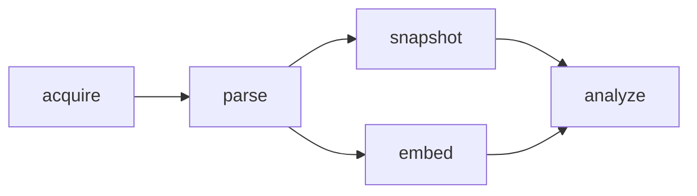

# Data Pipeline (Canonical Spec)

Status: living
Owner: documentation-maintainers + pipeline maintainers  
Last reviewed: 2026-04-30

This document defines the implemented, canonical five-stage dataset pipeline and its persistence/idempotency contracts.

## Pipeline Shape

Canonical order: `acquire -> parse -> snapshot -> embed -> analyze`.

## Locked Contract Decisions

- `embed` persists and reuses only dataframe-level `full` matrices.
- Non-`full` representations (for example `label_centroid`) are derived inside `analyze` from snapshot-sliced full vectors.
- `analyze` always takes `snapshot_group_id`; `embedding_batch_group_id` is method-contract-driven (`MethodDefinition.input_schema.required_inputs.embedding_batch`) and defaults to required when unspecified.
- Snapshot sampling is deterministic-only: `sample_n`/`sample_fraction` require `sampling_seed`.
- Analysis fingerprinting includes explicit representation identity and `input_snapshot_group_id`.
- HDBSCAN deterministic-defaults policy: `hdbscan_metric=cosine`, `hdbscan_random_state=0`, `hdbscan_core_dist_n_jobs=1`, `hdbscan_approx_min_span_tree=false` unless explicitly overridden.

## Stage Contracts

### Stage 1: `acquire`

- **Input:** `DatasetAcquireConfig` source spec.
- **Output group:** `dataset`
- **Output artifacts:** `dataset_acquisition_file`, `dataset_acquisition_manifest`
- **Idempotency key:** source-derived `content_fingerprint`
- **Key metadata:** `dataset_slug`, `content_fingerprint`, `manifest_hash`

### Stage 2: `parse`

- **Input:** `dataset_group_id`, parser callable + stable parser identity.
- **Output group:** `dataset_dataframe`
- **Output artifacts:** `dataset_canonical_parquet`, `dataset_dataframe_manifest`
- **Idempotency key:** `(source_dataset_group_id, parser_id, parser_version, dataframe_hash)`
- **Key metadata:** `source_dataset_group_id`, `parser_id`, `parser_version`, `dataframe_hash`, `row_count`

### Stage 3: `snapshot`

- **Input:** `dataframe_group_id`, `SubquerySpec`
- **Output group:** `dataset_snapshot`
- **Output artifacts:** `dataset_subquery_spec` (`subquery_spec.json`)
- **Idempotency key:** `(source_dataframe_group_id, spec_hash, resolved_index_hash)`
- **Determinism rule:** reject unseeded sampling (`sampling_seed` required whenever sampling is requested)
- **Category filter contract (`SubquerySpec.category_filter`):**
  - Matches against top-level keys in parsed `extra_json` (not JSONPath-style `extra.<key>` paths).
  - Semantics are AND across keys and IN within each key list.
  - Matching uses strict typed equality after `json.loads` (no coercion): `1` != `1.0` != `"1"`, and `True` != `1`.
  - Allowed candidate value types are `str`, `int`, `float`, `bool`, and `null` (`None`).
  - Missing-key vs `null` caveat: matching uses `parsed.get(key)`, so filtering on `null` currently matches both explicit `null` values and rows where the key is absent.
  - Empty outer dictionaries and empty inner lists are rejected at `SubquerySpec` construction.
- **Key metadata:** `source_dataframe_group_id`, `spec_hash`, `resolved_index_hash`, `row_count`

### Stage 4: `embed`

- **Input:** `dataframe_group_id`, embedding engine/provider
- **Output group:** `embedding_batch`
- **Output artifacts:** `embedding_matrix` only
- **Representation policy:** only `full` is accepted
- **Dataset key:** `dataframe:<dataframe_group_id>:full`
- **Idempotency key:** existing `embedding_matrix` lookup over
  `(dataset_key, embedding_engine, provider, entry_max, key_version)`
- **Key metadata:** `source_dataframe_group_id`, `dataset_key`, `representation=full`

### Stage 5: `analyze`

- **Input:** `snapshot_group_id`, optional `embedding_batch_group_id` (required when method contract declares `embedding_batch=true`), method/config
- **Output group:** `analysis_run`
- **Output artifacts:** method-defined analysis artifacts
- **Persistence contract:** dual-write to canonical execution provenance (`provenanced_runs`) and analysis outputs (`analysis_results`)
- **Fingerprint contract:** includes representation identity and `input_snapshot_group_id`
- **Alignment rule:** in embedding-backed mode, embeddings and texts are sliced in identical resolved-index order
- **Mode contract:** embedding methods keep dual lineage (`snapshot` + `embedding_batch`); snapshot-only methods skip embedding loads/dependencies and set `config_json.analysis_input_mode=snapshot_only`

## Core Data Structures

- `SnapshotRow`: normalized parser output row shape.
- `SubquerySpec`: declarative snapshot query with deterministic sampling policy; supports `label_mode`, top-level `filter_expr`, and `category_filter` membership predicates over `extra_json`.
- `StageResult`: standard stage return payload.

## Parser Identity Contract

Source-spec registry entries with a default parser must include:

- `default_parser`
- `default_parser_id`
- `default_parser_version`

Default parser identity is defined in each dataset source-spec module and consumed by `parse` for stable idempotency.

## Lineage Links

Expected `depends_on` links:

- `dataset_dataframe -> dataset`
- `dataset_snapshot -> dataset_dataframe`
- `embedding_batch -> dataset_dataframe`
- `analysis_run -> dataset_snapshot`
- `analysis_run -> embedding_batch` (embedding-required methods only)

## Persistence Guardrails

- Public stage entrypoints persist through `run_stage`.
- CI lint enforces:
  - public stage functions call `run_stage` (or are explicitly allowlisted),
  - stage group-type creation boundaries are not bypassed in unauthorized files.
- Lint script: `scripts/check_persistence_contract.py`

## BANK77 Reference Flow

Canonical entrypoint: `scripts/run_bank77_pipeline.py`

Execution shape:

1. `acquire` BANK77 source spec
2. `parse` into canonical dataframe
3. `snapshot` with subquery spec
4. `embed` dataframe `full` matrix
5. `analyze` with dual input (`snapshot`, `embedding_batch`) for embedding-backed methods (current BANK77 path)

The script supports:

- deterministic `run_key` generation for HDBSCAN-style analyses,
- idempotent stage reuse controls (`--force-*` flags),
- analysis representation selection at analyze-time (`full` / `label_centroid` alias `intent_mean`).

## Operator Cutover Runbook (Destructive)

When executing environment cutover:

1. Archive: DB backup to blob + inventory verification.
2. Wipe: archive/wipe/reset sequence per DB guardrails.
3. Reseed: run canonical BANK77 five-stage flow.
4. Validate: rerun with same config and verify no unexpected new groups/artifacts/runs.

Use `docs/runbooks/README.md` as the entrypoint for DB/tunnel/restore safety procedures.

## Acceptance Checklist

The pipeline contract is healthy when:

- same acquire inputs reuse `dataset`;
- same parse identity and data reuse `dataset_dataframe`;
- same snapshot spec and resolved index reuse `dataset_snapshot`;
- snapshots over same dataframe reuse the same dataframe-level `full` embedding matrix identity;
- embedding-backed analyze shows aligned text/vector slicing for resolved indices;
- snapshot-only analyze can run without embedding dependencies when method contract declares `required_inputs.embedding_batch=false`;
- representation changes yield distinct analysis fingerprints/runs;
- persistence lint and tests pass.
