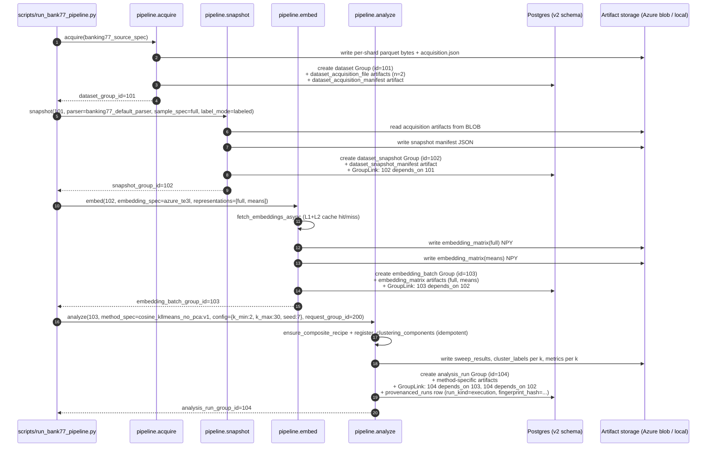
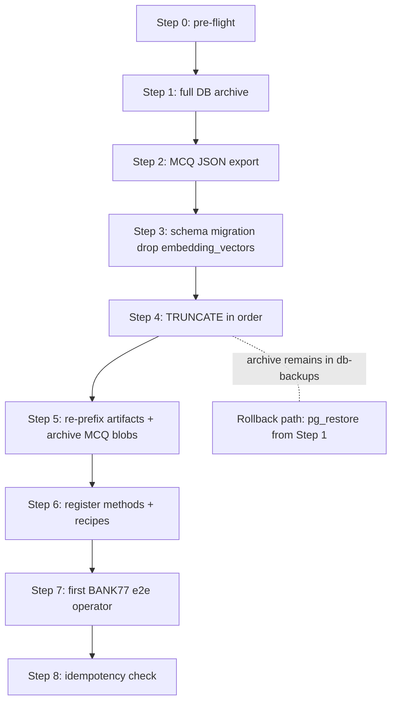

# Data Pipeline Rebuild — Design Doc

Status: **draft for ratification (revised 2026-04-17 post-peer-review)**
Owner: documentation-maintainers + data-pipeline-rebuild driver
Last reviewed: 2026-04-17 (revised same day)
Lifecycle: transient through rebuild; on implementation completion, rename/move to `docs/DATA_PIPELINE.md` (or `docs/living/DATA_PIPELINE.md`) and replace both [`docs/DATASET_ACQUISITION_LAYER0.md`](DATASET_ACQUISITION_LAYER0.md) and [`docs/DATASET_SNAPSHOT_PROVENANCE.md`](DATASET_SNAPSHOT_PROVENANCE.md) as the canonical pipeline spec.

This doc is **descriptive of the intended end-state**, not a how-to. The implementation plan (separate session, after ratification) will turn each section into ordered, verifiable steps.

---

## 1. Executive summary + scope

### Problem statement

The repo currently has two parallel, uncomposed data ingestion paths:

- **Layer 0 acquisition** (per [`docs/DATASET_ACQUISITION_LAYER0.md`](DATASET_ACQUISITION_LAYER0.md), implemented in [`src/study_query_llm/datasets/acquisition.py`](../src/study_query_llm/datasets/acquisition.py)) records pinned URLs, SHA-256, and timestamps for raw download provenance, but has **no `dataset_snapshot` consumers** in the materialized data.
- **Layer 1 dataset snapshots** (per [`docs/DATASET_SNAPSHOT_PROVENANCE.md`](DATASET_SNAPSHOT_PROVENANCE.md), with the BANK77 worked example in [`scripts/create_bank77_snapshot_and_embeddings.py`](../scripts/create_bank77_snapshot_and_embeddings.py)) loads datasets directly via the HuggingFace `datasets` library and creates `dataset_snapshot` groups, **bypassing Layer 0 entirely**.

The two were defined as a layered protocol in the docs, but never composed in the code. This is a glue-layer problem, not a substrate problem: the v2 schema, services, and embedding cache stack are sound and lane-neutral.

Compounding this, the existing `raw_calls` capture (~2-3 GB) is analytically thin because earlier work persisted analysis outcomes into ad-hoc files rather than canonical execution records — there is no clean, queryable mapping from a result back to the dataset+method+config that produced it.

### Decision

Wipe data, keep code where the code is correct, and rebuild the data pipeline as **four explicitly named, composable stages** that all write canonical provenance through the existing services:

```
acquisition → snapshot → embedding → analysis
```

The "Layer 0 / Layer 1" naming is dropped; the pipeline is described in domain terms going forward.

### Scope of this design doc

- Define stage names, responsibilities, boundaries, and APIs.
- Define the persistence contract every stage must satisfy.
- Define canonical naming (`dataset_key`, group names, artifact paths).
- Audit the v2 schema (14 tables) and decide keep/drop/simplify per table.
- Specify the source spec contract that the acquisition stage consumes.
- Walk BANK77 end-to-end as the validating example.
- Map documentation reorganization (file-by-file) and migration sequencing (irreversible-step order with verification + rollback).
- Specify acceptance criteria for moving to the implementation plan.

### Out of scope (recap; expanded in §13)

- Streaming acquisition or reference-only mode.
- MCQ refactor / retire / re-import.
- Method/algorithm catalog redesign.
- Writing implementation code, schema migrations, or commits during this design phase.

---

## 2. Pre-decided inputs (recap)

These are locked from the prior design conversation. The doc must respect them; it does not re-litigate them.

1. **Wipe data, keep code.** Archive first via [`scripts/dump_postgres_for_jetstream_migration.py`](../scripts/dump_postgres_for_jetstream_migration.py) + [`scripts/upload_jetstream_pg_dump_to_blob.py`](../scripts/upload_jetstream_pg_dump_to_blob.py) to the Azure `db-backups` container.
2. **MCQ data is exported once and read-only after wipe.** Extend [`scripts/backup_mcq_db_to_json.py`](../scripts/backup_mcq_db_to_json.py) to dump MCQ runs + linked `provenanced_runs` + `analysis_results` to local + Azure blob. No re-import to the new system. Future MCQ work is deferred.
3. **Substrate broadly untouched, with explicit carve-outs.** Keep:
   - [`src/study_query_llm/db/`](../src/study_query_llm/db/) (v2 models, repository, connection, migrations infra) — **carve-out:** `EmbeddingVector` model class is removed and the `embedding_vectors` table is dropped per §7. No other model/service surface changes.
   - [`src/study_query_llm/services/`](../src/study_query_llm/services/) (provenance, artifact, method, provenanced-run, sweep, jobs) — **carve-out:** `ProvenanceService` gains two new additive methods, `create_analysis_run_group(...)` and `create_analysis_request_group(...)`, per §4.4. The legacy `create_run_group(...)` is left intact.
   - [`src/study_query_llm/services/embeddings/`](../src/study_query_llm/services/embeddings/) (all 3 cache layers: file/L1, DB/L2, matrix-artifact/L3)
   - [`src/study_query_llm/storage/`](../src/study_query_llm/storage/) (local + Azure blob backends)
   - [`src/study_query_llm/providers/`](../src/study_query_llm/providers/) (Azure OpenAI / OpenAI / Hyperbolic adapters)
   - [`src/study_query_llm/datasets/source_specs/`](../src/study_query_llm/datasets/source_specs/) (per-source URL/spec modules) — **carve-out:** registry gains a `default_parser` field per §8; `ParserCallable` is defined in a new neutral module `src/study_query_llm/datasets/source_specs/parser_protocol.py` to avoid import cycles (see §4.5).
   - [`src/study_query_llm/datasets/acquisition.py`](../src/study_query_llm/datasets/acquisition.py) — **carve-out:** add a pure helper `content_fingerprint(...)` for stage-1 idempotency per §4.1; existing functions unchanged.
   - [`src/study_query_llm/algorithms/`](../src/study_query_llm/algorithms/) (clustering recipes, sweep code)
4. **Rewrite the entrypoint/glue layer.** This is the only code that changes (other than the schema audit deletions): scripts and per-dataset glue modules. Specifically rewrite or replace:
   - [`scripts/create_bank77_snapshot_and_embeddings.py`](../scripts/create_bank77_snapshot_and_embeddings.py)
   - [`scripts/create_dataset_snapshots_286.py`](../scripts/create_dataset_snapshots_286.py)
   - [`scripts/record_dataset_download.py`](../scripts/record_dataset_download.py)
   - per-dataset glue (e.g., [`src/study_query_llm/utils/estela_loader.py`](../src/study_query_llm/utils/estela_loader.py))
5. **Four named stages: acquisition → snapshot → embedding → analysis.** "Layer 0 / Layer 1" naming is retired.
6. **Snapshot stage takes a row iterator.** Future-proofs streaming/reference modes without committing to either now.
7. **BANK77 is the end-to-end composed-pipeline demo.** Acceptance is gated on BANK77 running clean through all four stages with full lineage.
8. **Out of scope for design plan**: streaming acquisition, reference-only mode, MCQ refactor.

---

## 3. Stage architecture

Four stages, each with a stable contract: **inputs, outputs, group type written, artifacts written, lineage links written**. Stages communicate exclusively through `Group` IDs and `CallArtifact` URIs — never in-memory blobs that bypass the artifact store.

### Stage table

| # | Stage | Input | Output (group_type) | Output artifacts (artifact_type) | Lineage links (parent → child, link_type) |
|---|-------|-------|---------------------|----------------------------------|--------------------------------------------|
| 1 | **acquisition** | source spec slug | `dataset` | `dataset_acquisition_manifest`, `dataset_acquisition_file` (n) | (none — root) |
| 2 | **snapshot** | `dataset.id` + sample/parser config | `dataset_snapshot` | `dataset_snapshot_manifest` | `dataset_snapshot → dataset` (`depends_on`) |
| 3 | **embedding** | `dataset_snapshot.id` + embedding spec | `embedding_batch` | `embedding_matrix` (full), `embedding_matrix` (means/centroids/etc., one per representation) | `embedding_batch → dataset_snapshot` (`depends_on`) |
| 4 | **analysis** | `embedding_batch.id` (or `dataset_snapshot.id`) + method spec | `analysis_run` (single canonical type) | method-specific (`metrics`, `cluster_labels`, `representatives`, ...) + always a `provenanced_runs` row | `analysis_run → embedding_batch` (`depends_on`); `analysis_run → dataset_snapshot` (`depends_on`) when applicable |

Notes:

- The new `analysis_run` group type **subsumes and replaces** the legacy `clustering_run` / `mcq_run` / `clustering_step` types for any work in the new pipeline. (Existing legacy rows are not migrated; the export-once approach for MCQ covers their visibility need.)
- Every stage produces **at least one** Group and **at least one** Artifact. No stage may return without persisting both.
- Every stage **idempotently re-uses** an existing matching Group when the input fingerprint and config match (see §5 for what "match" means).

### Mermaid: stage flow + persistence

```mermaid
flowchart LR
    SRC[Source spec module<br/>e.g., bank77.py]
    SRC -->|slug + FileFetchSpecs| ACQ[Stage 1: acquisition]
    ACQ -->|writes| DG[(dataset Group<br/>+ acquisition_manifest<br/>+ acquisition_file artifacts)]
    DG -->|dataset_group_id| SNAP[Stage 2: snapshot]
    SNAP -->|writes| SG[(dataset_snapshot Group<br/>+ snapshot_manifest artifact)]
    SG -.depends_on.-> DG
    SG -->|snapshot_group_id| EMB[Stage 3: embedding]
    EMB -->|writes| EBG[(embedding_batch Group<br/>+ embedding_matrix artifacts<br/>full / means / etc.)]
    EBG -.depends_on.-> SG
    EBG -->|embedding_batch_group_id| ANL[Stage 4: analysis]
    ANL -->|writes| ARG[(analysis_run Group<br/>+ method-specific artifacts<br/>+ provenanced_runs row)]
    ARG -.depends_on.-> EBG
    ARG -.depends_on.-> SG
```



### Why this shape

- **Composable, not nested.** Each stage has one job; cross-stage caching falls out of `dataset_key` lookup naturally.
- **Lineage is queryable in one direction.** From any analysis result, walk `depends_on` links back to embedding → snapshot → dataset.
- **Idempotency boundary is explicit.** Re-running a stage with the same inputs returns the existing group; new inputs create a new group.
- **MCQ flow already follows this shape.** `mcq_run_persistence.py` writes a `mcq_run` group + a `provenanced_runs` row; the only difference is naming. Aligning new work to `analysis_run` keeps the canonical contract uniform.

---

## 4. Stage API shapes + parser interface

All four stages are normal Python functions exposed as module-level callables in a new `src/study_query_llm/pipeline/` package. They share the same wrapper (see §5) that enforces the persistence contract. Signatures below are illustrative pseudocode — the implementation plan finalizes parameter names.

### 4.1 Stage 1 — `acquire(source_spec, *, force_refresh=False) -> int`

```python
def acquire(
    source_spec: AcquireSourceSpec,
    *,
    force_refresh: bool = False,
) -> int:  # returns dataset_group_id
    ...
```

- `source_spec` resolves a slug to: file specs (List[FileFetchSpec]), source metadata, default parser hint. See §8.
- Calls existing `download_acquisition_files` + `build_acquisition_manifest` (no rewrite).
- Persists via `ArtifactService.store_group_blob_artifact` for each file (artifact_type=`dataset_acquisition_file`) and a separate `dataset_acquisition_manifest` JSON artifact.
- **Idempotency: gated by `content_fingerprint`, not `manifest_hash`.**
  - `manifest_hash` (computed by `acquisition_manifest_sha256` over the output of `build_acquisition_manifest`) includes `acquired_at` (an ISO timestamp) and runner identity, so it is **not** deterministic across re-acquisitions even when the bytes are byte-identical. It remains the correct on-disk record of "what was acquired and when" but cannot serve as a cache key.
  - `content_fingerprint(source_spec) -> str` is a new pure helper added to [`acquisition.py`](../src/study_query_llm/datasets/acquisition.py). It excludes any timestamp / host / runner field and is computed from `(slug, source.pinning_identity, sorted_pairs(rel_path, sha256_when_known else url))`. The fingerprint is computable **before** downloading whenever the source spec carries per-file SHAs (e.g., `huggingface_resolve` + commit SHA + revision-locked SHAs). When per-file SHAs are unknown until after download, the fingerprint is computed from the post-download SHAs and idempotency degrades to "skip writing a duplicate group" rather than "skip downloads".
  - The fingerprint is persisted on the `dataset` group's `metadata_json` (`content_fingerprint: <hex>`) and queried via existing `ProvenanceService` group lookups. No new index, no schema change.
  - If a `dataset` group exists whose stored `content_fingerprint` matches what would be acquired now, return that group's id (skip downloads when possible) unless `force_refresh=True`.
- Returns: `dataset_group_id`.

### 4.2 Stage 2 — `snapshot(dataset_group_id, *, parser, sample_spec, label_mode) -> int`

```python
def snapshot(
    dataset_group_id: int,
    *,
    parser: ParserCallable,                # Iterable[Row] from acquisition files
    sample_spec: SampleSpec,               # name, sample_size, sampling_method, sampling_seed
    label_mode: Literal["labeled", "unlabeled"],
) -> int:  # returns snapshot_group_id
    ...
```

- `parser` is a callable (registered via the source spec; see §8) that takes the acquisition group's artifact URIs and yields rows: `Iterable[SnapshotRow]`.
- `SnapshotRow` shape (locked):
  ```python
  @dataclass(frozen=True)
  class SnapshotRow:
      position: int            # stable 0..N-1 ordering within the snapshot
      source_id: str | int     # original row id from the source dataset
      text: str                # canonical text payload
      label: int | None        # integer label when label_mode == "labeled"
      label_name: str | None   # optional human-readable label (e.g., "card_arrival")
      extra: dict | None       # optional source-specific fields, never required by downstream stages
  ```
- The stage materializes the iterator, persists via `ArtifactService.store_dataset_snapshot_manifest` (existing API; no change), creates a `dataset_snapshot` group via `ProvenanceService.create_dataset_snapshot_group`, and links `dataset_snapshot → dataset` (`depends_on`).
- Idempotency: if a `dataset_snapshot` group exists for the same `(dataset_group_id, sample_spec, parser identity, label_mode)` tuple with the same `manifest_hash`, return its id.
- The row-iterator API is the future-streaming hook — today the iterator materializes immediately; a future change can stream-and-checkpoint without changing the public signature.

### 4.3 Stage 3 — `embed(snapshot_group_id, *, embedding_spec, representations) -> int`

```python
def embed(
    snapshot_group_id: int,
    *,
    embedding_spec: EmbeddingSpec,         # provider, deployment, dimensions, key_version
    representations: list[Representation], # ["full", "intent_means", ...]
) -> int:  # returns embedding_batch_group_id
    ...
```

- `EmbeddingSpec` is locked to (`provider`, `deployment`, `dimensions`, `encoding_format`, `key_version`).
- Reads the snapshot manifest, drives existing `fetch_embeddings_async` (which transparently uses L1+L2 caches), then for each representation materializes the appropriate matrix:
  - `full` → `N × d` from per-row vectors.
  - `intent_means` (or generally `group_means`) → `K × d` mean per integer label.
  - Future: `centroids`, `pooled_quantiles`, etc. — additive only.
- For each representation: `ArtifactService.store_embedding_matrix(...)` with `dataset_key` per §6.
- Creates one `embedding_batch` group per call; links `embedding_batch → dataset_snapshot` (`depends_on`).
- Idempotency: for each representation, `ArtifactService.find_embedding_matrix_artifact(...)` (existing API) — if hit, reuse the URI; only create new artifact rows for misses. Group reuse is allowed when **all** representations match.

### 4.4 Stage 4 — `analyze(input_group_id, *, method_spec, config, request_group_id=None) -> int`

```python
def analyze(
    input_group_id: int,                   # embedding_batch_group_id, OR dataset_snapshot_group_id
    *,
    method_spec: MethodSpec,               # name + version (resolves via MethodService)
    config: dict,                          # per-method config; recipe_hash injected here
    request_group_id: int | None = None,   # umbrella request group; auto-created for one-offs
) -> int:  # returns analysis_run_group_id
    ...
```

- Resolves the method via `MethodService.get_method(name, version)` (active-by-default).
- Executes the method (e.g., `algorithms/sweep.run_sweep`) and writes (in this strict order — see also §5):
  1. **DB identity claim first.** Inside a single `session_scope`: create the `analysis_run` Group via the *new* `ProvenanceService.create_analysis_run_group(...)` method, write the `(request_group_id, run_key, run_kind)` row to `provenanced_runs` via `ProvenancedRunService.record_method_execution`, and write the `depends_on` link(s). Flush. This claims canonical identity for the run **before** any blob bytes are written. The `(request_group_id, run_key, run_kind)` unique index is the race resolver.
  2. **Artifacts second.** Method-specific artifacts via existing `ArtifactService.store_*` methods, but using deterministic logical paths derived from the just-claimed `analysis_run.id` + `step_name`. Writes are overwrite-safe because the path is fully determined by claimed identity. If a worker crashes between identity-claim and artifact-write, retry produces the same logical path and overwrites cleanly; there is no race window that produces a duplicate `call_artifacts` row.
  3. **Status update last.** After all artifact writes succeed, flip `provenanced_runs.run_status` from `running` to `completed`. On exception, mark `failed` and re-raise.
- **New service methods (additive, not replacements).**
  - `ProvenanceService.create_analysis_run_group(method_name, method_version, input_group_id, config_hash, recipe_hash, *, name=None, description=None) -> int` — creates a Group with `group_type='analysis_run'`. This is intentionally a new method, **not** a generalization of the existing `create_run_group(...)` (which is hard-wired to emit `clustering_run` groups for legacy back-compat per [`src/study_query_llm/services/provenance_service.py`](../src/study_query_llm/services/provenance_service.py) lines 96-134). Generalizing the legacy method would have a wide blast radius on existing clustering callers; adding a new method keeps the change surgical.
  - `ProvenanceService.create_analysis_request_group(name, *, description=None, metadata_json=None) -> int` — creates a Group with `group_type='analysis_request'` (also new). Used by `run_stage` to auto-create singleton request groups for one-off analyses (see `request_group_id` convention below).
- **`request_group_id` convention.** Stage 4 always writes a non-null `request_group_id` so the unique index is meaningful:
  - For sweep-driven analyses: caller passes the existing sweep request group id (created by `SweepRequestService.create_request(...)`).
  - For one-off / standalone analyses (e.g., the BANK77 demo's "run once for inspection"): if `request_group_id` is `None`, `run_stage` auto-creates a singleton request group of type `analysis_request` via `create_analysis_request_group(...)` **before** the analysis run's identity is claimed. This guarantees every `analysis_run` has an enclosing request group even outside the sweep/MCQ pipelines.
  - The illustrative `request_group_id=200` in §9.1 corresponds to such an auto-created singleton, not a sweep request.
- Idempotency: enforced at `provenanced_runs` via the `(request_group_id, run_key, run_kind)` unique index. Re-runs with the same fingerprint surface as constraint conflicts and are resolved by reusing the existing row (return its `analysis_group_id`).

### 4.5 Parser interface (used by stage 2)

Parsers are the only stage-specific callable shape. Implementations are defined in each source-spec module, but the **type** lives in a neutral module to break the import cycle that would otherwise form between `pipeline/` and `datasets/source_specs/`.

```python
# src/study_query_llm/datasets/source_specs/parser_protocol.py  (NEW, neutral location)
ParserCallable = Callable[["ParserContext"], Iterable["SnapshotRow"]]

@dataclass(frozen=True)
class ParserContext:
    dataset_group_id: int
    artifact_uris: dict[str, str]   # relative_path -> URI from acquisition manifest
    artifact_dir_local: Path | None # optional local materialization for parsers that need filesystem access
    source_metadata: dict           # passthrough from the source spec
```

- **Where the type lives.** `ParserCallable` and `ParserContext` are defined in a new module `src/study_query_llm/datasets/source_specs/parser_protocol.py`, **not** in `src/study_query_llm/pipeline/types.py`. Reason: source-spec modules already live under `datasets/source_specs/`; if `ParserCallable` lived in `pipeline/`, the registry (which the source specs import) would have to import from `pipeline/`, which in turn imports source specs — a circular import. Keeping the parser protocol next to the source-spec registry breaks that cycle and matches the rule "the protocol travels with whoever defines instances of it." `SnapshotRow` may safely live in `pipeline/types.py` because the parser protocol references it only as a forward string annotation (`Iterable["SnapshotRow"]`); the actual import happens at the call site inside `pipeline/stages/snapshot.py`.
- A parser **must not** make network calls. All bytes have to come from acquisition artifacts. This is what closes the loop — stage 2 is deterministic given (dataset_group_id, parser identity, sample_spec).
- Parsers are registered in source spec modules, not centrally — each source owns its parsing logic. The registry in [`src/study_query_llm/datasets/source_specs/registry.py`](../src/study_query_llm/datasets/source_specs/registry.py) gains a `default_parser` field; callers may override.

### 4.6 Parser dependency choice

For BANK77 the parser will use `pyarrow` (not `pandas`, not the HuggingFace `datasets` library) to read parquet from the artifact bytes:

- `pyarrow` is the smallest viable dependency for parquet → row iterator and is already a transitive dep of any HF or pandas stack.
- Avoiding `pandas` keeps memory profile predictable (no implicit DataFrame materialization).
- Avoiding the HF `datasets` library inside the parser is the whole point: that library re-fetches; we want to drive parsing from acquired bytes only.
- Pure-CSV parsers (e.g. AuSeM) use stdlib `csv`. JSONL uses stdlib `json`. Excel uses `openpyxl` only when unavoidable.

Concrete dependency adds expected: `pyarrow` (already commonly present; verify in implementation plan).

---

## 5. Persistence-contract enforcement

This is the most consequential decision in the doc. The current system has all the right pieces (`ProvenancedRunService`, `MethodService`, `ArtifactService`, `ProvenanceService`) but enforcement is **by convention only**, which is exactly how we ended up with the Layer 0/1 split that never composed. The new pipeline must make non-compliance hard.

### Options considered

**A. Runtime base class for stages.** A `Stage` base class subclassed per stage. Pros: visible structure. Cons: harder to compose ad-hoc; you can still write a function that does the work without subclassing.

**B. Job-runner gate.** All four stages run only via the existing `OrchestrationJob` runner. Pros: matches MCQ + clustering pattern; reuses the orchestration_jobs schema and lease logic. Cons: heavyweight for the acquisition+snapshot stages, which are small/sequential and don't need worker leasing.

**C. DB-level constraint (triggers).** Postgres triggers that reject `analysis_run` group writes lacking a `depends_on` edge to an `embedding_batch` (etc.). Pros: most rigorous. Cons: hidden behavior at the DB layer, fragile to migrate, and SQLAlchemy-side test ergonomics suffer.

**D. CI lint only.** Static check that scans for direct calls to lower-level services outside of the pipeline package. Pros: zero runtime cost. Cons: easy to evade; not a real guarantee at execution time.

**E. Stage runner function (recommended).** A single `run_stage(...)` helper in the new `pipeline/` package that is the only sanctioned execution path. It:

1. Validates inputs (group types match what the stage expects).
2. Computes the stage fingerprint **before** execution (for stage 1, the `content_fingerprint` per §4.1; for stage 2, the snapshot manifest hash; for stage 3, the embedding-spec hash; for stage 4, the canonical run fingerprint).
3. Calls the appropriate find-existing helper (`ProvenanceService.find_dataset_group_by_content_fingerprint` for stage 1, `ArtifactService.find_*` for stages 2-3, `provenanced_runs` lookup for stage 4) to short-circuit on idempotent hit.
4. On miss, calls the stage function (which returns the data to persist as a `StageResult` dataclass).
5. **Persistence ordering (strict):**
   - **(a) DB identity claim first.** Inside a single `session_scope`: create the Group, write the `depends_on` link(s), and (for stage 4) write the `provenanced_runs` row with `run_status='running'`. Flush. The `provenanced_runs` unique index resolves concurrent claims at this point.
   - **(b) Artifact writes second.** Bytes are written to deterministic logical paths derived from the just-claimed Group id (existing `ArtifactService` path-generation helpers already do this). Because the path is identity-derived, retries after a crash overwrite the same path and produce no duplicate `call_artifacts` rows.
   - **(c) Status update last (stage 4 only).** Flip `provenanced_runs.run_status` from `running` to `completed`. On exception inside (b) or (c), mark `failed` and re-raise.
   - This ordering is the answer to the "blob written but DB rolled back" race that exists in the current `ArtifactService` flow (see [`src/study_query_llm/services/artifact_service.py`](../src/study_query_llm/services/artifact_service.py) `_write_artifact_bytes` ↔ `_link_artifact_to_group`): claiming identity first ensures retries re-resolve to the same logical path; overwrite-safe writes mean orphan blobs cost storage but cannot create duplicate or inconsistent `call_artifacts` rows.
6. Returns the canonical group id.

Combined with **D** (lint that flags direct `create_group(group_type="dataset_snapshot", ...)` outside `pipeline/`), this gives runtime enforcement with low ceremony.

### Recommendation: E + D (stage-runner helper + CI lint)

- **Runtime helper** (`run_stage`): the only sanctioned creation path for the four stage group types. Stage functions are pure-ish: they take inputs, compute outputs, and return a `StageResult` dataclass; the helper handles all persistence.
- **CI lint** (`scripts/lint_pipeline_persistence.py` or pre-commit hook): rejects PRs that create `dataset` / `dataset_snapshot` / `embedding_batch` / `analysis_run` groups outside `src/study_query_llm/pipeline/`. The lint scans for imports + creation calls; allowlist is the pipeline package itself plus tests.
- **Schema-level idempotency** (already in place): the unique index `idx_provenanced_run_request_key_kind` on `(request_group_id, run_key, run_kind)` catches the most common analysis-stage duplication. We add a `dataset_snapshot.manifest_hash` uniqueness convention via metadata-key search (not a DB unique index — too brittle for evolving manifests; queried via existing `ArtifactService.find_*` patterns).

### Failure modes the contract catches

| Failure mode | How it's caught |
|--------------|-----------------|
| New code creates a `dataset_snapshot` outside the pipeline package | CI lint fails the PR |
| Stage runs but forgets the `depends_on` link | `run_stage` writes the link unconditionally; stage function can't skip it |
| Stage runs, writes group, then crashes before writing provenanced_run | All writes are in one DB transaction; rollback removes orphan group |
| Two workers run the same analysis concurrently | Unique index on `(request_group_id, run_key, run_kind)` rejects the second insert |
| Two snapshot calls produce different manifests for the same source+config | `find_*` reuse based on `manifest_hash`; mismatch surfaces in logs and creates a new group rather than overwriting (audit trail preserved) |

### Failure modes the contract does NOT catch (deliberate gaps)

- A stage function that returns wrong data (e.g., a snapshot whose `text` column contains labels). Caught by tests, not the contract.
- An algorithm that ignores its declared `parameters_schema`. Caught by tests, not the contract.
- Side-effectful imports that mutate state outside the pipeline. Out of scope; rely on code review.

### Open implementation questions (for the implementation plan, not this doc)

- Exact transaction boundary: single `session_scope` per `run_stage` call vs. nested savepoints per artifact write.
- CI lint hosting: pre-commit hook vs. GitHub Action vs. both.
- Whether `run_stage` should also write an `OrchestrationJob` row for stages 3 and 4 (consistency with MCQ flow) — leaning yes for stages 3+4, no for stages 1+2.

---

## 6. Canonical naming conventions

Naming is the second-most-leveraged decision after enforcement: it determines what cache hits look like, how groups are searchable, and how readable the logs are.

### 6.1 `dataset_key` format

Used by `ArtifactService.store_embedding_matrix` and `find_embedding_matrix_artifact`. Today usage is ad-hoc per script.

**Canonical format:**

```
snap:<snapshot_group_id>:<representation>
```

- `snap` is a fixed prefix denoting "snapshot-derived embedding matrix" (vs. future `raw:`, `aggr:`, etc.).
- `snapshot_group_id` is the integer Group id from stage 2. This is the unique anchor; since snapshot groups are immutable once created, this guarantees cache identity.
- `representation` is one of `full`, `means`, `centroids`, ... (extensible). The representation name is the contract; the matrix shape is recoverable from the artifact metadata (`shape`, `dtype`).

Examples:

- `snap:42:full` — full N×d matrix for snapshot 42.
- `snap:42:means` — K×d intent means for snapshot 42.

Caches keyed by `(dataset_key, embedding_engine, provider, entry_max, key_version)` — already the existing API contract — become predictable and queryable.

### 6.2 Group names

Pattern: `<stage_prefix>:<source_slug>:<short_id>` where `short_id` is the first 8 hex chars of the relevant content hash (manifest hash for stages 1-2, embedding spec hash for stage 3, run_key + config_hash for stage 4).

| Stage | Group type | Name pattern | Example |
|-------|-----------|--------------|---------|
| 1 | `dataset` | `acq:<slug>:<acq_hash[:8]>` | `acq:banking77_mteb:8a1f3c2e` |
| 2 | `dataset_snapshot` | `snap:<slug>:<snap_hash[:8]>` | `snap:banking77_mteb:b4e7c91d` |
| 3 | `embedding_batch` | `embed:<snapshot_id>:<engine>:<spec_hash[:8]>` | `embed:42:azure_te3l:6b29f0aa` |
| 4 | `analysis_run` | `analyze:<method_name>:<input_id>:<run_key>` | `analyze:cosine_kllmeans_no_pca:73:bank77_k_2_30_seed7` |

Slugs come from source spec modules. The short hash gives at-a-glance disambiguation when listing groups; the full hash lives in metadata.

### 6.3 Artifact paths

Existing pattern (`<group_id>/<step_name>/<artifact_type>.<ext>`) is preserved; we standardize `step_name` per stage:

| Stage | step_name values |
|-------|------------------|
| 1 | `acquisition` (per file) and `acquisition_manifest` |
| 2 | `snapshot_manifest` |
| 3 | `embedding_matrix_full`, `embedding_matrix_means`, ... (one per representation) |
| 4 | method-specific (existing convention preserved: `sweep_complete`, `clustering_k=N`, `metrics_k=N`, ...) |

### 6.4 `run_key` for stage 4

Stage 4 must produce a deterministic `run_key` per `(method, input_group_id, config)` so the unique index on `provenanced_runs` does its job. Pattern:

```
<source_slug>_<input_group_id>_<param1>_<param2>_..._seed<seed>
```

This mirrors the existing pattern used by the clustering sweep (`bank77_k_2_30_seed7`). The exact composer lives in the method's recipe; the doc only fixes that the format is **deterministic, ordered, and includes the seed when one applies**.

### 6.5 Group-name length cap

`Group.name` is `String(200)` (see [`src/study_query_llm/db/models_v2.py`](../src/study_query_llm/db/models_v2.py) line 127). Stage 4's name pattern `analyze:<method_name>:<input_id>:<run_key>` can overflow when `run_key` (`String(300)` on `provenanced_runs`) carries long parameter strings.

**Rule:** every Group-name producer in the pipeline (`run_stage` and any name-builder helper) must enforce:

- If the composed name length ≤ 180 chars, use it verbatim.
- If > 180 chars, truncate to `180 - 9 = 171` chars and append `:<hash8>` where `hash8` is the first 8 hex chars of `sha256(full_name)`. This guarantees:
  - The DB column (`String(200)`) is never overflowed (171 + 1 + 8 = 180 ≤ 200).
  - Two distinct long names never collide in their truncated form (the hash distinguishes them).
  - The full name is recoverable from the group's `metadata_json["full_name"]`, which the helper writes when truncation occurred.

A helper `pipeline.runner.cap_group_name(name: str, max_len: int = 180) -> tuple[str, str | None]` returns `(stored_name, full_name_if_truncated_else_none)` and is called by `run_stage` for every Group it creates.

### 6.6 `analysis_run` is a `Group.group_type` AND an `OrchestrationJob.job_type` — by design

The string `analysis_run` is reused in two unrelated tables:

- **`groups.group_type = "analysis_run"`** (NEW; this rebuild) — the canonical group type for stage-4 outputs, replacing legacy `clustering_run` / `mcq_run` / `clustering_step` for new work.
- **`orchestration_jobs.job_type = "analysis_run"`** (PRE-EXISTING; see [`src/study_query_llm/services/sweep_request_service.py`](../src/study_query_llm/services/sweep_request_service.py) line 52, [`src/study_query_llm/services/jobs/job_runner_factory.py`](../src/study_query_llm/services/jobs/job_runner_factory.py)) — the job-type string for orchestration-job rows that *execute* a stage-4 analysis (e.g., MCQ analysis-stage jobs).

**Both usages are kept.** The reuse is namespaced by table — `groups.group_type` and `orchestration_jobs.job_type` live in different tables and never collide at the data layer. Documentation and code review must be explicit that the same literal carries two roles:

- "An `analysis_run` group" → a row in `groups` with `group_type='analysis_run'`.
- "An `analysis_run` job" → a row in `orchestration_jobs` with `job_type='analysis_run'`, which when executed produces (or reuses) one `analysis_run` group.

When grep-ambiguity matters, the implementation plan adds the comment `# group_type` or `# job_type` next to each literal at the call sites that aren't obvious from context.

### 6.7 Unanswered (resolved in implementation)

- Exact short-hash length (8 vs 12 hex chars). Default to 8 unless collisions appear.
- Whether to include `key_version` in `dataset_key`. Currently it's a separate metadata field; keeping it separate avoids cache misses on key-version bumps for the same vector-equivalent matrix.

---

## 7. Schema audit (per-table)

All 14 v2 tables in [`src/study_query_llm/db/models_v2.py`](../src/study_query_llm/db/models_v2.py). Decisions are **post-wipe state**, i.e., what schema the new pipeline operates on. A "drop" decision means the table is not used by the new pipeline and the migration removes it; "simplify" means structure stays but unused columns/constraints are pruned.

| # | Table | Decision | Notes |
|---|-------|----------|-------|
| 1 | `raw_calls` | **keep** | Inference-call log is still valuable for debugging providers and replaying failed calls. The new pipeline writes here through existing services. |
| 2 | `groups` | **keep** | Foundation. New `analysis_run` group_type is added; no schema change. |
| 3 | `group_members` | **keep** | Used to attach raw_call rows to groups (e.g., embedding calls to embedding_batch). Foundation. |
| 4 | `call_artifacts` | **keep** | Foundation. All stage outputs persist here. |
| 5 | `group_links` | **keep** | Lineage backbone. The pipeline relies on `depends_on` links exclusively for cross-stage lineage. |
| 6 | `sweep_run_claims` | **keep, deprecate** | Used by the legacy worker-claim path; superseded by `orchestration_jobs` lease model for new work. Mark deprecated in code; do not drop in this rebuild — MCQ-replay tooling may still reference it. Re-evaluate for a later cleanup. |
| 7 | `orchestration_jobs` | **keep** | The lease/retry model is needed for stage 3 (embedding fan-out) and stage 4 (analysis sweeps). MCQ already uses this. |
| 8 | `orchestration_job_dependencies` | **keep** | DAG edges between jobs. Needed when stage-3 fan-out becomes a real DAG (deferred but schema is cheap). |
| 9 | `method_definitions` | **keep** | Method + recipe registry. Existing `recipe_json` + `parameters_schema` fields are exactly what the new pipeline needs. |
| 10 | `analysis_results` | **keep, dual-write (sharpened contract)** | Two complementary write paths, both unconditional from stage 4: (1) **canonical execution record** → `provenanced_runs` via `ProvenancedRunService.record_method_execution(...)` (one row per `(request_group_id, run_key, run_kind)` — "the run happened with this fingerprint"); (2) **per-metric scalar/JSON record** → `analysis_results` via `MethodService.record_result(...)` (one row per *result key* — "this scalar value with this key was emitted by that run", e.g. one per `(analysis_key, k)` for a clustering sweep). The two rows are NOT duplicates; they record different facts. Stage 4 always writes both: the canonical run row first (identity claim per §4.4 step 1), then one `analysis_results` row per metric the method emits (during artifact-writes phase). The `MethodService.record_result` API stays unchanged. Existing callers (`SweepRequestService.record_analysis_result` per [`src/study_query_llm/services/sweep_request_service.py`](../src/study_query_llm/services/sweep_request_service.py) line 1162) already follow this pattern and need no change. |
| 11 | `provenanced_runs` | **keep** | Canonical execution record. Stage 4 always writes here. The `(request_group_id, run_key, run_kind)` unique index is the idempotency contract. |
| 12 | `embedding_vectors` | **DROP (with Panel co-patch in same PR)** | Per-row vector storage tied to `raw_calls.id`. Superseded by `embedding_matrix` `CallArtifact`s + L2 cache (`embedding_cache_entries`). The new pipeline never writes here. Drop saves a join and removes the per-row contention surface. **Required co-changes** (covered by §11 Step 3 in the same PR): patch [`panel_app/views/analytics.py`](../panel_app/views/analytics.py) to remove the `embedding_vectors` count row from the v2 activity table, and patch [`panel_app/views/embeddings.py`](../panel_app/views/embeddings.py) to remove the per-vector DataFrame (the per-call vector listing relies on the dropped table). Without these patches, the Panel app fails to import after `EmbeddingVector` is removed from `models_v2.py`. |
| 13 | `embedding_cache_entries` | **keep** | L2 deterministic cache (content+model keyed). Lane-neutral; the new pipeline relies on it for stage 3. |
| 14 | `embedding_cache_leases` | **keep** | Single-flight coordination for L2 cache fills. Cheap, lane-neutral. |

### Summary

- **12 keeps** (including 2 with reduced/deprecated role).
- **1 drop** (`embedding_vectors`).
- **0 net new tables** — the new pipeline uses existing structures.

### Pre-drop checks gating the schema migration

Before dropping `embedding_vectors`, the implementation plan does:

1. **Static check (mandatory).** `rg "EmbeddingVector\(|from study_query_llm.db.models_v2 import.*EmbeddingVector"` across the entire repo (including `panel_app/`, `scripts/`, `notebooks/`, `tests/`). Every hit must be either (a) co-patched in the same PR as the schema migration or (b) explicitly added to a deferred-cleanup list. The two known hits at the time of this design are [`panel_app/views/analytics.py`](../panel_app/views/analytics.py) and [`panel_app/views/embeddings.py`](../panel_app/views/embeddings.py); both are co-patched per row 12 above.
2. **Data check (informational only).** The migration logs the current `embedding_vectors` row count immediately before issuing `DROP TABLE`. Emptiness is **not** a precondition — Step 1 of §11 has already archived everything to `db-backups`, and Step 4 (the wipe) makes data emptiness irrelevant for the rest of the schema. The log line exists so the migration record contains "we dropped this table while it had N rows on this date."

If the static check finds an unaccounted-for caller, the schema migration is held and the implementation plan adds a re-routing PR ahead of the drop.

---

## 8. Source spec contract

The source spec is the per-dataset module that lives in [`src/study_query_llm/datasets/source_specs/`](../src/study_query_llm/datasets/source_specs/) and tells the acquisition stage *what* to fetch and the snapshot stage *how* to parse it.

### 8.1 Required exports

Each source spec module **must** export:

| Symbol | Type | Purpose |
|--------|------|---------|
| `<SLUG>_DATASET_SLUG` | `str` (constant) | Stable identifier; used in group names and registry. |
| `<slug>_file_specs() -> List[FileFetchSpec]` | callable | Returns the pinned URL + relative path list for stage 1. |
| `<slug>_source_metadata() -> Dict[str, Any]` | callable | Returns the `source` block for the acquisition manifest (kind, repo, commit, description, etc.). |
| `<slug>_default_parser` | `ParserCallable` (new) | Default stage-2 parser bound to this source. Callers may override; this is the canonical choice. |

The first three already exist (see [`src/study_query_llm/datasets/source_specs/ausem.py`](../src/study_query_llm/datasets/source_specs/ausem.py) for the established shape). The fourth is new and is the only addition to the contract.

### 8.2 Registry update

[`src/study_query_llm/datasets/source_specs/registry.py`](../src/study_query_llm/datasets/source_specs/registry.py) currently exposes `DatasetAcquireConfig(slug, file_specs, source_metadata)`. The new shape adds `default_parser`:

```python
# src/study_query_llm/datasets/source_specs/registry.py
from study_query_llm.datasets.source_specs.parser_protocol import ParserCallable  # neutral module per §4.5

@dataclass(frozen=True)
class DatasetAcquireConfig:
    slug: str
    file_specs: Callable[[], List[FileFetchSpec]]
    source_metadata: Callable[[], Dict[str, Any]]
    default_parser: ParserCallable    # new field
```

`ParserCallable` is imported from `parser_protocol.py` (same package), **not** from `pipeline/`. This avoids the circular import described in §4.5: the registry must not depend on `pipeline/` because `pipeline/` consumes the registry.

Existing source specs (`ausem`, `semeval2013_sra_5way`, `sources_uncertainty_qc`) get a parser written and registered as part of the implementation plan's per-source migration (one source per PR is fine; not all four needed for BANK77 demo).

### 8.3 BANK77 source spec field enumeration

The BANK77 source spec (new module: `src/study_query_llm/datasets/source_specs/banking77.py`) populates:

| Field | Value (illustrative; pin at implementation time) |
|-------|--------------------------------------------------|
| `BANKING77_DATASET_SLUG` | `"banking77_mteb"` |
| `BANKING77_HF_REPO` | `"mteb/banking77"` |
| `BANKING77_PINNED_REVISION` | `<commit_sha>` (looked up at design-ratification time; pinned exactly like AuSeM's `AUSEM_PINNED_GIT_REF`) |
| `banking77_file_specs()` | List of `FileFetchSpec` for each parquet shard, e.g.: `data/test-00000-of-00001.parquet` and `data/train-00000-of-00001.parquet` (the actual split is determined by the HF dataset card; pin the URLs at implementation time). URL pattern: `https://huggingface.co/datasets/mteb/banking77/resolve/<commit_sha>/<relative_path>`. |
| `banking77_source_metadata()` | `{"kind": "huggingface_resolve", "repo": "mteb/banking77", "revision": "<commit_sha>", "description": "Banking77 intent classification benchmark (mteb mirror)", "expected_label_count": 77}` |
| `banking77_default_parser` | New parser (see §8.4). |

The `huggingface_resolve` URL pattern is the exact equivalent of GitHub's `raw.githubusercontent.com/<org>/<repo>/<sha>/<path>` for HF dataset repos; it returns raw bytes and is pinnable to a commit SHA. This is what makes BANK77 acquirable through the same Layer-0-style protocol as AuSeM and Zenodo.

### 8.4 BANK77 parser

```python
def banking77_default_parser(ctx: ParserContext) -> Iterable[SnapshotRow]:
    """Iterate parquet rows from acquired bytes; emit canonical SnapshotRows."""
    ...
```

- Reads parquet via `pyarrow.parquet.read_table(buffer).to_pylist()` for each acquired shard.
- Emits one `SnapshotRow` per row with `text=row["text"]`, `label=row["label"]`, `label_name=row.get("label_text")` (when present in the mteb mirror).
- `position` is a global 0..N-1 counter across all shards in stable shard-order.
- Asserts that the set of distinct `label` values matches the source-metadata `expected_label_count` (77). Mismatch raises and aborts the snapshot stage.

The parser **does not** call the HF `datasets` library, **does not** open a network connection, and **does not** depend on `pandas`.

### 8.5 Source spec for non-pinnable upstream

Some sources (e.g., a continuously-updated CSV) may resist pinning. For this rebuild we accept that constraint by **forcing the choice to be explicit in the source spec metadata**:

- `pinning_mode: "exact_commit"` (preferred — AuSeM, BANK77 via HF revision)
- `pinning_mode: "checksum_only"` (URL is unstable but we lock to the SHA-256 of bytes seen at acquisition time; subsequent acquisitions create a new dataset group and intentional re-snapshot)

This is metadata-only, no code-path change. The implementation plan does not have to address `pinning_mode: "checksum_only"` to ship; it's a future-extension annotation.

---

## 9. BANK77 worked example end-to-end

This is the validating example. Everything below is what the new pipeline does, with concrete (illustrative) IDs and types.

### 9.1 Sequence diagram



### 9.2 Concrete state per stage (illustrative IDs)

| Stage | Group created | Group type | Artifacts created | Links created | provenanced_runs row |
|-------|---------------|-----------|-------------------|---------------|----------------------|
| 1 | id=101 name=`acq:banking77_mteb:8a1f3c2e` | `dataset` | `dataset_acquisition_manifest` (1) + `dataset_acquisition_file` (n=2 parquet shards) | none | none |
| 2 | id=102 name=`snap:banking77_mteb:b4e7c91d` | `dataset_snapshot` | `dataset_snapshot_manifest` (1) | 102 → 101 (`depends_on`) | none |
| 3 | id=103 name=`embed:102:azure_te3l:6b29f0aa` | `embedding_batch` | `embedding_matrix` (full, `dataset_key=snap:102:full`) + `embedding_matrix` (means, `dataset_key=snap:102:means`) | 103 → 102 (`depends_on`) | none |
| 4 | id=104 name=`analyze:cosine_kllmeans_no_pca:103:bank77_k_2_30_seed7` | `analysis_run` | `sweep_results`, `cluster_labels` ×N, `metrics` ×N, `representatives` ×N | 104 → 103 (`depends_on`); 104 → 102 (`depends_on`) | one row, `run_kind=execution`, `request_group_id=200`, `run_key=bank77_k_2_30_seed7`, `fingerprint_hash=<sha256 of (method_name, version, config_hash incl. recipe_hash, input_snapshot_group_id=102, manifest_hash, data_regime, determinism_class)>` |

In §9.1 / §9.2, **`request_group_id=200`** denotes a Group of `group_type='analysis_request'` auto-created by `run_stage` (per §4.4 `request_group_id` convention) because this BANK77 demo is a one-off, not a sweep request. A sweep-driven invocation would pass an existing sweep request group id instead.

### 9.3 What "BANK77 demo passes" means

Two distinct gates: a **structural gate** that runs in CI on every PR (small fixture, mocked provider) and a **full-data gate** that an operator runs once after the rebuild lands (mteb/banking77 + real embedding provider). Both must pass for the rebuild to be ratified.

#### 9.3.1 CI acceptance — structural, runs on every PR

The CI test (see §12.3) runs `pipeline.acquire → snapshot → embed → analyze` against a **small BANK77 fixture** (e.g., 10 rows, 3 distinct labels, mocked embedding provider returning canned vectors of dimension `d=8` or similar). It asserts the **structural shape** — *not* the row counts of the real dataset:

1. Exactly one `dataset` group (with the fixture parquet shard(s) as artifacts and a `content_fingerprint` that matches the fixture spec).
2. Exactly one `dataset_snapshot` group with row count = `N_fixture` (e.g., 10) and label-set size = `K_fixture` (e.g., 3); the snapshot manifest hash is **byte-identical** across two consecutive runs of the test.
3. Exactly one `embedding_batch` group with `full` and `means` representations stored as `embedding_matrix` artifacts; full matrix shape is `(N_fixture, d)`; means matrix shape is `(K_fixture, d)`.
4. Exactly one `analysis_run` group containing the sweep results.
5. Exactly one `provenanced_runs` row with a populated `fingerprint_hash` and no `(request_group_id, run_key, run_kind)` unique-index violation.
6. Re-running the pipeline (same source spec, same config, same seed, same fixture) **adds no new groups, no new artifacts, and no new `provenanced_runs` rows** (full idempotency).
7. From `analysis_run.id` you can walk `depends_on` links back to the `dataset` group via stages 3→2→1.

These checks are scope-correct for CI: they validate the contract surface (group counts, lineage, idempotency, fingerprint stability) without depending on a real provider or full-dataset I/O.

#### 9.3.2 Operator acceptance — full data, runs once after rebuild lands

The operator runs `python scripts/run_bank77_pipeline.py` against the actual `mteb/banking77` mirror with the real embedding provider, on whatever environment the rebuild is being deployed against (Jetstream + production Azure prefix, or local Docker clone). The runbook entry (added under [`docs/runbooks/`](runbooks/)) records:

1. `dataset_snapshot` row count = **13083**, label-set size = **77** (the full mteb/banking77 mirror).
2. `embedding_matrix(full)` shape = **(13083, d)** for the configured embedding spec.
3. `embedding_matrix(means)` shape = **(77, d)**.
4. `analysis_run` group present with the configured sweep config (e.g., `k_min=2, k_max=30, seed=7`).
5. All idempotency claims from §9.3.1 hold on a second invocation against the real data.
6. The full lineage walk `analysis_run → embedding_batch → dataset_snapshot → dataset` succeeds.

The CI acceptance is the gate for **merging** the rebuild PRs. The operator acceptance is the gate for declaring the rebuild **landed** and closing out §11 Step 8.

---

## 10. Documentation reorg map

### 10.1 New file (this rebuild)

| Path | Action |
|------|--------|
| [`docs/DATA_PIPELINE_REBUILD_DESIGN.md`](DATA_PIPELINE_REBUILD_DESIGN.md) | **NEW** (this doc). Transient through implementation; on completion rename to `docs/DATA_PIPELINE.md` (or move to `docs/living/DATA_PIPELINE.md`) and replace `DATASET_ACQUISITION_LAYER0.md` + `DATASET_SNAPSHOT_PROVENANCE.md`. |

### 10.2 Existing docs — file-by-file

| Path | Action | Rationale |
|------|--------|-----------|
| [`docs/DATASET_ACQUISITION_LAYER0.md`](DATASET_ACQUISITION_LAYER0.md) | **DELETE on rebuild completion**; content folded into stage 1 + §8 of the canonical pipeline doc | "Layer 0" naming retired |
| [`docs/DATASET_SNAPSHOT_PROVENANCE.md`](DATASET_SNAPSHOT_PROVENANCE.md) | **DELETE on rebuild completion**; content folded into stage 2 + §6 + §9 of the canonical pipeline doc | "Layer 1" naming retired; BANK77 worked example moves into the new doc |
| [`docs/living/CURRENT_STATE.md`](living/CURRENT_STATE.md) | **UPDATE** (during implementation) | Replace Bank77 "scriptable" line with "BANK77 demo verified end-to-end through new pipeline" |
| [`docs/living/ARCHITECTURE_CURRENT.md`](living/ARCHITECTURE_CURRENT.md) | **UPDATE** (during implementation) | Update data-pipeline section to reference the new doc, remove Layer 0/1 framing |
| [`docs/living/METHOD_RECIPES.md`](living/METHOD_RECIPES.md) | **KEEP unchanged** | Recipe spec is independent of the pipeline rebuild |
| [`docs/runbooks/README.md`](runbooks/README.md) | **UPDATE** (during implementation) | Replace BANK77 bootstrap commands with new `pipeline/` invocations; same for other dataset bootstrap commands |
| [`docs/review/DOC_PARITY_LEDGER.md`](review/DOC_PARITY_LEDGER.md) | **UPDATE** (during implementation) | Add ledger entries for: deletion of two old docs, creation of canonical pipeline doc, updates to CURRENT_STATE/ARCHITECTURE_CURRENT/runbooks |
| [`docs/STANDING_ORDERS.md`](STANDING_ORDERS.md) | **UPDATE** (during implementation) | Add "Data pipeline persistence contract" section pointing to the canonical pipeline doc and the lint script |
| [`docs/IMPLEMENTATION_PLAN.md`](IMPLEMENTATION_PLAN.md) | **APPEND**, do not rewrite | Add a phase entry for the rebuild with link to this design doc; preserve historical chronology |
| [`docs/ARCHITECTURE.md`](ARCHITECTURE.md) | **KEEP unchanged** | Historical architecture doc; living version is what gets updated |
| [`docs/README.md`](README.md) | **UPDATE** (during implementation) | Update navigation to point to new canonical pipeline doc; remove links to deleted Layer 0/1 docs |
| [`docs/SCHEDULING_PROVENANCE_BOUNDARY.md`](SCHEDULING_PROVENANCE_BOUNDARY.md) | **KEEP unchanged** | Boundary concepts are unchanged by this rebuild |

### 10.3 Code documentation entry points

| Path | Action |
|------|--------|
| [`scripts/README.md`](../scripts/README.md) | UPDATE — replace BANK77 + 286-snapshot script entries with new `pipeline/` script entries |
| [`AGENTS.md`](../AGENTS.md) | UPDATE — add the canonical pipeline doc to "Key Documentation"; remove Layer 0/1 references |
| `src/study_query_llm/pipeline/__init__.py` (new) | Module-level docstring summarizing the four stages and pointing back to the canonical pipeline doc |

### 10.4 Net effect

- **2 docs deleted**, **1 doc created** (this one, then renamed/moved).
- **7 docs updated** (during implementation, not now).
- **2 docs touched lightly** (`scripts/README.md`, `AGENTS.md`).
- No docs are merged or moved between living/runbook/history during this rebuild beyond the two deletions and the one creation.

---

## 11. Migration sequencing

Ordered, irreversible-step sequence. Each step has a verification command (or check) and a rollback note. The sequence assumes the design doc is ratified and the implementation plan has been drafted; this section is the irreversible-step framework that the implementation plan operationalizes.

### Step 0 — pre-flight (no irreversible action)

- Verify Azure storage credentials for the `db-backups` container are configured locally and on Jetstream.
- Verify `pg_dump`, `pg_restore`, `psql` work against the Jetstream DB through the SSH tunnel ([`deploy/jetstream/LOCAL_DEV_TUNNEL.md`](../deploy/jetstream/LOCAL_DEV_TUNNEL.md)).
- Verify CI is green on `main`.
- Verify there are no in-flight long-running sweep workers (no rows in `sweep_run_claims` with status `claimed` and a fresh heartbeat; no `orchestration_jobs` in status `claimed` with fresh heartbeat).

**Verification:** `python scripts/check_active_workers.py` (existing or to-be-added; trivial query).
**Rollback:** none required (no state changed).

### Step 1 — full DB archive to Azure blob

Run [`scripts/dump_postgres_for_jetstream_migration.py`](../scripts/dump_postgres_for_jetstream_migration.py) against the production DB, then [`scripts/upload_jetstream_pg_dump_to_blob.py`](../scripts/upload_jetstream_pg_dump_to_blob.py) to push the dump and manifest to `db-backups`.

**Verification:**
- `az storage blob list -c db-backups` shows the new dump + manifest.
- Local checksum matches uploaded checksum (the upload script verifies this).
- Round-trip check: download the manifest from blob, re-verify SHA-256 against the local file.

**Rollback:** no code rollback needed; the local dump remains in `pg_migration_dumps/` as a second copy.

### Step 2 — MCQ data export (extended)

Extend [`scripts/backup_mcq_db_to_json.py`](../scripts/backup_mcq_db_to_json.py) to include:

- All `mcq_run`, `mcq_sweep`, `mcq_sweep_request` group rows.
- All `provenanced_runs` rows linked via `request_group_id` to MCQ sweep requests.
- All `analysis_results` rows linked via `source_group_id` to MCQ runs.
- All `call_artifacts` linked to MCQ runs (URI + metadata; not the blob bytes themselves — those stay in artifact storage and the MCQ replay tooling reads through the existing storage backend). **Step 5b** later copies those bytes to a frozen archive prefix and re-points these URIs accordingly, so the export survives the eventual cleanup of the original artifact prefix.

Output as a single JSON file (or sharded JSONL) to local + Azure blob.

**Verification:**
- Row counts in the export match `SELECT COUNT(*)` queries against the live DB pre-wipe.
- Spot-check: pick three MCQ runs at random; verify their `provenanced_runs` rows are present in the export and that their fingerprint hashes round-trip.

**Rollback:** none needed (pure read; no DB mutation).

### Step 3 — schema migration (drop `embedding_vectors`) + co-patch Panel UI

After Step 2 is verified. **Single PR, four coordinated changes:**

1. Add a migration `src/study_query_llm/db/migrations/drop_embedding_vectors.py` (or equivalent name) that:
   - Logs the current `embedding_vectors` row count immediately before the drop. **Informational only** — the wipe in Step 4 makes data emptiness irrelevant for the rest of the schema, and Step 1 has already archived everything to `db-backups`. The migration is unconditional.
   - Issues `DROP TABLE embedding_vectors CASCADE`.
2. Update `models_v2.py` to remove the `EmbeddingVector` class.
3. Patch [`panel_app/views/analytics.py`](../panel_app/views/analytics.py): remove the `from study_query_llm.db.models_v2 import EmbeddingVector` import and remove the `embedding_vectors` row from the v2 activity-counts table (`_v2_activity_markdown`).
4. Patch [`panel_app/views/embeddings.py`](../panel_app/views/embeddings.py): remove the `EmbeddingVector` import (line 47) and either (a) remove the per-vector DataFrame entirely (lines 38, 64-74, 121-128, 179-193, 199, 227-228), or (b) replace it with an `embedding_cache_entries` summary (counts by model + dimension). Choose **(a)** for the rebuild PR; **(b)** is a follow-up if needed.

All four changes ship in **one PR** — otherwise the Panel app fails to import after change 2 lands, and CI breaks.

**Verification:**
- `psql -c "\d embedding_vectors"` returns "Did not find any relation".
- `pytest tests/` passes (no test references `EmbeddingVector` after the model removal).
- `rg "EmbeddingVector\(|from study_query_llm.db.models_v2 import.*EmbeddingVector"` returns no hits in `src/`, `panel_app/`, `scripts/`, `tests/`.
- `python -c "import panel_app.views.analytics; import panel_app.views.embeddings"` imports cleanly.

**Rollback:** revert the PR; the model class can be restored from git history; the table can be re-created from the dump in Step 1 if absolutely necessary. (Panel changes are equally trivial to revert as part of the same PR.)

### Step 4 — wipe data (TRUNCATE in dependency order)

This is the irreversible point of no return for the data (the schema persists from Step 3).

Run TRUNCATE in this order (children first, parents last, so foreign-key constraints don't fight us):

1. `provenanced_runs`
2. `analysis_results`
3. `sweep_run_claims`
4. `orchestration_job_dependencies`
5. `orchestration_jobs`
6. `call_artifacts`
7. `group_members`
8. `group_links`
9. `embedding_cache_leases`
10. `embedding_cache_entries`
11. `raw_calls`
12. `groups`
13. `method_definitions`

(`embedding_vectors` is already dropped in Step 3.)

Use `TRUNCATE ... RESTART IDENTITY CASCADE` to also reset sequences.

**Verification:**
- Each table reports `SELECT COUNT(*) = 0`.
- Sequences reset (insert a fresh row, confirm id=1).

**Rollback:** restore from the Step 1 archive via `pg_restore`. The expected restore time should be measured during the dry-run rehearsal (see Step 0 pre-flight extension).

### Step 5 — re-prefix artifact storage AND archive MCQ-linked blobs

This step protects the MCQ export (Step 2) from the eventual cleanup of the old artifact prefix. Otherwise, the URIs captured in the Step 2 export would point to bytes that get aged out, leaving MCQ history with dead links.

Two coordinated actions:

**5a — re-prefix new pipeline writes.** Bump `AZURE_STORAGE_PREFIX` to a new value (e.g., `dev-rebuild`) so the new pipeline writes under a fresh prefix. Old artifacts remain visible under the original prefix during the cleanup window. (This is option **(b)** from earlier drafts; option (a) "clear the existing container" is rejected because it strands the MCQ export's URIs immediately.)

**5b — archive MCQ-linked blobs to a frozen prefix.** Before any eventual cleanup of the old `artifacts-dev` prefix, copy every blob whose URI is referenced in the Step 2 MCQ export to a new, frozen prefix (e.g., `mcq-archive/<YYYYMMDD>/`). Add a small script `scripts/archive_mcq_artifact_blobs.py` (new) that:

- Reads the Step 2 export (local + blob copy).
- For each `call_artifacts` URI, copies the source blob to the archive prefix at the same relative path.
- Writes a side-by-side manifest mapping `original_uri → archived_uri` plus the SHA-256 of each archived blob.
- Updates the Step 2 export's URIs to point at the archived prefix and re-uploads the patched export to `db-backups`.

The frozen `mcq-archive/<YYYYMMDD>/` prefix is **never deleted** even after the rebuild's cleanup window expires. This trades modest storage cost for byte-level reproducibility of MCQ history. (This is the chosen "option (a)" resolution for the MCQ-blob retention question raised during peer review.)

**Verification:**
- `ArtifactService` writes succeed under the new prefix (5a).
- `ArtifactService.find_*` reads return nothing for the new prefix (clean slate; 5a).
- `python scripts/archive_mcq_artifact_blobs.py --verify` returns success: every URI in the patched MCQ export resolves to an existing blob under the archive prefix (5b).
- Sample three MCQ runs at random; for each, fetch a blob via the archived URI and compare its SHA-256 to the value in the archive manifest.

**Rollback:**
- 5a: revert the `AZURE_STORAGE_PREFIX` env var. (Old artifacts are still there, untouched.)
- 5b: archived blobs are copies, never moves; rollback is a no-op (the archive simply stays).

### Step 6 — register methods (and recipes)

Run `python scripts/register_clustering_methods.py` (existing) which calls `register_clustering_components` + `ensure_composite_recipe`. Idempotent.

**Verification:**
- `SELECT name, version, is_active FROM method_definitions` shows the expected components + composites with the expected versions.
- Composite rows have `recipe_json` populated.

**Rollback:** TRUNCATE `method_definitions` and re-run.

### Step 7 — first BANK77 end-to-end (operator acceptance)

Run `python scripts/run_bank77_pipeline.py` (new entrypoint, written during implementation) against the **real** mteb/banking77 mirror with the real embedding provider.

**Verification:** see §9.3.2 — full-data operator acceptance (6 checks: row counts, matrix shapes, lineage walk, idempotency).

**Rollback:** TRUNCATE the four new groups and their artifacts; re-run.

### Step 8 — second BANK77 end-to-end (idempotency check)

Re-run `python scripts/run_bank77_pipeline.py` with no changes.

**Verification:** **no new groups, no new artifacts, no new `provenanced_runs` row** (full idempotency — §9.3.1 check 6 / §9.3.2 check 5).

**Rollback:** none needed (read-only on hits).

### Migration sequencing diagram



### Hard constraints

- **Step 1 must complete and verify before Step 4.** No exceptions.
- **Step 2 must complete and verify before Step 4.** MCQ export is the only post-wipe access path.
- **Steps 4 and 5 are the irreversible threshold.** All earlier steps are recoverable; everything from Step 4 onward depends on the Step 1 archive for any recovery.
- **Steps 7 and 8 are the acceptance gate.** If either fails, the rebuild has not landed and a debug-loop precedes any next-phase work.

---

## 12. Test strategy

The pipeline is small enough that the test pyramid is also small; focus is on the contract surfaces.

### 12.1 Unit tests

| Surface | What to test | Location |
|---------|--------------|----------|
| `SnapshotRow` dataclass | field types, immutability | `tests/test_pipeline/test_snapshot_row.py` |
| `dataset_key` formatter | format correctness, parse round-trip | `tests/test_pipeline/test_dataset_key.py` |
| `run_stage` helper | calls find first; on hit returns existing id; on miss runs fn + writes group + artifacts + links in one transaction | `tests/test_pipeline/test_run_stage.py` (mocked services) |
| BANK77 parser | given fixture parquet bytes → expected SnapshotRows; label count assertion fires on bad input | `tests/test_pipeline/test_banking77_parser.py` |
| Each existing source spec parser (post-add) | same as BANK77 | `tests/test_pipeline/test_<slug>_parser.py` |
| CI lint script | rejects synthetic test file that creates `dataset_snapshot` group outside `pipeline/`; allows the same call inside `pipeline/` | `tests/test_lint/test_pipeline_persistence_lint.py` |

### 12.2 Integration tests (real DB, mocked providers)

| Scenario | Coverage |
|----------|----------|
| Acquire stage end-to-end with mocked HTTP | Files persisted as artifacts, manifest hash deterministic |
| Snapshot stage end-to-end against an acquired group | Group created; manifest written; depends_on link present; idempotency on re-call |
| Embed stage end-to-end with mocked provider returning canned vectors | full + means matrices written; correct shape; cache hits on second call |
| Analyze stage end-to-end with a tiny method (e.g., `mean_pool_tokens` only) | analysis_run group + provenanced_runs row + depends_on links; second call hits unique-index conflict and returns existing row |

Use the existing test-DB fixture (`tests/conftest.py` patterns) and the mocked-provider fixture pattern.

### 12.3 End-to-end (BANK77)

A single integration test that runs `pipeline.acquire → snapshot → embed → analyze` against a small BANK77 sample (e.g., 10 rows, 3 labels, mocked embedding provider). Asserts all 7 **CI acceptance** criteria from §9.3.1 (structural shape — *not* the full-dataset row counts in §9.3.2; those are an operator-level check and are not asserted in CI).

Location: `tests/test_pipeline/test_bank77_e2e.py`.

This test must run in CI on every PR that touches `src/study_query_llm/pipeline/`, `src/study_query_llm/datasets/`, or `src/study_query_llm/services/`.

### 12.4 Regression / determinism tests

| Concern | Test |
|---------|------|
| Snapshot manifest hash deterministic across re-runs | Run snapshot twice in a single test; assert manifest bytes identical |
| `recipe_hash` deterministic | Test that re-importing recipe modules and re-hashing produces same hex |
| `fingerprint_hash` independent of scheduling-only keys | Run analyze with two different `worker_id`/`job_key` values; assert fingerprint_hash matches |

### 12.5 Out of scope for tests in this rebuild

- Performance / large-dataset throughput (deferred with streaming).
- Multi-worker fan-out (orchestration jobs — covered by existing MCQ tests).
- Cross-region storage backend edge cases (tested elsewhere).

---

## 13. Out of scope (explicit)

This list is referenced by the implementation plan to hold the line on scope creep.

1. **Streaming acquisition.** Acquisition still downloads full bytes per file. The snapshot row-iterator API is the future-streaming hook but is materialized eagerly today.
2. **Reference-only mode.** Datasets too large for the current schema (e.g., LAION-scale) are not addressed. The `pinning_mode: "checksum_only"` annotation is a future-extension placeholder, not a code path.
3. **MCQ refactor / retire.** MCQ stays as-is in code. MCQ data is exported once (Step 2) and then read-only after wipe. No re-import, no future-MCQ work in this rebuild.
4. **Method/algorithm catalog redesign.** The recipe pattern + `register_clustering_methods.py` stay verbatim; only their re-registration sequence appears in §11 Step 6.
5. **`sweep_run_claims` cleanup.** Marked deprecated but not dropped. A separate cleanup is appropriate after MCQ tooling stops referencing it.
6. **Schema introspection / panel UI updates** — except the targeted patches required by the `embedding_vectors` drop. The Panel app continues to read v2 tables; the only UI changes in this rebuild are the two Panel view patches (`panel_app/views/analytics.py`, `panel_app/views/embeddings.py`) required to remove `EmbeddingVector` references when the model class is dropped (see §7 row 12 and §11 Step 3). All other Panel UI work is deferred.
7. **Provider-level changes.** Azure OpenAI / OpenAI / Hyperbolic adapter layer is unchanged.
8. **Documentation merges across `docs/living/` ↔ `docs/runbooks/` ↔ `docs/history/`.** Only the two specific deletions and the one creation listed in §10 are part of this rebuild.
9. **Cost model / quota reform.** Existing artifact storage quota guard stays as-is.
10. **Notebook updates.** Notebooks under `notebooks/` are not modified; any that referenced the old Bank77 bootstrap script can be patched in a follow-up.

---

## 14. Acceptance criteria for moving to implementation plan

The design doc is ratified — and the rebuild is ready to be turned into an ordered implementation plan — when **all** of the following are true:

### 14.1 Section-level ratification

- [ ] §3 stage architecture diagram + per-stage table accepted.
- [ ] §4.1 stage-1 idempotency rule (`content_fingerprint` distinct from `manifest_hash`) accepted.
- [ ] §4.4 stage-4 strict persistence ordering (DB identity claim → artifacts → status flip) accepted; new `ProvenanceService.create_analysis_run_group(...)` and `create_analysis_request_group(...)` methods accepted as additive (not replacing `create_run_group(...)`).
- [ ] §4.5 `ParserCallable` neutral-module placement (`datasets/source_specs/parser_protocol.py`) accepted; `pyarrow` dependency choice for BANK77 explicitly noted.
- [ ] §5 enforcement mechanism (E + D: stage-runner helper + CI lint) accepted, including the strict ordering rule in step 5(a)–(c), OR an alternative explicitly chosen with rationale.
- [ ] §6 naming conventions accepted; `dataset_key` format `snap:<id>:<repr>` confirmed; group-name 180-char cap rule (§6.5) accepted; `analysis_run` `group_type`/`job_type` namespace reuse (§6.6) acknowledged.
- [ ] §7 per-table audit accepted, including the `embedding_vectors` drop **with co-required Panel patches** and the sharpened `analysis_results` dual-write contract.
- [ ] §8 source spec contract accepted; addition of `default_parser` to `DatasetAcquireConfig` (importing from `parser_protocol`) confirmed.
- [ ] §9 BANK77 worked-example acceptance criteria accepted as a two-gate split (§9.3.1 CI structural, §9.3.2 operator full-data).
- [ ] §10 doc reorg map accepted (which docs delete, update, keep).
- [ ] §11 migration sequencing accepted; Step 3 includes the Panel co-patch; Step 5 includes the MCQ blob archive (5b); Steps 4 and 5 explicitly recognized as the irreversible threshold.
- [ ] §12 test strategy accepted; the BANK77 e2e test is part of CI on the listed paths.
- [ ] §13 out-of-scope list accepted, including the explicit Panel-patch carve-out for `embedding_vectors`.

### 14.2 Cross-cutting assertions

- [ ] No section requires re-litigating a pre-decided input (§2; the carve-outs in §2 are explicit and bounded, not new re-litigation).
- [ ] No section introduces a new substrate dependency beyond `pyarrow` (and possibly `openpyxl` only if a parser later needs it).
- [ ] No section requires a schema change beyond the single `embedding_vectors` drop.
- [ ] No section requires modifying an existing service-method signature in a non-additive way; new methods (`create_analysis_run_group`, `create_analysis_request_group`, `acquisition.content_fingerprint`) are added alongside the existing surface.
- [ ] The persistence-contract enforcement choice is unambiguous: one mechanism is named (E + D), with strict ordering in §5 step 5.

### 14.3 Implementation-plan readiness

When the above checkboxes are all green, the next plan-mode session takes this design doc as input and produces:

- An ordered implementation plan with one PR per logical milestone.
- A per-PR test/verification spec aligned with §12.
- A CI workflow update (or pre-commit hook) for the §5 lint.
- The wipe/migration steps as a single dedicated PR or runbook entry, not interleaved with feature PRs.
- The `pipeline/` package skeleton + `run_stage` helper + BANK77 source spec + entrypoint script as the first concrete deliverable.

The implementation plan must not begin until §11 Step 0 (pre-flight) checks are also independently verifiable on the operator's machine.

---

## Appendix A — module map (target end-state)

| Path | Status |
|------|--------|
| `src/study_query_llm/pipeline/__init__.py` | NEW |
| `src/study_query_llm/pipeline/runner.py` | NEW — `run_stage` helper, `StageResult`, `cap_group_name` helper (§6.5), lint allowlist anchor |
| `src/study_query_llm/pipeline/stages/acquire.py` | NEW |
| `src/study_query_llm/pipeline/stages/snapshot.py` | NEW |
| `src/study_query_llm/pipeline/stages/embed.py` | NEW |
| `src/study_query_llm/pipeline/stages/analyze.py` | NEW |
| `src/study_query_llm/pipeline/types.py` | NEW — `SnapshotRow`, `EmbeddingSpec`, `MethodSpec` (does **not** define `ParserCallable` / `ParserContext` — those live in `parser_protocol.py` per §4.5) |
| `src/study_query_llm/datasets/source_specs/parser_protocol.py` | NEW — `ParserCallable`, `ParserContext` (neutral module, no dependency on `pipeline/`) |
| `src/study_query_llm/datasets/source_specs/banking77.py` | NEW |
| `src/study_query_llm/datasets/source_specs/registry.py` | UPDATE — add `default_parser` field (imports `ParserCallable` from `parser_protocol`) |
| [`src/study_query_llm/datasets/acquisition.py`](../src/study_query_llm/datasets/acquisition.py) | UPDATE — add `content_fingerprint(...)` helper per §4.1 (existing functions unchanged) |
| [`src/study_query_llm/services/provenance_service.py`](../src/study_query_llm/services/provenance_service.py) | UPDATE — add `create_analysis_run_group(...)` and `create_analysis_request_group(...)` methods per §4.4 (existing methods unchanged) |
| [`src/study_query_llm/services/`](../src/study_query_llm/services/) (other modules) | KEEP unchanged |
| [`src/study_query_llm/services/embeddings/`](../src/study_query_llm/services/embeddings/) (all) | KEEP unchanged |
| [`src/study_query_llm/db/models_v2.py`](../src/study_query_llm/db/models_v2.py) | UPDATE — remove `EmbeddingVector` class only |
| [`panel_app/views/analytics.py`](../panel_app/views/analytics.py) | UPDATE — remove `EmbeddingVector` import and count row (§11 Step 3) |
| [`panel_app/views/embeddings.py`](../panel_app/views/embeddings.py) | UPDATE — remove `EmbeddingVector` import and per-vector DataFrame (§11 Step 3) |
| [`scripts/create_bank77_snapshot_and_embeddings.py`](../scripts/create_bank77_snapshot_and_embeddings.py) | DELETE on rebuild completion |
| [`scripts/create_dataset_snapshots_286.py`](../scripts/create_dataset_snapshots_286.py) | DELETE on rebuild completion (non-BANK77 datasets follow in implementation plan) |
| [`scripts/record_dataset_download.py`](../scripts/record_dataset_download.py) | DELETE on rebuild completion |
| `scripts/run_bank77_pipeline.py` | NEW |
| `scripts/lint_pipeline_persistence.py` | NEW |
| `scripts/archive_mcq_artifact_blobs.py` | NEW — copies MCQ-linked blobs to a frozen archive prefix (§11 Step 5b) |
| `tests/test_pipeline/` | NEW directory |

## Appendix B — cross-reference index

- Pre-decided inputs and the design plan that produced this doc: [`.cursor/plans/design_plan_data_pipeline_2fc076a3.plan.md`](../.cursor/plans/design_plan_data_pipeline_2fc076a3.plan.md)
- Existing acquisition implementation (kept unchanged): [`src/study_query_llm/datasets/acquisition.py`](../src/study_query_llm/datasets/acquisition.py)
- Existing source spec example: [`src/study_query_llm/datasets/source_specs/ausem.py`](../src/study_query_llm/datasets/source_specs/ausem.py)
- Existing services that the new pipeline composes: [`src/study_query_llm/services/provenance_service.py`](../src/study_query_llm/services/provenance_service.py), [`src/study_query_llm/services/artifact_service.py`](../src/study_query_llm/services/artifact_service.py), [`src/study_query_llm/services/method_service.py`](../src/study_query_llm/services/method_service.py), [`src/study_query_llm/services/provenanced_run_service.py`](../src/study_query_llm/services/provenanced_run_service.py)
- v2 schema this rebuild operates on: [`src/study_query_llm/db/models_v2.py`](../src/study_query_llm/db/models_v2.py)
- Recipe pattern (used by stage 4): [`docs/living/METHOD_RECIPES.md`](living/METHOD_RECIPES.md), [`src/study_query_llm/algorithms/recipes.py`](../src/study_query_llm/algorithms/recipes.py)
- MCQ persistence (kept as-is, exported once): [`src/study_query_llm/experiments/mcq_run_persistence.py`](../src/study_query_llm/experiments/mcq_run_persistence.py)
- Backup tooling: [`scripts/dump_postgres_for_jetstream_migration.py`](../scripts/dump_postgres_for_jetstream_migration.py), [`scripts/upload_jetstream_pg_dump_to_blob.py`](../scripts/upload_jetstream_pg_dump_to_blob.py), [`scripts/backup_mcq_db_to_json.py`](../scripts/backup_mcq_db_to_json.py)
