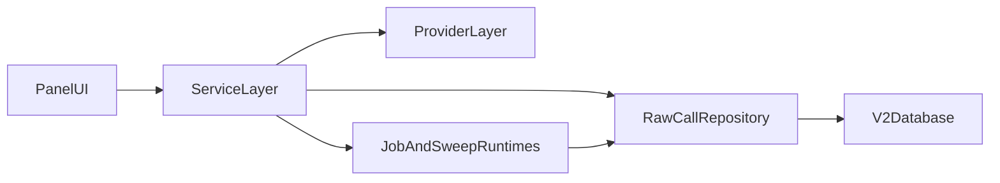

# Architecture (Current, v2-first)

Status: living  
Owner: documentation-maintainers  
Last reviewed: 2026-04-09

## System Shape

## Current Layer Responsibilities

- `panel_app/`: user-facing inference and analytics workflows.
- `src/study_query_llm/services/`: orchestration/business logic (`InferenceService`, `StudyService`, sweep/provenance/jobs).
- `src/study_query_llm/providers/`: provider abstraction and factory entrypoints.
- `src/study_query_llm/db/raw_call_repository.py`: canonical data access for v2 capture and grouping.
- `src/study_query_llm/db/models_v2.py`: canonical schema for immutable calls + mutable grouping relationships.
- `provenanced_runs`: first-class execution provenance row using canonical `run_kind=execution`, with role semantics in `metadata_json.execution_role`, linked to `method_definitions` for versioned method identity.

## Current Execution Surfaces

- Interactive UI: `panel serve panel_app/app.py --show`
- Package CLI:
  - `python -m study_query_llm.cli jobs langgraph-worker`
  - `python -m study_query_llm.cli jobs cached-supervisor`
  - `python -m study_query_llm.cli sweep engine-supervisor`
  - `python -m study_query_llm.cli sweep run-bigrun`

Legacy `scripts/run_*.py` files are compatibility wrappers where retained.

## Orchestration and Provenance Notes

- `OrchestrationJob` is the canonical scheduling/lease substrate for clustering and MCQ execution paths.
- Standalone execution is modeled as an orchestration profile, not a separate run-key control plane.
- MCQ orchestration uses per-run `mcq_run` jobs plus dependent `analysis_run` jobs in the same control plane.
- `analyze` CLI remains as compatibility UX, but now enqueues/claims/executes orchestration `analysis_run` jobs instead of a separate non-orchestrated write path.
- Read models derive request-level analysis state from orchestration/execution records, with legacy metadata arrays retained as compatibility mirrors during cutover.
- New MCQ method executions are captured as explicit `provenanced_runs` rows (`run_kind=execution`, `execution_role=method_execution`, `determinism_class=non_deterministic`).
- `run_key` remains identity/idempotency metadata, while execution lineage is represented through `provenanced_runs` + `Group`/`GroupLink`.
- Dataset snapshots support immutable full lineage and delta lineage (`depends_on` link from child snapshot to parent snapshot).

## Legacy Notes

- v1 `InferenceRepository` and `InferenceRun` remain for compatibility but are not the default for new development.
- Historical architecture narrative and migration context remain in `docs/ARCHITECTURE.md`.
