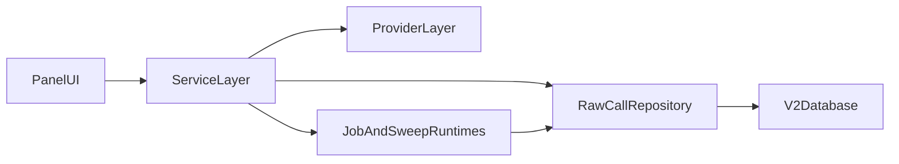

# Architecture (Current, v2-first)

Status: living  
Owner: documentation-maintainers  
Last reviewed: 2026-04-18

## System Shape

## Current Layer Responsibilities

- `panel_app/`: user-facing inference and analytics workflows.
- `src/study_query_llm/services/`: orchestration/business logic (`InferenceService`, `StudyService`, sweep/provenance/jobs).
- `src/study_query_llm/providers/`: provider abstraction and factory entrypoints.
- `src/study_query_llm/db/raw_call_repository.py`: canonical data access for v2 capture and grouping.
- `src/study_query_llm/db/models_v2.py`: canonical schema for immutable calls + mutable grouping relationships.
- `src/study_query_llm/pipeline/`: canonical five-stage dataset flow (`acquire`, `parse`, `snapshot`, `embed`, `analyze`) with contract enforcement via `run_stage`.
- `provenanced_runs`: first-class execution provenance row using canonical `run_kind=execution`, with role semantics in `metadata_json.execution_role`, linked to `method_definitions` for versioned method identity.

## Current Execution Surfaces

- Interactive UI: `panel serve panel_app/app.py --show`
- Package CLI:
  - `python -m study_query_llm.cli jobs langgraph-worker`
  - `python -m study_query_llm.cli jobs cached-supervisor`
  - `python -m study_query_llm.cli sweep engine-supervisor`
  - `python -m study_query_llm.cli sweep run-bigrun`

Legacy `scripts/run_*.py` files are compatibility wrappers where retained.

## Data Pipeline (Canonical)

- Canonical spec: [`docs/DATA_PIPELINE.md`](../DATA_PIPELINE.md).
- Stage order: `acquire -> parse -> snapshot -> embed -> analyze`.
- Runtime entrypoint: `python scripts/run_bank77_pipeline.py ...` for end-to-end execution.
- Persistence contract: public stage functions persist through `run_stage` and are linted by `scripts/check_persistence_contract.py`.

## Orchestration and Provenance Notes

- `OrchestrationJob` is the canonical scheduling/lease substrate for clustering and MCQ execution paths.
- Standalone execution is modeled as an orchestration profile, not a separate run-key control plane.
- MCQ orchestration uses per-run `mcq_run` jobs plus dependent `analysis_run` jobs in the same control plane.
- `analyze` CLI remains as compatibility UX, but now enqueues/claims/executes orchestration `analysis_run` jobs instead of a separate non-orchestrated write path.
- Read models derive request-level analysis state from orchestration/execution records, with legacy metadata arrays retained as compatibility mirrors during cutover.
- New MCQ method executions are captured as explicit `provenanced_runs` rows (`run_kind=execution`, `execution_role=method_execution`, `determinism_class=non_deterministic`).
- `run_key` remains identity/idempotency metadata, while execution lineage is represented through `provenanced_runs` + `Group`/`GroupLink`.
- Each `provenanced_runs` row carries a **canonical run fingerprint** (`fingerprint_json`/`fingerprint_hash`) that captures algorithmic identity independent of scheduling granularity. See `canonical_run_fingerprint()` and `fingerprints_match()` in `provenanced_run_service.py`.
- The boundary between schedulable units and in-job provenance events is documented in [SCHEDULING_PROVENANCE_BOUNDARY.md](SCHEDULING_PROVENANCE_BOUNDARY.md).
- Composite/pipeline methods (e.g. `cosine_kllmeans_no_pca`) carry a **method recipe** on `method_definitions.recipe_json` that lists ordered component stages by `(name, version)`. The recipe is descriptive metadata; execution remains monolithic within `run_sweep`. The `recipe_hash` enters the run fingerprint via `config_json["recipe_hash"]`, so structurally different pipelines produce distinct fingerprints without any change to the fingerprint tuple shape. See [METHOD_RECIPES.md](METHOD_RECIPES.md).
- Terminology guardrail: use `provenance_stage`, `algorithm_iteration`, `restart_try`, and `orchestration_job` in architecture prose; keep legacy schema literals (`step_name`, `clustering_step`) only when quoted.
- Orchestration claim/complete paths include `perf_counter` timing instrumentation (logged at DEBUG level) for diagnosing overhead.
- Dataset snapshots support immutable full lineage and delta lineage (`depends_on` link from child snapshot to parent snapshot).

## Legacy Notes

- v1 `InferenceRepository` and `InferenceRun` remain for compatibility but are not the default for new development.
- Historical architecture narrative and migration context remain in `docs/ARCHITECTURE.md`.
