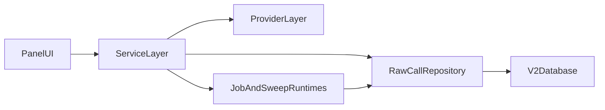

# Architecture (Current, v2-first)

Status: living  
Owner: documentation-maintainers  
Last reviewed: 2026-04-06

## System Shape

## Current Layer Responsibilities

- `panel_app/`: user-facing inference and analytics workflows.
- `src/study_query_llm/services/`: orchestration/business logic (`InferenceService`, `StudyService`, sweep/provenance/jobs).
- `src/study_query_llm/providers/`: provider abstraction and factory entrypoints.
- `src/study_query_llm/db/raw_call_repository.py`: canonical data access for v2 capture and grouping.
- `src/study_query_llm/db/models_v2.py`: canonical schema for immutable calls + mutable grouping relationships.

## Current Execution Surfaces

- Interactive UI: `panel serve panel_app/app.py --show`
- Package CLI:
  - `python -m study_query_llm.cli jobs langgraph-worker`
  - `python -m study_query_llm.cli jobs cached-supervisor`
  - `python -m study_query_llm.cli sweep engine-supervisor`
  - `python -m study_query_llm.cli sweep run-bigrun`

Legacy `scripts/run_*.py` files are compatibility wrappers where retained.

## Legacy Notes

- v1 `InferenceRepository` and `InferenceRun` remain for compatibility but are not the default for new development.
- Historical architecture narrative and migration context remain in `docs/ARCHITECTURE.md`.
