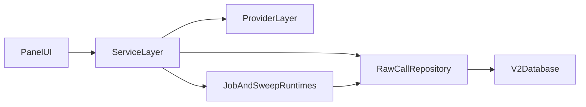

# Architecture (Current, v2-first)

Status: living  
Owner: documentation-maintainers  
Last reviewed: 2026-05-08

## System Shape

```mermaid
flowchart LR
panelUI[PanelUI] --> serviceLayer[ServiceLayer]
serviceLayer --> providerLayer[ProviderLayer]
serviceLayer --> repoLayer[RawCallRepository]
repoLayer --> v2db[V2Database]
serviceLayer --> jobRuntimes[JobAndSweepRuntimes]
jobRuntimes --> repoLayer
```

## Current Layer Responsibilities

- `panel_app/`: user-facing analytics/exploration workflows (Inference tab is intentionally disabled in current safe-mode runtime posture).
- `src/study_query_llm/services/`: orchestration/business logic (`InferenceService`, `StudyService`, sweep/provenance/jobs, method execution runtime lane).
- `src/study_query_llm/providers/`: provider abstraction and factory entrypoints.
- `src/study_query_llm/db/raw_call_repository.py`: canonical data access for v2 capture and grouping.
- `src/study_query_llm/db/models_v2.py`: canonical schema for immutable calls + mutable grouping relationships.
- `src/study_query_llm/db/_base_connection.py`: canonical DB chokepoint (lane resolution, explicit write intent, lane/intent enforcement, canonical identity conflict checks).
- `src/study_query_llm/pipeline/`: canonical five-stage dataset flow (`acquire`, `parse`, `snapshot`, `embed`, `analyze`) with contract enforcement via `run_stage`.
- `src/study_query_llm/services/artifact_service.py`: artifact persistence abstraction with backend governance; canonical write intent is fail-closed to Azure Blob storage.
- `provenanced_runs`: first-class execution provenance row using canonical `run_kind=execution`, with role semantics in `metadata_json.execution_role` and method-stage semantics in `metadata_json.pipeline_stage_role`, linked to `method_definitions` for versioned method identity.

## Current Execution Surfaces

- Interactive UI: `panel serve panel_app/app.py --show`
- Package CLI:
  - `python -m study_query_llm.cli jobs langgraph-worker`
  - `python -m study_query_llm.cli jobs cached-supervisor`
  - `python -m study_query_llm.cli sweep engine-supervisor`
  - `python -m study_query_llm.cli sweep run-bigrun`

Legacy `scripts/run_*.py` files are compatibility wrappers where retained.

Boundary vocabulary for implementation work:
- Tier A (canonical runtime): `src/study_query_llm/**`
- Tier B (compatibility surfaces): root `scripts/run_*.py` wrappers
- Tier C (historical): `scripts/history/**`
- Tier D (policy mirror): `docs/living/**` + runbooks

Known transitional boundary mismatch (documented, not hidden):
- `src/study_query_llm/services/jobs/runtime_supervisors.py` currently launches `scripts/run_local_300_2datasets_worker.py` via subprocess for compatibility (`worker_script` path + restart path).

## Data Pipeline (Canonical)

- Canonical spec: [`docs/DATA_PIPELINE.md`](../DATA_PIPELINE.md).
- Stage order: `acquire -> parse -> snapshot -> embed -> analyze`.
- Analyze input contract is method-defined: snapshot is always required; embedding is required by default and can be disabled per method via `MethodDefinition.input_schema.required_inputs.embedding_batch=false`.
- Runtime entrypoint: `python scripts/run_bank77_pipeline.py ...` for end-to-end execution.
- Persistence contract: public stage functions persist through `run_stage` and are linted by `scripts/check_persistence_contract.py`.

## Orchestration and Provenance Notes

- `OrchestrationJob` is the canonical scheduling/lease substrate for clustering and MCQ execution paths.
- Planner ownership is adapter-driven: sweep-type adapters emit orchestration graph specs (nodes + dependency edges), and `SweepRequestService` performs generic enqueue from those specs.
- Standalone execution is modeled as an orchestration profile, not a separate run-key control plane.
- Clustering payload identity does not include `summarizer`; request expansion and orchestration payloads are dataset+embedding scoped.
- Clustering per-request fanout is service-owned: `create_request(..., clustering_analysis_selection=...)` resolves/validates selection against the clustering registry and derives request `analysis_catalog`; the adapter consumes resolved catalog entries and does not auto-expand from full registry membership.
- Clustering selection validation is strict at request creation (unknown method names, missing required params, unknown/extra params fail loud before planning).
- For non-empty clustering selection, planning enforces complete caller-supplied lineage inputs (`run_key_to_lineage_inputs`) and raises `lineage_required_for_selection` when `dataset_snapshot_ids` / required `embedding_batch_group_id` coverage is missing.
- MCQ orchestration uses per-run `mcq_run` jobs plus dependent `analysis_run` jobs in the same control plane.
- Job execution dispatch is registry-based in `job_runner_factory.py`; `langgraph_run` remains a first-class registry entry.
- Polymorphic non-clustering method dispatch is service-owned in `MethodExecutionService` + `method_runtime_registry` (single invocation -> single runner -> single canonical execution row).
- Method-execution idempotency identity is deterministic and suffix-ordered: `<base_run_key>__method__<name>@<version>[__node__<node_id>][__inv__<invocation_id>]`.
- Clustering `analysis_run` execution separates lineage identity from analysis idempotency identity: payload keeps base `run_key` for lineage lookup and carries `analysis_run_key = "{run_key}__analysis__{analysis_key}"`; worker enforces registry-only clustering methods before analyze dispatch, and `analyze` uses `analysis_run_key` for lock/upsert/run-stage keys to prevent cross-method collisions on the same base run.
- Reducer/finalizer execution uses a typed plugin seam (`ReducerPlugin`) with a default clustering adapter that wraps `JobReducerService`.
- `analyze` CLI remains as compatibility UX, but now enqueues/claims/executes orchestration `analysis_run` jobs instead of a separate non-orchestrated write path.
- Read models derive request-level analysis state from orchestration/execution records, with legacy metadata arrays retained as compatibility mirrors during cutover.
- New MCQ method executions are captured as explicit `provenanced_runs` rows (`run_kind=execution`, `execution_role=method_execution`, `determinism_class=non_deterministic`).
- `run_key` remains identity/idempotency metadata, while execution lineage is represented through `provenanced_runs` + `Group`/`GroupLink`.
- Each `provenanced_runs` row carries a **canonical run fingerprint** (`fingerprint_json`/`fingerprint_hash`) that captures algorithmic identity independent of scheduling granularity. See `canonical_run_fingerprint()` and `fingerprints_match()` in `provenanced_run_service.py`.
- The boundary between schedulable units and in-job provenance events is documented in [SCHEDULING_PROVENANCE_BOUNDARY.md](SCHEDULING_PROVENANCE_BOUNDARY.md).
- Composite/pipeline methods (e.g. `cosine_kllmeans_no_pca`) carry a **method recipe** on `method_definitions.recipe_json` that lists ordered component stages by `(name, version)`. The recipe is descriptive metadata; execution remains monolithic within `run_sweep`. The `recipe_hash` enters the run fingerprint via `config_json["recipe_hash"]`, so structurally different pipelines produce distinct fingerprints without any change to the fingerprint tuple shape. See [METHOD_RECIPES.md](METHOD_RECIPES.md).
- Register-first discipline is enforced on previously lazy fallback surfaces:
  - `pipeline.analyze._resolve_method_definition_id` now fails loud for missing non-composite method rows.
  - `SweepRequestService.record_analysis_result` now fails loud for missing analysis method rows.
  - `langgraph_provenance.record_langgraph_job_outcome` now fails loud for missing method rows.
- `src/study_query_llm/pipeline/clustering/` is the **Bundled Clustering Subsystem**: the permanent module home for bundled clustering methods registered through `pipeline/clustering/registry.py`. Bundled methods emit `cluster_labels`, `summary_metrics`, and `recipe_hash` and remain permanently self-contained. After Slice 1.5 every registry spec ships with `provenance_envelope="none"`; the legacy `clustering_v1` envelope (YAML resolver/validators/identity-decorated `clustering_summary`) was retired and the legacy method names (`hdbscan`, `kmeans+silhouette+kneedle`, `gmm+bic+argmin`) were renamed to `hdbscan+fixed`, `kmeans+normalize+pca+sweep`, and `gmm+normalize+pca+sweep` with algorithmic identity preserved. A loud-fail deprecation guard (`raise_if_deprecated_clustering_method`) at the top of `pipeline.analyze()` rejects the legacy names so explicit `method_runner` injection cannot bypass it. `src/study_query_llm/pipeline/transforms/` is reserved for future DR-as-method transformed-embedding artifacts; no implementations exist there in this rollout, and adding any requires a separate explicitly scoped design. See [METHOD_RECIPES.md](METHOD_RECIPES.md) § Bundled Clustering Subsystem.
- For the registry-menu vs per-request catalog distinction used by bundled clustering scheduling, see [METHOD_RECIPES.md](METHOD_RECIPES.md) § Registry, catalog, and per-request selection.
- Terminology guardrail: use `provenance_stage`, `algorithm_iteration`, `restart_try`, and `orchestration_job` in architecture prose; keep legacy schema literals (`step_name`, `clustering_step`) only when quoted.
- Orchestration claim/complete paths include `perf_counter` timing instrumentation (logged at DEBUG level) for diagnosing overhead.
- Dataset snapshots support immutable full lineage and delta lineage (`depends_on` link from child snapshot to parent snapshot).

## Legacy Notes

- v1 `InferenceRepository` and `InferenceRun` remain for compatibility but are not the default for new development.
- Historical architecture narrative and migration context remain in `docs/ARCHITECTURE.md`.
