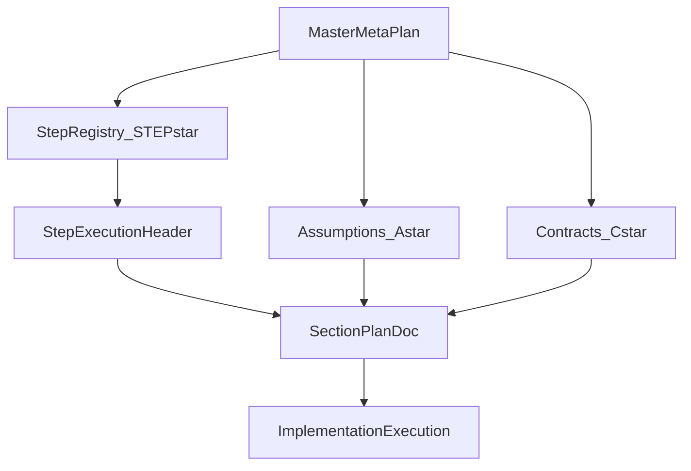

# Master Meta-Plan For Plan-Doc Generation

## Purpose

Establish one canonical planning framework that can generate many independent plan documents. The master meta-plan defines global assumptions, contract IDs, step IDs, and handoff rules so each section plan can be authored in isolation with minimal context.

## Scope

- Define planning-only governance for multi-document plan generation.
- Define stable IDs for assumptions, contracts, and steps.
- Define how to execute each step in new chat contexts.
- Define acceptance criteria for independence between section plans.

## Non-Goals

- This document does not implement runtime code changes.
- This document does not lock in algorithm internals.
- This document does not replace `docs/IMPLEMENTATION_PLAN.md` as the implementation status ledger.

## Canonical References

- `docs/IMPLEMENTATION_PLAN.md` (implementation status and phase tracking)
- `docs/STANDING_ORDERS.md` (documentation and consistency rules)
- `docs/plans/README.md` (operator workflow for this planning system)
- `docs/plans/templates/STEP_EXECUTION_HEADER.md` (copy-paste execution input)
- `docs/plans/templates/SECTION_PLAN_TEMPLATE.md` (standard section plan output)

## Global Assumptions Registry

All section plans may rely on the assumptions below, and must not introduce hidden assumptions outside this registry.

| ID | Assumption | Why It Enables Independence |
| --- | --- | --- |
| `A-001` | All planning artifacts live under `docs/plans/` unless explicitly noted. | Gives a stable location boundary for cross-step references. |
| `A-002` | `docs/IMPLEMENTATION_PLAN.md` remains the implementation status source of truth. | Prevents plan docs from duplicating live status governance. |
| `A-003` | Cross-step dependencies are expressed only through `C-*` contracts, not implementation details. | Keeps section plans decoupled from each other. |
| `A-004` | Each section plan can be authored in a fresh chat with only the step header and master doc. | Enables chunked execution without full chat history. |
| `A-005` | Contract IDs are stable and append-only; breaking changes require a new major contract version. | Preserves downstream validity and traceability. |
| `A-006` | Section plans must include explicit non-goals and forbidden dependencies. | Reduces scope creep and hidden coupling. |
| `A-007` | If a required contract is missing or ambiguous, the step must pause and request clarification before proceeding. | Avoids invalid plans generated from uncertain inputs. |
| `A-008` | Clustering remains a specialization use case, not a separate planning architecture. | Aligns generic framework direction with current strategic goal. |

## Contract Registry Rules

### Contract ID Format

- Format: `C-XXX@MAJOR.MINOR` (example: `C-003@1.0`).
- `XXX` is a zero-padded numeric ID.
- `MAJOR` increments on breaking semantic changes.
- `MINOR` increments on backward-compatible clarifications.

### Contract Lifecycle States

- `draft`: being defined, not yet required by downstream steps.
- `active`: approved for downstream consumption.
- `deprecated`: still readable; no new downstream adoption.
- `retired`: replaced; preserved for history only.

### Contract Authoring Rules

Each active contract must include:

1. `Name`
2. `Purpose`
3. `Producer step(s)`
4. `Consumer step(s)`
5. `Schema` (required fields and optional fields)
6. `Validation checks`
7. `Backward compatibility policy`

## Step Registry Rules

### Step ID Format

- Format: `STEP-XX` (example: `STEP-03`).
- IDs are stable and never reused.
- Each step produces one primary plan document output.

### Required Fields Per Step Definition

1. Objective
2. Allowed assumptions (`A-*`)
3. Required input contracts (`C-*`)
4. Forbidden dependencies
5. Required outputs (new/updated contracts and plan artifact path)
6. Definition of done
7. Failure and rollback behavior

## Initial Step Registry

| Step | Objective | Allowed Assumptions | Required Inputs | Primary Output | Forbidden Dependencies |
| --- | --- | --- | --- | --- | --- |
| `STEP-01` | Bootstrap assumptions + contracts catalog | `A-001`..`A-007` | None | `docs/plans/STEP-01_master_bootstrap.md` | Any code-level design internals |
| `STEP-02` | Define generic run/request lifecycle planning contract | `A-001`..`A-007` | `C-001@1.0` | `docs/plans/STEP-02_run_request_lifecycle.md` | Clustering-specific algorithm choices |
| `STEP-03` | Define method plugin contract plan | `A-001`..`A-008` | `C-001@1.0`, `C-002@1.0` | `docs/plans/STEP-03_method_plugin_contract.md` | Panel UX implementation specifics |
| `STEP-04` | Define input ingestion + artifact eligibility plan | `A-001`..`A-007` | `C-001@1.0`, `C-003@1.0` | `docs/plans/STEP-04_input_artifact_plan.md` | Worker orchestration internals |
| `STEP-05` | Define clustering-as-specialization plan | `A-001`..`A-008` | `C-002@1.0`, `C-003@1.0`, `C-004@1.0` | `docs/plans/STEP-05_clustering_specialization.md` | Hard-coding framework to clustering-only |
| `STEP-06` | Define analysis/provenance contract plan | `A-001`..`A-007` | `C-002@1.0`, `C-004@1.0` | `docs/plans/STEP-06_analysis_provenance.md` | UI-only assumptions |
| `STEP-07` | Define panel orchestration/resource estimation UX plan | `A-001`..`A-007` | `C-002@1.0`, `C-005@1.0` | `docs/plans/STEP-07_panel_orchestration_ux.md` | Algorithm implementation internals |
| `STEP-08` | Define cutover and risk policy plan | `A-001`..`A-008` | `C-001@1.0`..`C-006@1.0` | `docs/plans/STEP-08_cutover_risk_policy.md` | Introducing new core contracts |

## Seed Contracts For Step Bootstrapping

These contracts are intentionally high-level and are refined by section plans.

| Contract | Name | Initial Purpose | Producer | Primary Consumers |
| --- | --- | --- | --- | --- |
| `C-001@1.0` | PlanningArtifactContract | Standard metadata for all plan-doc artifacts. | `STEP-01` | `STEP-02`..`STEP-08` |
| `C-002@1.0` | GenericRunRequestContract | Canonical run/request planning semantics. | `STEP-02` | `STEP-03`, `STEP-06`, `STEP-07` |
| `C-003@1.0` | InputAndArtifactContract | Ingestion and artifact eligibility planning fields. | `STEP-04` | `STEP-05` |
| `C-004@1.0` | MethodSpecializationContract | How methods specialize generic contracts. | `STEP-03`, `STEP-05` | `STEP-06` |
| `C-005@1.0` | AnalysisProvenanceContract | Provenance and analysis planning semantics. | `STEP-06` | `STEP-07` |
| `C-006@1.0` | CutoverPolicyContract | Cutover sequencing and risk controls. | `STEP-08` | Future execution checklists |

## Execution Handoff Protocol

Use the reusable step header template from `docs/plans/templates/STEP_EXECUTION_HEADER.md` in all fresh chats. Each execution must include:

- exact step ID (`STEP-XX`)
- allowed assumptions list (`A-*`)
- required contracts list (`C-*`)
- forbidden dependency statement
- deliverable path
- definition of done block

If any of these are missing, the step is considered invalid and must not proceed.

## Independence Validation Checklist

A section plan is considered independent only if all checks pass:

1. It references assumptions only by `A-*` IDs.
2. It references upstream dependencies only by `C-*` IDs.
3. It does not rely on implementation specifics of sibling steps.
4. It includes explicit non-goals and forbidden dependencies.
5. It can be generated from the copy-paste header plus this master document.

## Failure and Rollback Policy

- If a required contract is absent, mark status as blocked and request clarification.
- If a contract becomes breaking, publish a new major version and keep prior version visible.
- If two steps define overlapping contract ownership, ownership is resolved in favor of the step designated as producer in this master document.

## Dependency View

## Acceptance Criteria

- One canonical master source exists in `docs/plans/MASTER_META_PLAN.md`.
- The step and contract registries are explicit, stable, and internally consistent.
- Every step can be executed in a fresh chat using the reusable header template.
- Cross-step coupling is contract-driven, not implementation-detail-driven.
