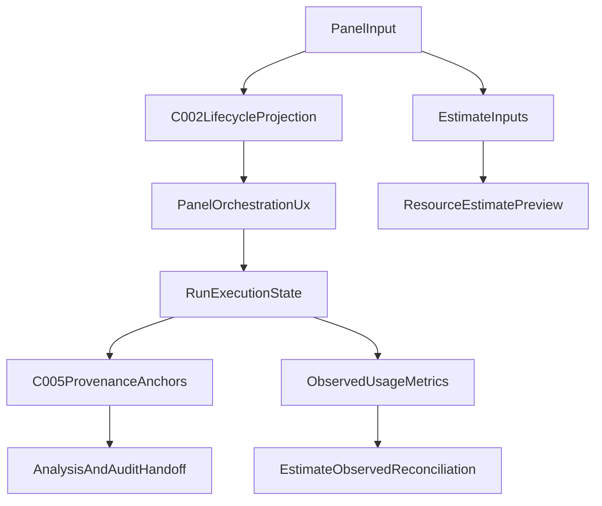

# STEP-07 Panel Orchestration UX

## Metadata

- Step ID: `STEP-07`
- Plan title: `Panel orchestration and resource-estimation UX semantics definition`
- Status: `active`
- Execution mode: `draft_provisional`
- Last updated: `2026-04-07`
- Source meta-plan: `docs/plans/MASTER_META_PLAN.md`

## Objective

Define panel orchestration and resource-estimation UX semantics that project canonical lifecycle behavior from `C-002@1.0` and provenance/analysis behavior from `C-005@1.0` into operator-facing workflows, without redefining upstream contract ownership or introducing algorithm implementation internals. This step establishes scope boundaries, interaction invariants, and validation rules for request creation, run grouping, status visibility, estimate previews, and estimate-vs-observed reconciliation.

## Allowed Assumptions

- `A-001`
- `A-002`
- `A-003`
- `A-004`
- `A-005`
- `A-006`
- `A-007`
- `A-009`

## Required Input Contracts

| Contract ID | Version | Why Needed |
| --- | --- | --- |
| `C-002@1.0` | `1.0` | Provides canonical request/run lifecycle semantics, state transitions, and transition-log invariants that panel orchestration UX must project without reinterpretation. |
| `C-005@1.0` | `1.0` | Provides canonical analysis/provenance semantics and lineage anchors required for post-run analysis handoff UX and evidence visibility. |

## Contract Source Resolution

| Contract ID | Selected Source | Why This Source Was Chosen |
| --- | --- | --- |
| `C-002@1.0` | `producer_step_output` | No standalone contract file exists under `docs/plans/contracts/`; `docs/plans/STEP-02_run_request_lifecycle.md` is the highest-priority available source. |
| `C-005@1.0` | `producer_step_output` | No standalone contract file exists under `docs/plans/contracts/`; `docs/plans/STEP-06_analysis_provenance.md` is the highest-priority available source. |

## Forbidden Dependencies

- No algorithm implementation internals.
- No implementation details from sibling steps.
- No hidden assumptions outside listed `A-*`.
- No references to non-canonical contract IDs.

## Output Artifacts

- Primary output document: `docs/plans/STEP-07_panel_orchestration_ux.md`
- Produced/updated contract(s): `None` (consumer-only UX composition plan over existing contracts)
- Optional supporting appendix: _None_

## STEP-07 Orchestration and Resource-Estimation UX Semantics

### Name

- `PanelOrchestrationAndResourceEstimationUxProfile`

### Purpose

- Define how panel workflows expose lifecycle orchestration semantics from `C-002@1.0` for standalone and grouped/batch runs.
- Define how panel workflows expose planning-grade resource estimates before execution and reconcile those estimates with observed runtime metrics after execution.
- Define how panel workflows hand off from execution results to provenance-aware analysis using `C-005@1.0` references.

### Producer Step(s)

- `STEP-07`

### Consumer Step(s)

- `STEP-08`
- Future implementation execution checklists and UI delivery workstreams

### Composition With Upstream Contracts

| Upstream Contract | Composition Rule | STEP-07 Constraint |
| --- | --- | --- |
| `C-002@1.0` | Panel orchestration UX maps request/run interactions to canonical lifecycle states, allowed transitions, and transition-log expectations. | STEP-07 may define display/action gating semantics, but must not add/remove lifecycle states, alter transition legality, or reinterpret terminal-state ownership. |
| `C-005@1.0` | Panel analysis handoff UX references provenance records, grouping keys, and lineage/evidence anchors for result inspection and auditability. | STEP-07 may define presentation and navigation semantics for provenance context, but must not redefine provenance states, lineage model ownership, or evidence schema requirements. |

### Flow Sketch

### Semantics And Boundaries

Boundary invariants:

1. Panel orchestration state is a projection of `C-002@1.0` lifecycle state and transition constraints, not an independent state machine.
2. Available UI actions (for example submit, cancel, retry, inspect) are gated by valid next-state behavior from `C-002@1.0`.
3. Resource estimates are explicitly predictive artifacts shown before dispatch and must be labeled as non-authoritative for billing/compliance.
4. Post-run summaries must distinguish observed runtime values from pre-run estimates and retain both for reconciliation visibility.
5. Analysis/provenance links shown in UX must anchor to `C-005@1.0` identifiers and evidence references without rewriting provenance ownership.
6. Group/run UX constructs may organize requests for operator workflows, but cannot override lifecycle/provenance contract semantics.
7. UX semantics remain method-family agnostic and must avoid clustering-specific algorithm assumptions.

Boundary table:

| Area | In Scope For STEP-07 | Out Of Scope For STEP-07 |
| --- | --- | --- |
| Lifecycle orchestration UX | State projection, action gating, status timeline semantics based on `C-002@1.0` | Defining new lifecycle states, changing transition rules, or changing terminal-state semantics |
| Run grouping/batch orchestration UX | Defining panel interactions for standalone runs, run grouping, and batch submission semantics | Defining queue engine internals, worker lease logic, or scheduler implementation |
| Resource-estimation UX | Defining estimate input set, estimate output categories, confidence/caveat semantics, and reconciliation UX | Implementing provider-specific pricing engines, tokenizers, or optimization algorithms |
| Provenance-aware analysis handoff | Defining how panel links execution outputs to provenance context and analysis entry points via `C-005@1.0` anchors | Defining lineage storage/query internals, provenance graph algorithms, or analysis computation internals |
| Cross-tab/operator navigation | Defining UX-level transitions between inference, analytics, groups, and sweep/analysis contexts | Defining data-model schema ownership already governed by upstream contracts |

### Schema

Required orchestration UX fields:

| Field | Type | Description |
| --- | --- | --- |
| `ux_profile_id` | `string` | Stable identifier for this orchestration UX profile instance. |
| `contract_bindings` | `object` | Must include `lifecycle_contract_id = C-002@1.0` and `provenance_contract_id = C-005@1.0`. |
| `request_id` | `string` | Canonical request identifier projected from lifecycle context. |
| `lifecycle_state` | `enum` | Current projected lifecycle state from `C-002@1.0`. |
| `allowed_actions` | `array[string]` | UX action set valid for current lifecycle state projection. |
| `status_timeline` | `array[object]` | Ordered timeline of user-visible lifecycle events mapped from transition logs. |
| `estimate_preview` | `object` | Pre-run resource estimate payload (tokens/latency/cost category fields). |
| `estimate_confidence` | `string` | Confidence band (`low`, `medium`, `high`) for estimate interpretation. |
| `estimate_caveats` | `array[string]` | Required caveats clarifying estimate limitations and assumptions. |
| `provenance_anchor` | `object` | Provenance linkage payload referencing `C-005@1.0` entities for analysis handoff. |
| `updated_at_utc` | `datetime` | Last UX model update timestamp in UTC ISO-8601 format. |

Optional orchestration UX fields:

| Field | Type | Description |
| --- | --- | --- |
| `run_id` | `string` | Optional run identifier when lifecycle state has runtime assignment. |
| `queue_ref` | `string` | Optional queue/lane hint shown to operators. |
| `group_context` | `object` | Optional run/batch grouping metadata for navigation semantics. |
| `progress_snapshot` | `object` | Optional execution progress indicators while in active states. |
| `observed_usage` | `object` | Optional observed tokens/latency/cost payload from runtime outputs. |
| `reconciliation_summary` | `object` | Optional estimate-vs-observed delta summary. |
| `error_summary` | `object` | Optional structured summary for failed/rejected/expired flows. |
| `warning_messages` | `array[string]` | Optional non-fatal warnings shown to operators. |
| `metadata` | `object` | Backward-compatible extension container for non-breaking annotations. |

### Resource-Estimation UX Semantics

Input signal categories:

| Signal Category | Example Inputs | UX Expectation |
| --- | --- | --- |
| Request shape | Prompt length proxy, requested call count, max token limits | Inputs are captured before dispatch and shown in estimate context so users can reason about scale. |
| Execution context | Provider/deployment selection, run grouping mode, retry intent | Estimates reflect selected execution context without exposing provider implementation internals. |
| Historical baseline (optional) | Prior observed token/latency aggregates from analytics views | If present, baseline is labeled as historical guidance rather than deterministic prediction. |

Estimate output categories:

| Output Category | Description | Constraints |
| --- | --- | --- |
| `estimated_token_range` | Expected token envelope for planned execution. | Must be clearly labeled as estimated and not equivalent to final billed usage. |
| `estimated_latency_band` | Expected latency range band based on available context. | Must communicate uncertainty and avoid hard runtime guarantees. |
| `estimated_cost_range` | Optional derived cost range for planning prioritization. | Must include caveats on pricing assumptions/source freshness. |
| `capacity_hint` | Qualitative operator signal (`low`, `moderate`, `high`) about expected resource pressure. | Must remain advisory; no scheduler-automation ownership in STEP-07. |

Reconciliation semantics:

1. On terminal lifecycle states, UX shows both estimate snapshot and observed usage summary side-by-side.
2. Reconciliation highlights absolute and relative deltas where observed metrics are available.
3. Missing observed metrics are explicitly labeled, not imputed silently.
4. Reconciliation artifacts are navigable into provenance-aware analysis context through `provenance_anchor`.

### Validation Checks

1. `contract_bindings.lifecycle_contract_id` equals `C-002@1.0` and `contract_bindings.provenance_contract_id` equals `C-005@1.0`.
2. `lifecycle_state` and `allowed_actions` are consistent with valid next-state behavior from `C-002@1.0`.
3. `status_timeline` entries are ordered and reflect transition-log order (no backdated reordering).
4. `estimate_preview` includes explicit caveat metadata and is marked as predictive.
5. `estimate_confidence` uses constrained vocabulary (`low`, `medium`, `high`) to avoid ambiguous interpretation.
6. `provenance_anchor` references non-empty provenance identifiers when analysis handoff is available.
7. `observed_usage` and `reconciliation_summary` (if present) are derived from runtime outcomes, not estimate copies.
8. Unknown optional fields are allowed only under `metadata` to preserve extensibility boundaries.

### Backward Compatibility Policy

1. Minor updates may add optional UX fields, refine caveat wording, and clarify action-gating semantics without changing contract ownership boundaries.
2. Minor updates must not reinterpret lifecycle/provenance ownership inherited from `C-002@1.0` and `C-005@1.0`.
3. Major updates are required if required UX fields are removed/renamed, if binding semantics to upstream contracts are broken, or if reconciliation meaning changes incompatibly.
4. Consumers should preserve unknown optional `metadata` keys to support forward-compatible UX evolution.

## Proposed Plan

1. Define a contract-projected panel orchestration UX model that maps interactions to `C-002@1.0` lifecycle semantics and valid action boundaries.
2. Define a resource-estimation UX model covering estimate inputs, estimate outputs, caveats/confidence handling, and estimate-vs-observed reconciliation semantics.
3. Define explicit provenance-aware analysis handoff boundaries anchored to `C-005@1.0` while preserving strict out-of-scope exclusions for algorithm internals.

## Definition Of Done

- [x] Define panel orchestration semantics that project `C-002@1.0` lifecycle behavior without redefining lifecycle ownership.
- [x] Define resource-estimation UX semantics including pre-run estimate preview, caveat/confidence handling, and post-run reconciliation.
- [x] Define explicit scope boundaries, including forbidden dependencies and non-goals that exclude algorithm implementation internals.
- [x] Produce one step plan document at `docs/plans/STEP-07_panel_orchestration_ux.md` with assumption ledger and non-goals.

## Validation Checks

1. PASS: All referenced assumptions are valid `A-*` IDs and constrained to the allowed list.
2. PASS: Required contracts are resolved via source precedence from producer outputs (`STEP-02`, `STEP-06`) with no standalone contract override.
3. PASS: Output artifact path matches `STEP-07` naming and deliverable requirements.
4. PASS: Forbidden dependency against algorithm implementation internals is explicit.
5. PASS: Assumption ledger, non-goals, failure/rollback policy, and contract change log are included.

## Non-Goals

- Define algorithm implementation internals, optimization strategies, or model-specific runtime behavior.
- Redefine request lifecycle states, transition rules, or terminal semantics owned by `C-002@1.0`.
- Redefine provenance state model, lineage edge semantics, or evidence schema ownership owned by `C-005@1.0`.
- Define queue-worker internals, scheduling infrastructure, or backend execution control loops.
- Replace `docs/IMPLEMENTATION_PLAN.md` as implementation status source of truth.

## Failure And Rollback Behavior

- In `draft_provisional`, if a required contract is missing or ambiguous, proceed with best-available source and log challenged assumptions.
- In `finalize_gated`, if a required contract is missing or ambiguous, set status to `blocked` and request clarification.
- If a contract change is breaking, publish a new major version and retain old contract references.
- If overlap with another step is discovered, defer to producer ownership in the master step registry.

## Assumption Ledger

| ID | Statement | Status | Notes |
| --- | --- | --- | --- |
| `A-001` | All planning artifacts live under `docs/plans/` unless explicitly noted. | `accepted` | Output path and artifact boundary remain within `docs/plans/`. |
| `A-002` | `docs/IMPLEMENTATION_PLAN.md` remains the implementation status source of truth. | `accepted` | This document defines planning semantics only, not runtime implementation tracking. |
| `A-003` | Cross-step dependencies are expressed only through `C-*` contracts, not implementation details. | `accepted` | Upstream dependencies are represented only through `C-002@1.0` and `C-005@1.0`. |
| `A-004` | Each section plan can be authored in a fresh chat with only the step header and master doc. | `accepted` | The document is self-contained and follows standard section template structure. |
| `A-005` | Contract IDs are stable and append-only; breaking changes require a new major contract version. | `accepted` | Compatibility section enforces major-version requirements for breaking semantic changes. |
| `A-006` | Section plans must include explicit non-goals and forbidden dependencies. | `accepted` | Non-goals and forbidden dependencies are explicit and scope-limiting. |
| `A-007` | Execution mode controls blocking: `draft_provisional` proceeds with fallback semantics; `finalize_gated` blocks on unresolved contracts. | `accepted` | Failure and rollback behavior mirrors mode policy exactly. |
| `A-009` | Default mode for new step runs is `draft_provisional` unless explicitly overridden in the step header. | `accepted` | STEP-07 executes in `draft_provisional` per starter definition. |

## Contract Change Log

| Contract ID | Change Type | Version Impact | Summary |
| --- | --- | --- | --- |
| `C-002@1.0` | `clarify` | `none` | Added consumer-side orchestration UX mapping and action-gating guidance in STEP-07 without changing lifecycle contract schema ownership. |
| `C-005@1.0` | `clarify` | `none` | Added consumer-side provenance-aware analysis handoff guidance in STEP-07 without changing provenance contract schema ownership. |
