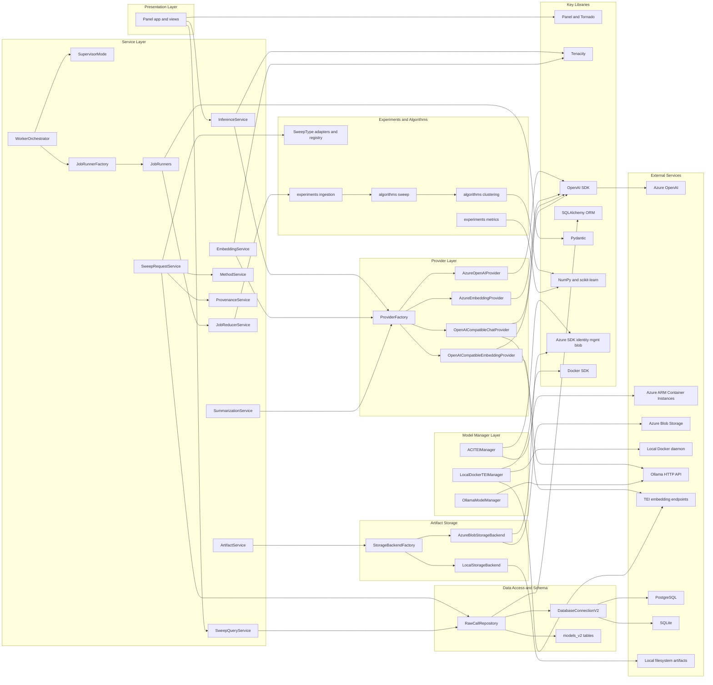
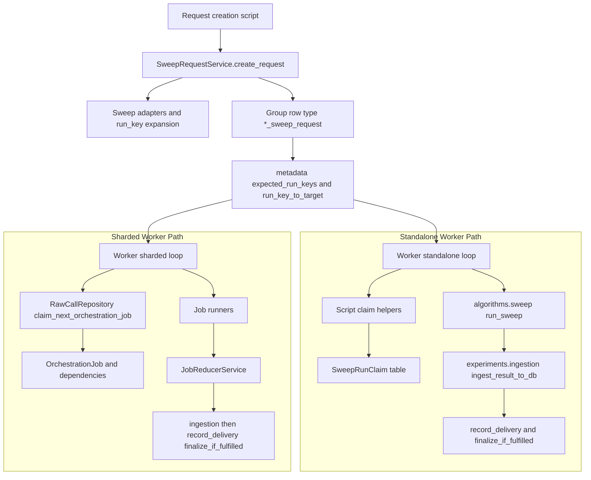

# Agent transcript text diagrams (auto-extracted)

Generated by `scratch/extract_agent_transcript_diagrams.py`. **Agent model** is not stored in these JSONL files. **Date** is the transcript file modification time (approximate).

## Entry 1

- **Date (approx.)**: 2026-03-16 21:44 UTC (file mtime)
- **Conversation**: `1435953e-b7f7-4aaa-ae78-0976e5f2918c`
- **Agent model**: not recorded in transcript JSON
- **Source file**: `C:\Users\spenc\.cursor\projects\c-Users-spenc-Cursor-Repos-study-query-llm\agent-transcripts\1435953e-b7f7-4aaa-ae78-0976e5f2918c\1435953e-b7f7-4aaa-ae78-0976e5f2918c.jsonl` (JSONL line ~90)
- **Diagram kind**: ASCII box / layer diagram
- **Fence lang**: `(none)`
- **Descriptive sentence**: Your Current Stack Overview

```
┌─────────────────────────────────────────────────────────────────────────────┐
│  PRESENTATION                                                                 │
│  panel_app/          Panel UI (sweep explorer, embeddings, groups, analytics) │
└─────────────────────────────────────────────────────────────────────────────┘
                                        │
┌───────────────────────────────────────▼───────────────────────────────────────┐
│  SCRIPTS (CLI / batch entry points)                                            │
│  scripts/           run_local_300_2datasets_worker.py, engine_supervisor.py   │
│                     ingest_sweep_to_db.py, run_pca_kllmeans_sweep.py, etc.     │
└───────────────────────────────────────┬───────────────────────────────────────┘
                                        │
┌───────────────────────────────────────▼───────────────────────────────────────┐
│  SERVICE LAYER (src/study_query_llm/services/)                                 │
│  sweep_request_service, embedding_service, summarization_service,              │
│  provenance_service, artifact_service, job_reducer_service, method_service     │
│  worker_orchestrator, supervisor_mode  ← orchestrator factory (standalone/sharded)│
└───────────────────────────────────────┬───────────────────────────────────────┘
                                        │
        ┌───────────────────────────────┼───────────────────────────────┐
        │                               │                               │
        ▼                               ▼                               ▼
┌───────────────┐            ┌──────────────────┐            ┌─────────────────────┐
│  PROVIDERS    │            │  EXECUTION       │            │  STORAGE            │
│  providers/   │            │  execution/     │            │  storage/           │
│  LLM + Embed  │            │  factory.py     │            │  factory.py          │
│  factory.py   │            │  local_docker   │            │  local, azure_blob  │
│  managers/    │            │  ssh_docker     │            │                     │
│  TEI, Ollama  │            │  vastai         │            │                     │
└───────────────┘            └──────────────────┘            └─────────────────────┘
        │                               │                               │
        └───────────────────────────────┼───────────────────────────────┘
                                        │
                                        ▼
┌─────────────────────────────────────────────────────────────────────────────┐
│  DATA LAYER                                                                   │
│  db/             connection_v2, raw_call_repository, models_v2               │
│  algorithms/     clustering.py, sweep.py, dimensionality_reduction           │
│  experiments/    result_metrics, sweep_io, ingestion, sweep_request_types     │
└─────────────────────────────────────────────────────────────────────────────┘
```

## Entry 2

- **Date (approx.)**: 2026-03-16 21:44 UTC (file mtime)
- **Conversation**: `1435953e-b7f7-4aaa-ae78-0976e5f2918c`
- **Agent model**: not recorded in transcript JSON
- **Source file**: `C:\Users\spenc\.cursor\projects\c-Users-spenc-Cursor-Repos-study-query-llm\agent-transcripts\1435953e-b7f7-4aaa-ae78-0976e5f2918c\1435953e-b7f7-4aaa-ae78-0976e5f2918c.jsonl` (JSONL line ~94)
- **Diagram kind**: ASCII box / layer diagram
- **Fence lang**: `(none)`
- **Descriptive sentence**: Stack with Pydantic and LangChain/LangGraph

```
┌─────────────────────────────────────────────────────────────────────────────┐
│  PRESENTATION                                                                │
│  panel_app/          Panel UI (sweep explorer, embeddings, groups, analytics)│
└─────────────────────────────────────────────────────────────────────────────┘
                                        │
┌───────────────────────────────────────▼───────────────────────────────────────┐
│  SCRIPTS (CLI / batch entry points)                                            │
│  scripts/           run_local_300_2datasets_worker.py, engine_supervisor.py   │
│                     ingest_sweep_to_db.py, run_pca_kllmeans_sweep.py, etc.     │
└───────────────────────────────────────┬───────────────────────────────────────┘
                                        │
┌───────────────────────────────────────▼───────────────────────────────────────┐
│  ORCHESTRATION (agentic workflows) — NEW                                       │
│  LangGraph        Graph-based agent orchestration: cycles, state, HITL         │
│  (uses LangChain)  Multi-step reasoning, tool loops, branching                 │
└───────────────────────────────────────┬───────────────────────────────────────┘
                                        │
┌───────────────────────────────────────▼───────────────────────────────────────┐
│  SERVICE LAYER (src/study_query_llm/services/)                                 │
│  sweep_request_service, embedding_service, summarization_service,              │
│  provenance_service, artifact_service, job_reducer_service, method_service   │
│  worker_orchestrator, supervisor_mode                                          │
└───────────────────────────────────────┬───────────────────────────────────────┘
                                        │
        ┌───────────────────────────────┼───────────────────────────────┐
        │                               │                               │
        ▼                               ▼                               ▼
┌───────────────┐            ┌──────────────────┐            ┌─────────────────────┐
│  PROVIDERS    │            │  EXECUTION       │            │  STORAGE             │
│  providers/   │            │  execution/     │            │  storage/            │
│  (+ LangChain │            │  factory.py     │            │  factory.py           │
│   wrappers    │            │  local_docker   │            │  local, azure_blob    │
│   optional)   │            │  ssh_docker     │            │                      │
└───────────────┘            └──────────────────┘            └─────────────────────┘
        │                               │                               │
        └───────────────────────────────┼───────────────────────────────┘
                                        │
                                        ▼
┌─────────────────────────────────────────────────────────────────────────────┐
│  DATA / BOUNDARIES — NEW                                                      │
│  Pydantic       Typed models for payload_json, metadata_json, config         │
│                 Structured LLM output, request/response validation           │
│                 Shapes at all boundaries (DB ↔ service, API ↔ service)       │
└───────────────────────────────────────┬───────────────────────────────────────┘
                                        │
                                        ▼
┌─────────────────────────────────────────────────────────────────────────────┐
│  DATA LAYER                                                                  │
│  db/             connection_v2, raw_call_repository, models_v2 (Neon/SQLite)│
│  algorithms/     clustering.py, sweep.py, dimensionality_reduction           │
│  experiments/    result_metrics, sweep_io, ingestion, sweep_request_types     │
└─────────────────────────────────────────────────────────────────────────────┘
```

## Entry 3

- **Date (approx.)**: 2026-03-16 21:44 UTC (file mtime)
- **Conversation**: `1435953e-b7f7-4aaa-ae78-0976e5f2918c`
- **Agent model**: not recorded in transcript JSON
- **Source file**: `C:\Users\spenc\.cursor\projects\c-Users-spenc-Cursor-Repos-study-query-llm\agent-transcripts\1435953e-b7f7-4aaa-ae78-0976e5f2918c\1435953e-b7f7-4aaa-ae78-0976e5f2918c.jsonl` (JSONL line ~94)
- **Diagram kind**: ASCII tree / hierarchy
- **Fence lang**: `(none)`
- **Descriptive sentence**: Vertical slice (with Pydantic + LangGraph)

```
User / Script
     │
     ▼
LangGraph (agent orchestration)
     │ uses
     ▼
LangChain (models, prompts, tools)
     │
     ├──► Your providers (Azure, TEI, etc.) — optionally wrapped by LangChain
     │
     ▼
Services (sweep_request, embedding, provenance, etc.)
     │
     ├──► Pydantic models for payloads, metadata, structured output
     │
     ▼
DB (Neon) via raw_call_repository
```

## Entry 4

- **Date (approx.)**: 2026-03-16 21:44 UTC (file mtime)
- **Conversation**: `1435953e-b7f7-4aaa-ae78-0976e5f2918c`
- **Agent model**: not recorded in transcript JSON
- **Source file**: `C:\Users\spenc\.cursor\projects\c-Users-spenc-Cursor-Repos-study-query-llm\agent-transcripts\1435953e-b7f7-4aaa-ae78-0976e5f2918c\1435953e-b7f7-4aaa-ae78-0976e5f2918c.jsonl` (JSONL line ~140)
- **Diagram kind**: Text flow / pipeline
- **Fence lang**: `(none)`
- **Descriptive sentence**: 1. Sequential pipeline

```
START → researcher_llm → writer_llm → critic_llm → END
```

## Entry 5

- **Date (approx.)**: 2026-03-16 21:44 UTC (file mtime)
- **Conversation**: `1435953e-b7f7-4aaa-ae78-0976e5f2918c`
- **Agent model**: not recorded in transcript JSON
- **Source file**: `C:\Users\spenc\.cursor\projects\c-Users-spenc-Cursor-Repos-study-query-llm\agent-transcripts\1435953e-b7f7-4aaa-ae78-0976e5f2918c\1435953e-b7f7-4aaa-ae78-0976e5f2918c.jsonl` (JSONL line ~140)
- **Diagram kind**: Text flow / pipeline
- **Fence lang**: `(none)`
- **Descriptive sentence**: 2. Supervisor pattern

```
START → supervisor (routes based on state)
         ├→ coding_agent (GPT-4)
         ├→ search_agent (Claude + tools)
         └→ writer_agent (different model)
```

## Entry 6

- **Date (approx.)**: 2026-03-16 21:44 UTC (file mtime)
- **Conversation**: `1435953e-b7f7-4aaa-ae78-0976e5f2918c`
- **Agent model**: not recorded in transcript JSON
- **Source file**: `C:\Users\spenc\.cursor\projects\c-Users-spenc-Cursor-Repos-study-query-llm\agent-transcripts\1435953e-b7f7-4aaa-ae78-0976e5f2918c\1435953e-b7f7-4aaa-ae78-0976e5f2918c.jsonl` (JSONL line ~142)
- **Diagram kind**: Text flow / pipeline
- **Fence lang**: `(none)`
- **Descriptive sentence**: Flow: LangGraph → LangChain → Azure

```
LangGraph node  →  LangChain chat model  →  openai SDK  →  HTTPS  →  Azure OpenAI REST API
```

## Entry 7

- **Date (approx.)**: 2026-03-11 00:53 UTC (file mtime)
- **Conversation**: `2b26eedb-c587-4d2f-92f2-c827d045ce15`
- **Agent model**: not recorded in transcript JSON
- **Source file**: `C:\Users\spenc\.cursor\projects\c-Users-spenc-Cursor-Repos-study-query-llm\agent-transcripts\2b26eedb-c587-4d2f-92f2-c827d045ce15\2b26eedb-c587-4d2f-92f2-c827d045ce15.jsonl` (JSONL line ~2)
- **Diagram kind**: ASCII tree / hierarchy
- **Fence lang**: `(none)`
- **Descriptive sentence**: Panel inference runs (`group_type="inference_run"`)

```
Group (group_type="inference_run")
  └── GroupMember (many-to-many)
        └── RawCall
```

## Entry 8

- **Date (approx.)**: 2026-03-11 00:53 UTC (file mtime)
- **Conversation**: `2b26eedb-c587-4d2f-92f2-c827d045ce15`
- **Agent model**: not recorded in transcript JSON
- **Source file**: `C:\Users\spenc\.cursor\projects\c-Users-spenc-Cursor-Repos-study-query-llm\agent-transcripts\2b26eedb-c587-4d2f-92f2-c827d045ce15\2b26eedb-c587-4d2f-92f2-c827d045ce15.jsonl` (JSONL line ~2)
- **Diagram kind**: ASCII tree / hierarchy
- **Fence lang**: `(none)`
- **Descriptive sentence**: Clustering / algorithm runs (hierarchical)

```
clustering_sweep_request (Group)
  └── OrchestrationJob (work items)
  └── GroupLink(link_type="contains")
        └── clustering_sweep (Group)
              └── GroupLink(link_type="contains")
                    └── clustering_run (Group)
                          └── GroupLink(link_type="clustering_step")
                                └── clustering_step (Group)
                                      └── GroupMember
                                            └── RawCall
```

## Entry 9

- **Date (approx.)**: 2026-03-11 00:53 UTC (file mtime)
- **Conversation**: `2b26eedb-c587-4d2f-92f2-c827d045ce15`
- **Agent model**: not recorded in transcript JSON
- **Source file**: `C:\Users\spenc\.cursor\projects\c-Users-spenc-Cursor-Repos-study-query-llm\agent-transcripts\2b26eedb-c587-4d2f-92f2-c827d045ce15\2b26eedb-c587-4d2f-92f2-c827d045ce15.jsonl` (JSONL line ~4)
- **Diagram kind**: ASCII tree / hierarchy
- **Fence lang**: `(none)`
- **Descriptive sentence**: 6. For your specific quiz example

```
dataset_snapshot (the subject/level combos)
  │
  ├─ depends_on ──► inference_run (10 chatbots × quiz generation)
  │                    └── RawCall per chatbot response
  │
  ├─ depends_on ──► analysis_run (answer extraction)
  │                    metadata: {method: "parse_quiz", version: "2", 
  │                               code_commit: "abc123"}
  │                    └── structured results (as CallArtifact JSON)
  │
  └─ depends_on ──► analysis_run (statistical analysis)
                       metadata: {method: "answer_bias_test", version: "1"}
                       └── results artifact (chi-square, p-values)
```

## Entry 10

- **Date (approx.)**: 2026-03-11 00:53 UTC (file mtime)
- **Conversation**: `2b26eedb-c587-4d2f-92f2-c827d045ce15`
- **Agent model**: not recorded in transcript JSON
- **Source file**: `C:\Users\spenc\.cursor\projects\c-Users-spenc-Cursor-Repos-study-query-llm\agent-transcripts\2b26eedb-c587-4d2f-92f2-c827d045ce15\2b26eedb-c587-4d2f-92f2-c827d045ce15.jsonl` (JSONL line ~10)
- **Diagram kind**: ASCII tree / hierarchy
- **Fence lang**: `(none)`
- **Descriptive sentence**: Pattern 2: Analysis as its own Group with links (fits your current schema)

```
Group(type="analysis_run")
  ├── metadata_json: {method_definition_id: 7, parameters: {...}}
  ├── GroupLink(link_type="depends_on") → source sweep/run Group
  ├── GroupLink(link_type="used_method") → MethodDefinition (if you make it a Group too)
  └── CallArtifact(artifact_type="analysis_result")
        └── uri: "artifacts/42/answer_bias.json"
            content: {"chi_sq": 12.3, "p": 0.002, "per_choice": {...}}
```

## Entry 11

- **Date (approx.)**: 2026-03-11 00:53 UTC (file mtime)
- **Conversation**: `2b26eedb-c587-4d2f-92f2-c827d045ce15`
- **Agent model**: not recorded in transcript JSON
- **Source file**: `C:\Users\spenc\.cursor\projects\c-Users-spenc-Cursor-Repos-study-query-llm\agent-transcripts\2b26eedb-c587-4d2f-92f2-c827d045ce15\2b26eedb-c587-4d2f-92f2-c827d045ce15.jsonl` (JSONL line ~10)
- **Diagram kind**: ASCII tree / hierarchy
- **Fence lang**: `(none)`
- **Descriptive sentence**: How the three pieces fit together

```
MethodDefinition (what code ran)
    │
    │  method_definition_id
    ▼
AnalysisResult (the output)
    │
    │  source_group_id          analysis_group_id
    ▼                           ▼
Source Group                    Analysis Group
(sweep/run/inference_run)       (type="analysis_run")
    │                               │
    └── RawCall, artifacts          └── GroupLink(depends_on) → Source Group
                                    └── CallArtifact (full result files)
```

## Entry 12

- **Date (approx.)**: 2026-03-11 00:53 UTC (file mtime)
- **Conversation**: `2b26eedb-c587-4d2f-92f2-c827d045ce15`
- **Agent model**: not recorded in transcript JSON
- **Source file**: `C:\Users\spenc\.cursor\projects\c-Users-spenc-Cursor-Repos-study-query-llm\agent-transcripts\2b26eedb-c587-4d2f-92f2-c827d045ce15\2b26eedb-c587-4d2f-92f2-c827d045ce15.jsonl` (JSONL line ~12)
- **Diagram kind**: Text flow / pipeline
- **Fence lang**: `(none)`
- **Descriptive sentence**: What changes with the new tables

```
result_metrics.extract_by_k_metrics() → dump into step.metadata_json → done
```

## Entry 13

- **Date (approx.)**: 2026-03-11 00:53 UTC (file mtime)
- **Conversation**: `2b26eedb-c587-4d2f-92f2-c827d045ce15`
- **Agent model**: not recorded in transcript JSON
- **Source file**: `C:\Users\spenc\.cursor\projects\c-Users-spenc-Cursor-Repos-study-query-llm\agent-transcripts\2b26eedb-c587-4d2f-92f2-c827d045ce15\2b26eedb-c587-4d2f-92f2-c827d045ce15.jsonl` (JSONL line ~12)
- **Diagram kind**: Text flow / pipeline
- **Fence lang**: `(none)`
- **Descriptive sentence**: What changes with the new tables

```
result_metrics.extract_by_k_metrics() → dump into step.metadata_json (unchanged)
                                      → also write AnalysisResult rows referencing
                                        the MethodDefinition for extract_by_k_metrics
```

## Entry 14

- **Date (approx.)**: 2026-03-18 22:16 UTC (file mtime)
- **Conversation**: `4a59d4a4-a5e4-435e-a256-a34e9c37d4de`
- **Agent model**: not recorded in transcript JSON
- **Source file**: `C:\Users\spenc\.cursor\projects\c-Users-spenc-Cursor-Repos-study-query-llm\agent-transcripts\4a59d4a4-a5e4-435e-a256-a34e9c37d4de\4a59d4a4-a5e4-435e-a256-a34e9c37d4de.jsonl` (JSONL line ~4)
- **Diagram kind**: ASCII tree / hierarchy
- **Fence lang**: `(none)`
- **Descriptive sentence**: Recommendation: `src/study_query_llm/domain/`

```
src/study_query_llm/
├── domain/                          # NEW: domain-specific conceptual models
│   ├── __init__.py
│   └── representation_hierarchy.py  # Your physics problem hierarchy
├── algorithms/                      # Clustering, PCA, sweep (computation)
├── experiments/                     # Sweep orchestration, result metrics
├── services/
├── providers/
└── ...
```

## Entry 15

- **Date (approx.)**: 2026-03-23 04:42 UTC (file mtime)
- **Conversation**: `4b74985a-a602-4569-a356-464598ab79a3`
- **Agent model**: not recorded in transcript JSON
- **Source file**: `C:\Users\spenc\.cursor\projects\c-Users-spenc-Cursor-Repos-study-query-llm\agent-transcripts\4b74985a-a602-4569-a356-464598ab79a3\4b74985a-a602-4569-a356-464598ab79a3.jsonl` (JSONL line ~347)
- **Diagram kind**: Mermaid diagram
- **Fence lang**: `mermaid`
- **Descriptive sentence**: Detailed layer/service map

```mermaid
flowchart TB
  subgraph entryPoints [EntryPoints]
    panelApp["Panel app"]
    sweepScripts["Sweep scripts"]
    workerScripts["Worker scripts"]
    notebooks["Notebooks"]
  end

  subgraph serviceLayer [ServiceLayer]
    inferenceSvc["InferenceService"]
    embeddingSvc["EmbeddingService"]
    summarizationSvc["SummarizationService"]
    studySvc["StudyService"]
    preprocessorSvc["PromptPreprocessor"]
    provenanceSvc["ProvenanceService"]
    methodSvc["MethodService"]
    sweepReqSvc["SweepRequestService"]
    sweepQuerySvc["SweepQueryService"]
    workerOrchSvc["WorkerOrchestrator"]
    supervisorModeSvc["SupervisorMode adapters"]
    jobRunnerFactorySvc["JobRunnerFactory"]
    jobRunnerSvc["RunKTry ReduceK FinalizeRun LangGraph runners"]
    reducerSvc["JobReducerService"]
    artifactSvc["ArtifactService"]
    dataQualitySvc["DataQualityService"]
  end

  subgraph contractAlgoLayer [ContractsAndAlgorithms]
    sweepTypes["Sweep type adapters and analysis contracts"]
    expIngestion["experiments ingestion"]
    expMetrics["experiments result metrics"]
    clusteringAlgo["algorithms sweep and clustering"]
  end

  subgraph providerLayer [ProviderLayer]
    providerFactory["ProviderFactory"]
    chatProviders["Azure/OpenAI compatible chat providers"]
    embeddingProviders["Azure/OpenAI compatible embedding providers"]
    modelManagers["Model managers ACI Docker Ollama"]
  end

  subgraph dataAccessLayer [DataAccessLayer]
    rawRepo["RawCallRepository"]
    inferenceRepo["InferenceRepository legacy"]
    dbConn["Database connections and session scope"]
  end

  subgraph modelLayer [DatabaseModelLayer]
    rawCallModel["RawCall"]
    groupModel["Group GroupMember GroupLink"]
    requestModel["SweepRunClaim OrchestrationJob JobDependency"]
    analysisModel["MethodDefinition AnalysisResult"]
    artifactModel["CallArtifact EmbeddingCache tables"]
  end

  subgraph externalSystems [ExternalSystems]
    llmApis["Azure OpenAI OpenAI Hyperbolic endpoints"]
    teiHosts["TEI hosts local Docker or ACI"]
    postgresDb["PostgreSQL"]
    blobStore["Azure Blob and local artifact files"]
  end

  panelApp --> inferenceSvc
  panelApp --> studySvc
  sweepScripts --> sweepReqSvc
  sweepScripts --> sweepQuerySvc
  workerScripts --> workerOrchSvc
  workerScripts --> supervisorModeSvc
  notebooks --> sweepQuerySvc

  sweepReqSvc --> sweepTypes
  sweepReqSvc --> provenanceSvc
  sweepReqSvc --> methodSvc
  sweepReqSvc --> rawRepo
  sweepQuerySvc --> rawRepo
  reducerSvc --> expIngestion
  expIngestion --> clusteringAlgo
  sweepTypes --> expMetrics

  workerOrchSvc --> jobRunnerFactorySvc
  jobRunnerFactorySvc --> jobRunnerSvc
  jobRunnerSvc --> reducerSvc
  supervisorModeSvc --> sweepReqSvc
  supervisorModeSvc --> rawRepo

  inferenceSvc --> preprocessorSvc
  inferenceSvc --> providerFactory
  embeddingSvc --> providerFactory
  summarizationSvc --> providerFactory
  providerFactory --> chatProviders
  providerFactory --> embeddingProviders
  embeddingProviders --> modelManagers

  chatProviders --> llmApis
  embeddingProviders --> llmApis
  modelManagers --> teiHosts

  inferenceSvc --> rawRepo
  embeddingSvc --> rawRepo
  summarizationSvc --> rawRepo
  studySvc --> rawRepo
  provenanceSvc --> rawRepo
  methodSvc --> rawRepo
  artifactSvc --> rawRepo
  dataQualitySvc --> rawRepo
  rawRepo --> dbConn
  inferenceRepo --> dbConn
  dbConn --> postgresDb

  rawRepo --> rawCallModel
  rawRepo --> groupModel
  rawRepo --> requestModel
  rawRepo --> analysisModel
  rawRepo --> artifactModel
  artifactSvc --> blobStore
  reducerSvc --> blobStore
```



## Entry 16

- **Date (approx.)**: 2026-03-23 04:42 UTC (file mtime)
- **Conversation**: `4b74985a-a602-4569-a356-464598ab79a3`
- **Agent model**: not recorded in transcript JSON
- **Source file**: `C:\Users\spenc\.cursor\projects\c-Users-spenc-Cursor-Repos-study-query-llm\agent-transcripts\4b74985a-a602-4569-a356-464598ab79a3\4b74985a-a602-4569-a356-464598ab79a3.jsonl` (JSONL line ~361)
- **Diagram kind**: Mermaid diagram
- **Fence lang**: `mermaid`
- **Descriptive sentence**: Detailed system connectivity diagram



## Entry 17

- **Date (approx.)**: 2026-03-23 04:42 UTC (file mtime)
- **Conversation**: `4b74985a-a602-4569-a356-464598ab79a3`
- **Agent model**: not recorded in transcript JSON
- **Source file**: `C:\Users\spenc\.cursor\projects\c-Users-spenc-Cursor-Repos-study-query-llm\agent-transcripts\4b74985a-a602-4569-a356-464598ab79a3\4b74985a-a602-4569-a356-464598ab79a3.jsonl` (JSONL line ~361)
- **Diagram kind**: Mermaid diagram
- **Fence lang**: `mermaid`
- **Descriptive sentence**: Sweep request-worker lifecycle map



## Entry 18

- **Date (approx.)**: 2026-03-01 07:29 UTC (file mtime)
- **Conversation**: `62aa258f-40d0-4602-af13-38717015b2e2`
- **Agent model**: not recorded in transcript JSON
- **Source file**: `C:\Users\spenc\.cursor\projects\c-Users-spenc-Cursor-Repos-study-query-llm\agent-transcripts\62aa258f-40d0-4602-af13-38717015b2e2\62aa258f-40d0-4602-af13-38717015b2e2.jsonl` (JSONL line ~168)
- **Diagram kind**: ASCII tree / hierarchy
- **Fence lang**: `(none)`
- **Descriptive sentence**: Here's the hierarchy, from top to bottom: **Three levels of `Group` entities, linked by `GroupLink`:**

```
clustering_sweep          (top level -- a named collection of runs)
  │
  │  link_type = "contains"
  │
  ├── clustering_run      (one complete algorithm execution -- one dataset + engine + summarizer combo)
  │     │
  │     │  link_type = "clustering_step"
  │     │
  │     ├── clustering_step   k=2   (metrics for all restarts at this k)
  │     ├── clustering_step   k=3
  │     ├── clustering_step   k=4
  │     └── ...               k=20
  │
  ├── clustering_run      (another dataset/engine/summarizer combo)
  │     ├── clustering_step   k=2
  │     └── ...
  └── ...
```

## Entry 19

- **Date (approx.)**: 2026-03-01 07:29 UTC (file mtime)
- **Conversation**: `62aa258f-40d0-4602-af13-38717015b2e2`
- **Agent model**: not recorded in transcript JSON
- **Source file**: `C:\Users\spenc\.cursor\projects\c-Users-spenc-Cursor-Repos-study-query-llm\agent-transcripts\62aa258f-40d0-4602-af13-38717015b2e2\62aa258f-40d0-4602-af13-38717015b2e2.jsonl` (JSONL line ~170)
- **Diagram kind**: ASCII tree / hierarchy
- **Fence lang**: `(none)`
- **Descriptive sentence**: - **`GroupLink`** -- links a `Group` to another `Group` (parent/child). This is the clustering hierarchy I described before (sweep -> run -> step). So the complete picture looks like:

```
clustering_sweep
  └── clustering_run
        ├── clustering_step (k=2, metrics in metadata_json)
        ├── clustering_step (k=3)
        └── ...
        │
        └──[GroupMember]──► RawCall (embedding API call)
                           RawCall (embedding API call)
                           RawCall (summarization API call)
                           ...
```

## Entry 20

- **Date (approx.)**: 2026-03-20 02:22 UTC (file mtime)
- **Conversation**: `6c98946d-902b-481d-a214-7cb42df66151 (subagent f719d2cf-7d3b-41fd-bd45-85877a37d69c)`
- **Agent model**: not recorded in transcript JSON
- **Source file**: `C:\Users\spenc\.cursor\projects\c-Users-spenc-Cursor-Repos-study-query-llm\agent-transcripts\6c98946d-902b-481d-a214-7cb42df66151\subagents\f719d2cf-7d3b-41fd-bd45-85877a37d69c.jsonl` (JSONL line ~6)
- **Diagram kind**: ASCII tree / hierarchy
- **Fence lang**: `(none)`
- **Descriptive sentence**: 1. Full Directory Tree: `src/study_query_llm/`

```
src/study_query_llm/
├── __init__.py                     (32 lines)
├── config.py                       (237 lines)
│
├── algorithms/
│   ├── __init__.py                 (44 lines)
│   ├── clustering.py              (628 lines)
│   ├── dimensionality_reduction.py (90 lines)
│   └── sweep.py                   (260 lines)
│
├── db/
│   ├── __init__.py                 (42 lines)
│   ├── _base_connection.py         (87 lines)
│   ├── connection.py              (32 lines)
│   ├── connection_v2.py            (61 lines)
│   ├── inference_repository.py     (328 lines)
│   ├── models.py                   (73 lines)
│   ├── models_v2.py                (814 lines)
│   ├── raw_call_repository.py      (1357 lines)
│   └── migrations/
│       ├── add_embedding_cache_layers.py    (60 lines)
│       ├── add_group_links.py               (55 lines)
│       ├── add_method_analysis_tables.py     (59 lines)
│       ├── add_orchestration_jobs.py         (64 lines)
│       ├── add_sweep_request_indexes.py      (77 lines)
│       └── add_sweep_worker_safety.py        (130 lines)
│
├── domain/
│   ├── __init__.py                 (46 lines)
│   └── representation_hierarchy.py (761 lines)
│
├── experiments/
│   ├── __init__.py                 (14 lines)
│   ├── ingestion.py                (227 lines)
│   ├── result_metrics.py           (298 lines)
│   ├── sweep_io.py                 (146 lines)
│   └── sweep_request_types.py      (114 lines)
│
├── execution/
│   ├── __init__.py                 (23 lines)
│   ├── factory.py                  (46 lines)
│   ├── local_docker.py             (163 lines)
│   ├── protocol.py                 (68 lines)
│   ├── ssh_docker.py               (190 lines)
│   └── vastai.py                   (201 lines)
│
├── providers/
│   ├── __init__.py                 (30 lines)
│   ├── azure_embedding_provider.py (71 lines)
│   ├── azure_provider.py           (303 lines)
│   ├── base.py                     (144 lines)
│   ├── base_embedding.py           (84 lines)
│   ├── factory.py                  (268 lines)
│   ├── managed_tei_embedding_provider.py (186 lines)
│   ├── openai_compatible_chat_provider.py (121 lines)
│   ├── openai_compatible_embedding_provider.py (74 lines)
│   └── managers/
│       ├── __init__.py             (26 lines)
│       ├── aci_tei.py              (423 lines)
│       ├── local_docker_tei.py     (323 lines)
│       ├── ollama.py               (241 lines)
│       └── protocol.py            (39 lines)
│
├── services/
│   ├── __init__.py                 (58 lines)
│   ├── _shared.py                  (97 lines)
│   ├── artifact_service.py         (889 lines)
│   ├── data_quality_service.py     (85 lines)
│   ├── embedding_file_cache.py     (153 lines)
│   ├── embedding_helpers.py        (140 lines)
│   ├── embedding_service.py        (1244 lines)
│   ├── inference_service.py       (623 lines)
│   ├── job_payload_models.py       (58 lines)
│   ├── job_reducer_service.py      (167 lines)
│   ├── job_runner_factory.py       (60 lines)
│   ├── job_runners.py              (145 lines)
│   ├── langgraph_job_runner.py     (114 lines)
│   ├── langgraph_provenance.py     (172 lines)
│   ├── method_service.py           (261 lines)
│   ├── model_registry.py           (172 lines)
│   ├── paraphraser_factory.py      (151 lines)
│   ├── preprocessors.py            (255 lines)
│   ├── provenance_service.py      (613 lines)
│   ├── summarization_service.py    (537 lines)
│   ├── supervisor_mode.py          (137 lines)
│   ├── sweep_query_service.py     (306 lines)
│   ├── sweep_request_service.py    (506 lines)
│   ├── study_service.py            (293 lines)
│   └── worker_orchestrator.py      (62 lines)
│
├── storage/
│   ├── __init__.py                 (15 lines)
│   ├── azure_blob.py               (374 lines)
│   ├── factory.py                  (44 lines)
│   ├── local.py                    (136 lines)
│   ├── protocol.py                 (30 lines)
│
└── utils/
    ├── __init__.py                 (27 lines)
    ├── estela_loader.py            (38 lines)
    ├── logging_config.py           (86 lines)
    ├── session_utils.py             (125 lines)
    └── text_utils.py               (43 lines)
```

## Entry 21

- **Date (approx.)**: 2026-03-20 02:22 UTC (file mtime)
- **Conversation**: `6c98946d-902b-481d-a214-7cb42df66151 (subagent f719d2cf-7d3b-41fd-bd45-85877a37d69c)`
- **Agent model**: not recorded in transcript JSON
- **Source file**: `C:\Users\spenc\.cursor\projects\c-Users-spenc-Cursor-Repos-study-query-llm\agent-transcripts\6c98946d-902b-481d-a214-7cb42df66151\subagents\f719d2cf-7d3b-41fd-bd45-85877a37d69c.jsonl` (JSONL line ~6)
- **Diagram kind**: ASCII tree / hierarchy
- **Fence lang**: `(none)`
- **Descriptive sentence**: 2. Full Directory Tree: `tests/`

```
tests/
├── __init__.py                     (8 lines)
├── conftest.py                     (367 lines)
├── README.md                       (87 lines)
│
├── test_algorithms/
│   ├── __init__.py                 (1 line)
│   ├── test_clustering.py          (386 lines)
│   ├── test_dimensionality_reduction.py (76 lines)
│   └── test_sweep.py               (220 lines)
│
├── test_db/
│   ├── __init__.py                 (2 lines)
│   ├── test_batch_tracking.py      (254 lines)
│   ├── test_connection.py          (108 lines)
│   ├── test_group_links.py         (184 lines)
│   ├── test_migration_v1_to_v2.py  (246 lines)
│   ├── test_models.py              (85 lines)
│   ├── test_models_v2.py           (181 lines)
│   ├── test_repository.py          (220 lines)
│   └── test_repository_v2.py       (428 lines)
│
├── test_execution/
│   ├── __init__.py                 (1 line)
│   ├── test_factory.py             (45 lines)
│   ├── test_local_docker.py        (209 lines)
│   ├── test_ssh_docker.py          (141 lines)
│   └── test_vastai.py              (111 lines)
│
├── test_experiments/
│   └── test_ingestion.py           (140 lines)
│
├── test_integration/
│   ├── test_combined_sweep_integration.py (194 lines)
│   ├── test_local_embedding_integration.py (123 lines)
│   └── test_local_summarizer_integration.py (124 lines)
│
├── test_panel_app/
│   └── test_app_shutdown.py       (113 lines)
│
├── test_providers/
│   ├── __init__.py                 (2 lines)
│   ├── test_azure.py               (141 lines)
│   ├── test_azure_embedding.py     (150 lines)
│   ├── test_base.py                (184 lines)
│   ├── test_base_embedding.py      (82 lines)
│   ├── test_factory.py             (225 lines)
│   ├── test_managed_tei_embedding.py (356 lines)
│   ├── test_openai_compatible_chat.py (158 lines)
│   ├── test_openai_compatible_embedding.py (119 lines)
│   └── test_ollama_model_manager.py (218 lines)
│
├── test_scripts/
│   ├── test_aci_tei_manager.py     (527 lines)
│   ├── test_ingest_sweep_to_db.py  (288 lines)
│   ├── test_local_300_2datasets_one_container_mode.py (121 lines)
│   ├── test_local_docker_tei_manager.py (392 lines)
│   ├── test_model_manager_protocol.py (33 lines)
│   ├── test_run_300_bigrun_sweep_request_mode.py (95 lines)
│   ├── test_run_langgraph_job_worker.py (234 lines)
│   ├── test_sweep_utils_provider.py (63 lines)
│   └── test_validate_and_backfill_run_snapshots.py (92 lines)
│
├── test_services/
│   ├── __init__.py                 (2 lines)
│   ├── test_artifact_service.py    (525 lines)
│   ├── test_batch_tracking.py      (230 lines)
│   ├── test_embedding_service.py   (787 lines)
│   ├── test_inference.py           (94 lines)
│   ├── test_inference_with_db.py   (139 lines)
│   ├── test_job_payload_models.py  (74 lines)
│   ├── test_job_runner_factory.py  (104 lines)
│   ├── test_langgraph_job_runner.py (70 lines)
│   ├── test_langgraph_provenance.py (97 lines)
│   ├── test_method_service.py     (173 lines)
│   ├── test_orchestration_jobs.py  (298 lines)
│   ├── test_preprocessing.py       (152 lines)
│   ├── test_provenance_service.py  (343 lines)
│   ├── test_retry.py               (131 lines)
│   ├── test_sampling_inference.py  (171 lines)
│   ├── test_study_service.py       (277 lines)
│   ├── test_summarization_service.py (367 lines)
│   ├── test_supervisor_mode_factory.py (69 lines)
│   ├── test_sweep_request_service.py (390 lines)
│   └── test_worker_orchestrator_factory.py (86 lines)
│
└── test_storage/
    ├── __init__.py                 (1 line)
    ├── test_azure_blob.py          (220 lines)
    ├── test_factory.py             (43 lines)
    └── test_local_storage.py       (78 lines)
```

## Entry 22

- **Date (approx.)**: 2026-03-20 02:22 UTC (file mtime)
- **Conversation**: `6c98946d-902b-481d-a214-7cb42df66151 (subagent f719d2cf-7d3b-41fd-bd45-85877a37d69c)`
- **Agent model**: not recorded in transcript JSON
- **Source file**: `C:\Users\spenc\.cursor\projects\c-Users-spenc-Cursor-Repos-study-query-llm\agent-transcripts\6c98946d-902b-481d-a214-7cb42df66151\subagents\f719d2cf-7d3b-41fd-bd45-85877a37d69c.jsonl` (JSONL line ~6)
- **Diagram kind**: ASCII tree / hierarchy
- **Fence lang**: `(none)`
- **Descriptive sentence**: 3. Full Directory Tree: `scripts/`

```
scripts/
├── README.md                       (197 lines)
├── run_300_bigrun_launcher.ps1     (52 lines)
│
├── analyze_dbpedia_character_length_grid.py (290 lines)
├── analyze_dataset_lengths.py      (214 lines)
├── analyze_estela_lengths.py       (290 lines)
├── archive_defective_data.py       (268 lines)
├── archive_pre_fix_runs.py         (304 lines)
├── audit_last_partial_sweep.py     (245 lines)
├── azure_embeddings_smoke.py       (161 lines)
├── benchmark_20leaf_worker_scaling.py (299 lines)
├── benchmark_azure_embedding_worker_scaling.py (401 lines)
├── benchmark_tei_failed_models.py  (209 lines)
├── benchmark_tei_models.py         (203 lines)
├── build_embedding_cache_30k.py    (415 lines)
├── check_aci_credentials.py        (99 lines)
├── check_all_data.py               (81 lines)
├── check_azure_blob_storage.py     (162 lines)
├── check_db_empty.py               (49 lines)
├── check_embedding_calls.py         (44 lines)
├── check_orchestration_jobs.py     (55 lines)
├── check_rate_limits.py            (103 lines)
├── check_run_groups.py             (90 lines)
├── check_summarizer_results_differ.py (119 lines)
├── check_sweep_requests.py         (176 lines)
├── create_artifact_containers.py    (63 lines)
├── create_bigrun_300_sweep.py      (154 lines)
├── create_dataset_snapshots_286.py (272 lines)
├── download_embedding_models.py     (234 lines)
├── download_summarizer_models.py    (226 lines)
├── docker_smoke.py                 (100 lines)
├── export_estela_prompt_data.py    (52 lines)
├── init_local_db.py                (81 lines)
├── ingest_sweep_to_db.py           (763 lines)
├── label_pre_fix_runs.py           (121 lines)
├── migrate_artifacts_to_azure_blob.py (158 lines)
├── migrate_group_types_to_clustering.py (133 lines)
├── plot_no_pca_50runs.py           (367 lines)
├── plot_no_pca_multi_embedding.py  (419 lines)
├── reconcile_last_partial_sweep.py (180 lines)
├── run_cached_job_supervisor.py    (228 lines)
├── run_custom_full_categories_sweep.py (350 lines)
├── run_experimental_sweep.py       (828 lines)
├── run_langgraph_job_worker.py     (179 lines)
├── run_local_300_2datasets_engine_supervisor.py (365 lines)
├── run_local_300_2datasets_worker.py (1044 lines)
├── run_mcq_answer_position_probe.py (436 lines)
├── run_no_pca_50runs_sweep.py      (242 lines)
├── run_no_pca_multi_embedding_sweep.py (448 lines)
├── run_pca_kllmeans_sweep.py       (293 lines)
├── run_pca_kllmeans_sweep_full.py  (544 lines)
├── run_300_bigrun_sweep.py         (733 lines)
├── sync_from_online.py             (303 lines)
├── test_no_pca_sweep.py            (193 lines)
├── validate_and_backfill_run_snapshots.py (136 lines)
```

## Entry 23

- **Date (approx.)**: 2026-03-15 16:01 UTC (file mtime)
- **Conversation**: `f747a569-3288-488a-9799-6ff3f45555b6`
- **Agent model**: not recorded in transcript JSON
- **Source file**: `C:\Users\spenc\.cursor\projects\c-Users-spenc-Cursor-Repos-study-query-llm\agent-transcripts\f747a569-3288-488a-9799-6ff3f45555b6\f747a569-3288-488a-9799-6ff3f45555b6.jsonl` (JSONL line ~44)
- **Diagram kind**: Text flow / pipeline
- **Fence lang**: `env`
- **Descriptive sentence**: - **`AZURE_STORAGE_CONNECTION_STRING`** – full connection string from the Azure portal (Storage account → Access keys) - **`AZURE_STORAGE_CONTAINER`** – container name (default: `"artifacts"`) Add a section like this to …

```env
# Azure Blob Storage (artifact storage backend)
# Used when ArtifactService is configured with StorageBackendFactory.create("azure_blob")
# Get connection string from Azure Portal: Storage Account → Access keys → Connection string
AZURE_STORAGE_CONNECTION_STRING=DefaultEndpointsProtocol=https;AccountName=your-account;AccountKey=...;EndpointSuffix=core.windows.net
AZURE_STORAGE_CONTAINER=artifacts
```

## Entry 24

- **Date (approx.)**: 2026-03-15 16:01 UTC (file mtime)
- **Conversation**: `f747a569-3288-488a-9799-6ff3f45555b6`
- **Agent model**: not recorded in transcript JSON
- **Source file**: `C:\Users\spenc\.cursor\projects\c-Users-spenc-Cursor-Repos-study-query-llm\agent-transcripts\f747a569-3288-488a-9799-6ff3f45555b6\f747a569-3288-488a-9799-6ff3f45555b6.jsonl` (JSONL line ~60)
- **Diagram kind**: ASCII tree / hierarchy
- **Fence lang**: `(none)`
- **Descriptive sentence**: Resulting architecture

```
Scripts / Services
       │
       ▼
  ArtifactService  ◄── configured with StorageBackend (local or azure_blob)
       │
       ▼
  StorageBackend.write(logical_path, bytes)
       │
       ├── LocalStorageBackend  →  local disk
       └── AzureBlobStorageBackend  →  blob
```

## Entry 25

- **Date (approx.)**: 2026-03-13 20:09 UTC (file mtime)
- **Conversation**: `f747a569-3288-488a-9799-6ff3f45555b6 (subagent 43aeab41-dacd-4a44-a1eb-d372e1524503)`
- **Agent model**: not recorded in transcript JSON
- **Source file**: `C:\Users\spenc\.cursor\projects\c-Users-spenc-Cursor-Repos-study-query-llm\agent-transcripts\f747a569-3288-488a-9799-6ff3f45555b6\subagents\43aeab41-dacd-4a44-a1eb-d372e1524503.jsonl` (JSONL line ~2)
- **Diagram kind**: ASCII tree / hierarchy
- **Fence lang**: `(none)`
- **Descriptive sentence**: Relationship diagram

```
ModelManager (Protocol)
├── start() -> str
├── stop() -> None
├── ping() -> None
└── __enter__ / __exit__

Implementations:
├── LocalDockerTEIManager (start/stop map to Docker start/stop)
├── ACITEIManager (start/stop map to create/delete)
└── OllamaModelManager

ManagedTEIEmbeddingProvider
├── Accepts any manager with that duck-type
├── Calls manager.ping() before each embedding request
└── Subclasses OpenAICompatibleEmbeddingProvider
```
